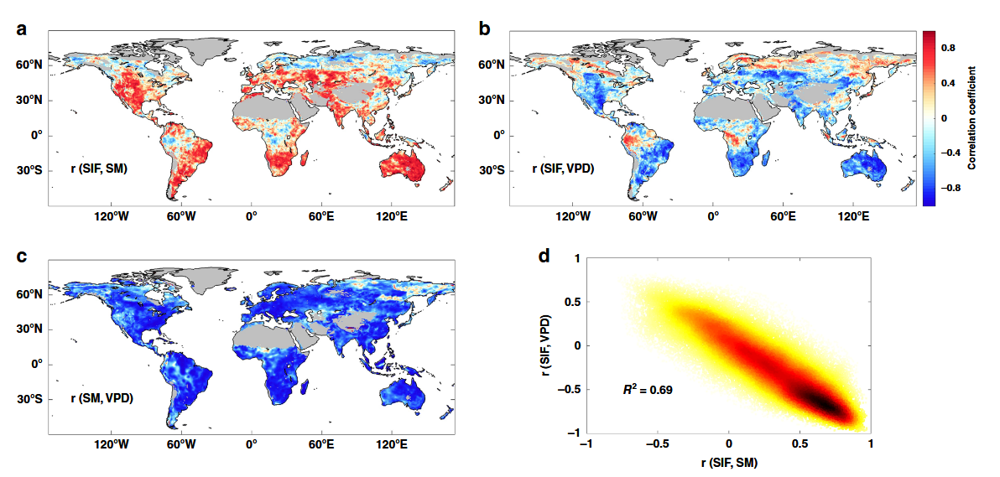
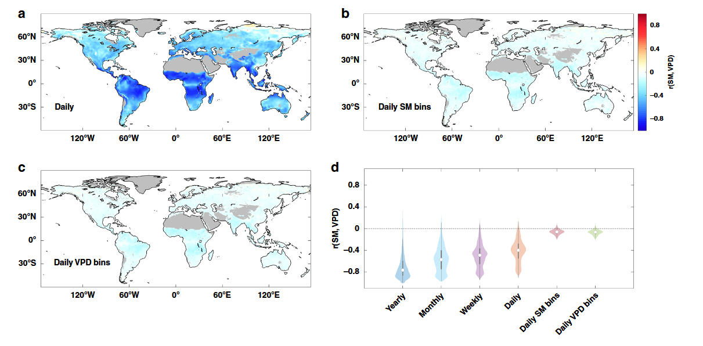
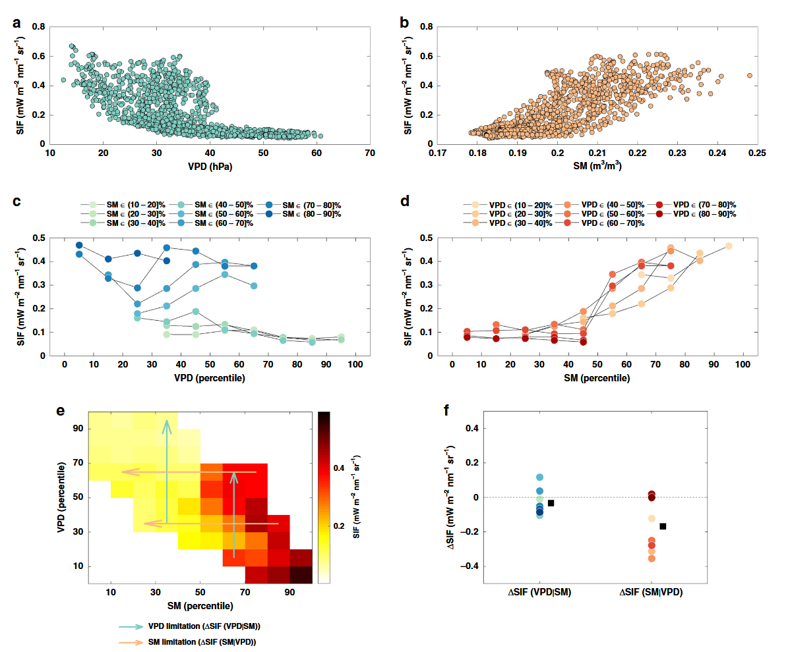
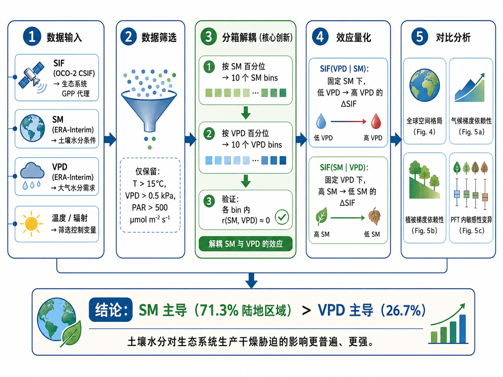
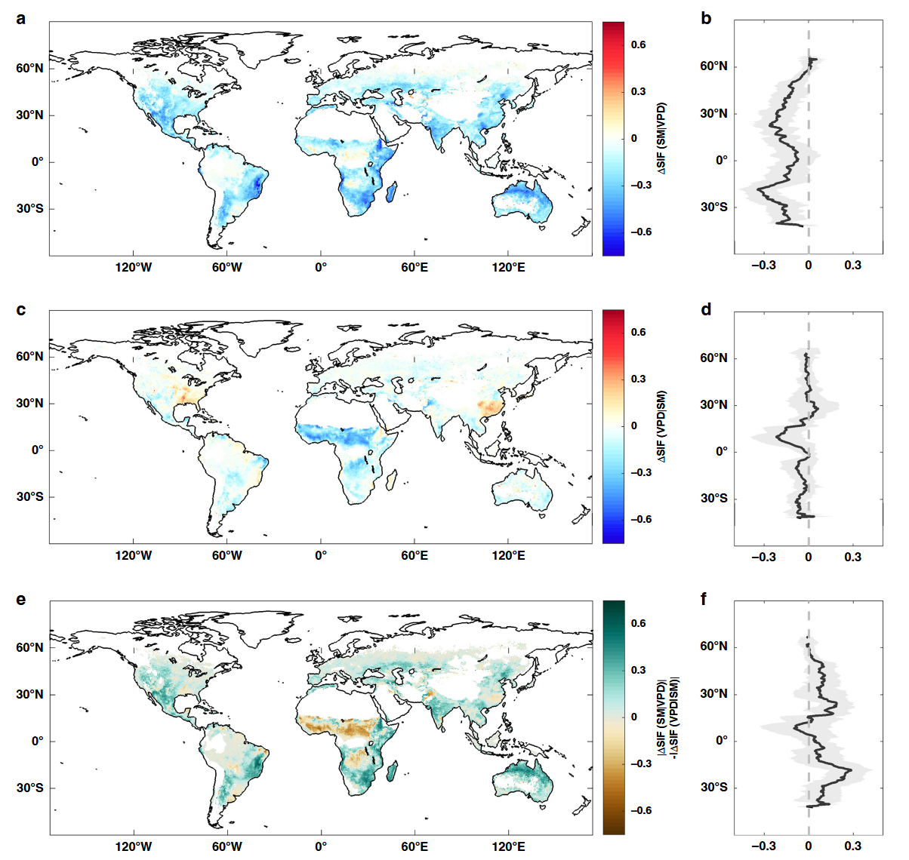
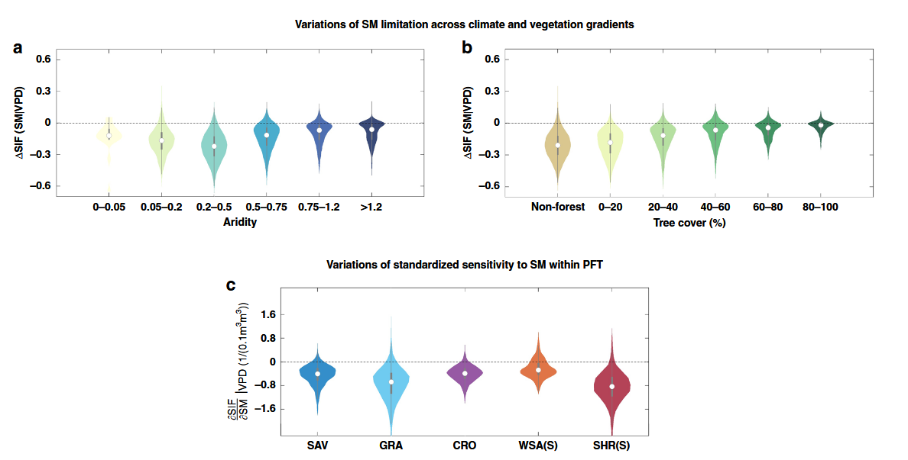

# Soil moisture dominates dryness stress on ecosystem production globally

## 土壤水分主导全球生态系统生产的干燥胁迫

---

**文献信息：** Liu, L., Gudmundsson, L., Hauser, M., Qin, D., Li, S. & Seneviratne, S.I. (2020). *Nature Communications*, **11**:4892.

**DOI:** [10.1038/s41467-020-18631-1](https://doi.org/10.1038/s41467-020-18631-1)

**作者机构：** ETH Zurich (苏黎世联邦理工学院) 大气与气候科学研究所; 北京大学城市与环境学院

---

## 一、研究背景 / Research Background

### 1.1 核心概念

干燥胁迫（dryness stress）限制植被生长的两个主要驱动因子：

| 驱动因子 | 英文 | 缩写 | 含义 |
|:---|:---|:---|:---|
| 低土壤水分 | Soil Moisture | SM | 植物根系可直接提取的水分池，决定植物可利用水量 |
| 高大气水汽压差 | Vapor Pressure Deficit | VPD | 大气对水分的"需求"强度，高VPD诱导植物关闭气孔以减少水分损失 |

### 1.2 领域争议

目前科学界对SM和VPD的相对作用存在**持续争论（ongoing debate）**，导致三个层面的分歧：

1. **科学认知层面：** 一部分研究强调SM对植被生产力的主导作用（通过降水/土壤水分识别干旱胁迫）[4-9]；另一部分研究强调VPD可能具有更强效应[11,12]。
2. **模型表征层面：** 不同陆地生态系统模型（TEMs）对干燥胁迫的表征差异巨大——JSBACH模型仅用SM函数表示[13,14]，G'Day模型仅用VPD函数表示[15-17]，部分模型同时使用两者[18]。
3. **预测层面：** 模型对干旱胁迫表征的不确定性被认为是预测未来陆地碳汇和气候的最大不确定性之一[35-37]。

### 1.3 核心难题：SM-VPD耦合

问题的根源在于**SM和VPD通过陆-气相互作用强烈耦合**[7,20]：
- 在年尺度上，SM与VPD呈强负相关（低SM总是伴随高VPD）
- 这种耦合使得无论是单独使用SM还是VPD作为干燥胁迫指标，都会在全球尺度上呈现与SIF（日光诱导叶绿素荧光，GPP的代理指标）相似的相关性（图1d, R²=0.69）
- **关键混淆因素（confounding factor）：** SM与VPD之间的相关性使得评估它们各自对生态系统生产的影响变得极为困难

> **图1解析（Fig. 1, p.3）：SM与VPD的强耦合混淆了生态系统干燥胁迫信号。** (a) SIF与SM的年尺度相关系数r(SIF, SM)空间分布；(b) SIF与VPD的年尺度相关系数r(SIF, VPD)空间分布；(c) SM与VPD的年尺度相关系数r(SM, VPD)空间分布——显示全球大范围强负相关；(d) 年尺度r(SIF, VPD)与r(SIF, SM)的关系散点图，R²高达0.69，说明因SM-VPD耦合，两者与SIF的相关性高度一致，无法区分。

---

## 二、关键科学问题 / Key Scientific Questions

本研究的核心科学问题可以凝练为：

> **在生态系统尺度上，低土壤水分（SM）和高大气水汽压差（VPD）哪个是限制植被光合生产的主导因素？**

具体分解为三个子问题：

1. **方法学问题：** 如何消除SM-VPD耦合的混淆效应，将两者的独立影响分离开来？
2. **空间格局问题：** SM和VPD对生态系统生产的限制作用在全球陆地的空间分布格局是怎样的？
3. **调控机制问题：** SM/VPD的干燥胁迫效应如何随气候梯度（干旱指数）和植被梯度（树木覆盖度、植物功能型）变化？

---

## 三、数据与方法 / Data and Methods

### 3.1 核心数据源

| 数据类型 | 数据来源 | 时空分辨率 | 用途 |
|:---|:---|:---|:---|
| SIF（光合作用代理） | OCO-2 CSIF（机器学习填补空间间隙）[22] | 0.5°, 4天, 2000–2016 | 指示GPP |
| SIF（验证用） | GOME-2 SIF, SCIAMACHY SIF | 0.5°/1.5°, 天尺度 | 鲁棒性检验 |
| 土壤水分 SM | ERA-Interim (主分析) / MERRA-2 / ESA CCI | 0.5°, 日尺度 | 独立变量 |
| 水汽压差 VPD | ERA-Interim 计算 | 0.5°, 日尺度 | 独立变量 |
| 降水、温度、辐射 | ERA-Interim, CERES | 0.5°–1°, 日尺度 | 控制变量筛选 |
| 干旱指数 AI | CRU v4.01 (1982–2015) | 0.5° | 气候梯度分析 |
| 树木覆盖度 | GFC v1.6 (Landsat) | 30 m → 0.5°聚合 | 植被梯度分析 |
| 土地覆盖 | MODIS IGBP (MCD12Q1) | 0.05° → 0.5° | PFT分类 |

### 3.2 核心方法：分箱解耦（Binning Decoupling）

这是本文**最关键的创新方法**。逻辑链条如下：

**Step 1 — 数据筛选：** 仅保留生长季且温度>15°C、VPD>0.5 kPa、光合有效辐射>500 μmol m⁻² s⁻¹的天数，排除其他气象因子的主导影响。

**Step 2 — 百分位分箱：** 对每个像素，将日尺度SM和VPD数据分别按0–10th, 10–20th, ..., 80–90th, 90–100th百分位分为10个分箱（bin）。

**Step 3 — 解耦验证（图2）：** 关键发现在于——在每个SM分箱内或每个VPD分箱内，SM与VPD之间的相关性系数**近似为零**。这意味着在分箱内，SM和VPD实现了统计解耦。

**Step 4 — 效应量化：**
- **VPD限制效应** SIF(VPD\|SM)：在每个SM分箱内，从低VPD到高VPD的SIF变化（消除SM耦合后）
- **SM限制效应** SIF(SM\|VPD)：在每个VPD分箱内，从高SM到低SM的SIF变化（消除VPD耦合后）

> **图2解析（Fig. 2, p.3）：SM与VPD的解耦策略。** (a) 日尺度SM与VPD的相关系数空间分布——仍显示大范围强负相关；(b) 在SM分箱内进行平均后的相关系数——相关性消失（近似为零）；(c) 在VPD分箱内进行平均后的相关系数——同样近似为零；(d) 小提琴图展示了从年尺度到日尺度分箱后SM-VPD相关系数的变化：年/月/周/日尺度上相关系数中位数均>0.5，但在SM分箱和VPD分箱内降至接近零。**这一结果构成了整个研究的方法论基础。**

**Step 5 — 效应比较（图3 Mali示例）：** 以一个位于西非马里的像素为例，展示了完整分析流程——在SM分箱内，高VPD非但未降低SIF，反而在中等SM条件下略微增加SIF；而在VPD分箱内，低SM显著降低了SIF。由此定量比较两种效应的大小。

> **图3解析（Fig. 3, p.4）：分离SM与VPD限制效应的示例。** (a) 日SIF vs. 日VPD原始散点图——无法判断因果关系；(b) 日SIF vs. 日SM原始散点图；(c) 按SM分箱后SIF vs. VPD——每条彩色线代表一个固定SM分箱内的SIF-VPD关系，可见高VPD并未降低SIF；(d) 按VPD分箱后SIF vs. SM——低SM明显降低SIF；(e) SM-VPD百分位空间中的SIF平均值，青色箭头代表VPD限制效应SIF(VPD\|SM)，橙色箭头代表SM限制效应SIF(SM\|VPD)；(f) 两种效应的箱线图分布——SM效应(−0.17)远大于VPD效应(−0.03)。

---

## 四、新发现与新认识 / New Findings

### 发现1：SM在全球>70%的植被覆盖陆地主导干燥胁迫（图4）

- 在**71.3%** 的有效植被覆盖陆地上，\|SIF(SM\|VPD)\| > \|SIF(VPD\|SM)\|，即SM效应强于VPD效应
- VPD效应更大的区域仅占26.7%
- 量化结果：从最湿SM到最干SM（消除VPD耦合后），SIF平均减少**14.9%**；而从最低VPD到最高VPD（消除SM耦合后），SIF平均仅减少**3.8%**
- 高SM效应集中在中纬度地区：北美南部、欧亚大陆中部、南部非洲、澳大利亚
- **关键推论：** 许多先前对VPD在生态系统生产中作用的估计可能被**夸大**了[16,24]，因为它们未考虑SM-VPD强耦合这一混淆因素

> **图4解析（Fig. 4, p.5）：全球SM与VPD对生态系统生产的影响。** (a, b) SIF(SM\|VPD)的空间分布及纬向平均——显示中纬度大范围负值，表明低SM限制SIF；(c, d) SIF(VPD\|SM)的空间分布及纬向平均——大部分区域接近零，仅在赤道非洲有正值；(e, f) \|SIF(SM\|VPD)\| − \|SIF(VPD\|SM)\|的空间分布及纬向平均——正值（红色）占优势，表明SM效应普遍强于VPD效应。

### 发现2：VPD效应在热带和北方高纬度地区消失（图4c-d）

- 在北方高纬度（boreal）和热带地区，SM和VPD对SIF的影响均较小
- 这些区域的植被生产力主要受温度和辐射控制[7,25]
- **然而，** 使用上午过境时间（9:30/10:00 am）的GOME-2和SCIAMACHY SIF数据会低估VPD效应（全球平均仅减少0.1%/0.02%），这是因为上午光合作用对干燥胁迫不敏感

### 发现3：SM胁迫在半干旱生态系统中最强（图5）

- SM限制效应在半干旱（aridity 0.2–0.5）生态系统中最大，包括灌丛（shrubland）、草地（grassland）和稀树草原（savannah）
- 这些半干旱生态系统恰恰是**全球陆地CO₂通量年际变异的主要驱动力**
- 树木覆盖度越低的区域，对SM胁迫的响应越大（图5b）
- **深远推论：** 随着气候变化驱动的旱地扩张（dryland expansion），SM对未来全球碳循环的影响可能将进一步增强

> **图5解析（Fig. 5, p.6）：SM干燥胁迫对气候和植被梯度的依赖性。** (a) SM限制效应SIF(SM\|VPD)沿干旱指数（aridity）梯度的小提琴图——在半干旱区间（0.2–0.5）效应最强；(b) 沿树木覆盖度梯度的小提琴图——非森林/低树木覆盖度区域SM胁迫效应更大；(c) 不同植物功能型（PFT）内SIF对SM的标准化敏感性（∂SIF/∂SM\|VPD）——**同一PFT内部敏感性差异巨大**，表明仅按PFT参数化干燥胁迫的模型方案存在严重不足。SAV=稀树草原, GRA=草地, CRO=农田, WSA(S)=木本稀树草原(45°N以南), SHR(S)=灌丛(45°N以南)。

### 发现4：同种植被功能型的干燥胁迫敏感性差异巨大（图5c）

- 在草地、灌丛等PFT中，即使是同一PFT，SIF对SM的敏感性变化范围也很大
- 说明植物物种、株高、木质部/叶肉导度可塑性、栓塞抗性、水分储存等植物水力过程是关键调控因素
- **模型启示：** 现有模型通常仅按PFT使用经验函数来表征干燥胁迫，未经验证[38]，亟需整合更多植物水力过程[41]

---

## 五、结论 / Conclusions

### 5.1 核心结论

> **SM（土壤水分）而非VPD（大气水汽压差），是生态系统尺度上主导植被生产力干旱限制的驱动因素。** 在消除SM-VPD耦合后，VPD对生态系统生产的胁迫效应在大范围陆地区域几乎消失。

### 5.2 学术意义

1. **澄清了长期争议：** 解决了关于SM vs. VPD相对作用的长期科学争论，为模型改进提供了观测约束。
2. **方法论贡献：** 提出的分箱解耦方法为在强耦合变量中分离因果效应提供了可推广的分析框架。
3. **空间显式信息：** 首次提供了全球尺度、空间显式的SM胁迫分布图，可帮助量化干旱下陆地碳通量变化。

### 5.3 需要重新审视的问题

1. **重新评估VPD的文献重要性：** 以往未考虑SM-VPD耦合的研究可能夸大了VPD的作用。
2. **模型必须正确解耦：** 不能正确分离VPD和SM限制的模型将无法充分预测生态系统对干燥胁迫的响应。
3. **下一步挑战：** 将观测约束整合到模型对植物干燥胁迫的表征中，以减少陆地CO₂通量和气候预估的不确定性。

### 5.4 局限性与未来方向

- 本文关注相对较浅的土壤水分，深根植物可能利用深层SM或地下水，导致SM效应被低估
- 需要进一步研究叶片尺度气孔VPD敏感性为何未转化为生态系统尺度的VPD响应——可能涉及生态系统水分利用效率、水分储存和水力策略等因素

---

## 六、研究亮点 / Research Highlights

| 序号 | 亮点 | 说明 |
|:---|:---|:---|
| 1 | **巧妙的方法设计** | 通过分箱（binning）策略将SM和VPD的强耦合关系在统计上解耦，以分箱后相关性趋零为突破口 |
| 2 | **多源卫星数据验证** | 同时使用OCO-2 CSIF、GOME-2 SIF、SCIAMACHY SIF三种独立SIF产品，以及ERA-Interim、MERRA-2、ESA CCI三种SM产品，结果具有高度鲁棒性 |
| 3 | **首次全球空间显式证据** | 区别于以往基于少量通量站点或未考虑耦合的研究，首次在全球连续空间上给出了SM vs. VPD相对重要性的量化证据 |
| 4 | **推翻流行认知** | 有力反驳了"VPD可能是更强的生态系统水碳通量限制因子"的近年流行观点 |
| 5 | **与叶片尺度实验的矛盾** | 结论与许多显示叶片尺度VPD对气孔导度强效应的实验室实验形成对比，揭示了尺度推移（leaf→ecosystem）中的重要知识缺口 |
| 6 | **政策相关性** | 随着旱地扩张，SM对全球碳循环的约束将增强，对干旱风险管理和碳中和路径评估具有直接指导意义 |
| 7 | **模型改进的明确路标** | 指出需要在下一代TEM中整合植物水力过程（木质部/叶肉导度可塑性、栓塞抗性、水分储存等），而非仅按PFT参数化 |
