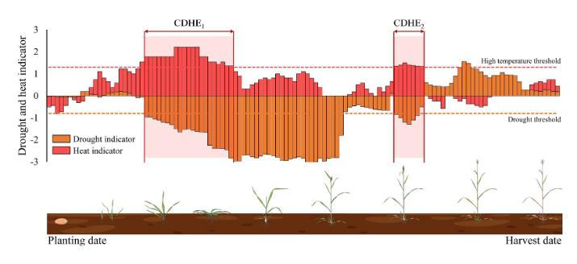
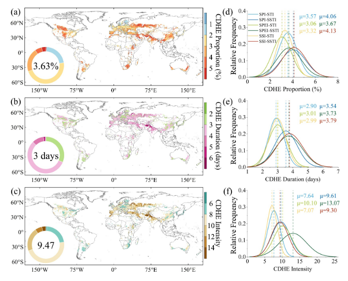
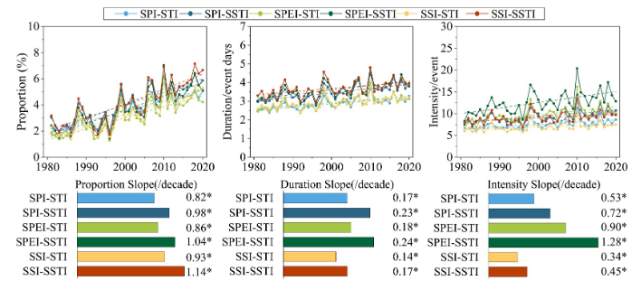
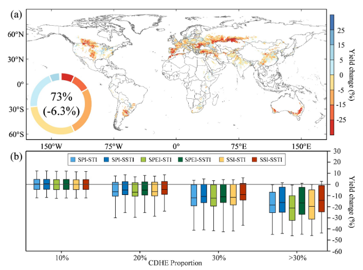
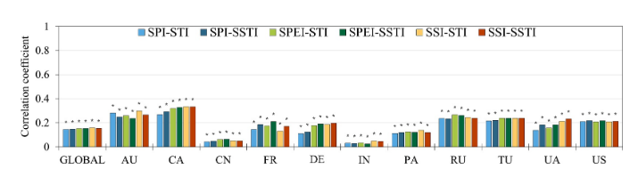

# Multi-Indicator Assessment to Assess the Increasing Impacts of Compound Dry and Hot Events on Global Wheat Yield

## 多指标评估揭示复合干热事件对全球小麦产量的日益加剧影响

---

**文献信息：** Hu, J., Skalsky, R., Zhang, G., Folberth, C., & Shi, P. (2026). *Earth's Future*, **14**, e2025EF007084.

**DOI:** [10.1029/2025EF007084](https://doi.org/10.1029/2025EF007084)

**作者机构：** 北京师范大学 地表过程与灾害风险国家重点实验室; 国际应用系统分析研究所 (IIASA) 生物多样性与自然资源项目 (奥地利); 北京师范大学 减灾与应急管理研究院; 北京师范大学 文理学院 (珠海)

---

## 一、研究背景 / Research Background

### 1.1 核心概念

复合干热事件（CDHE）指干旱与极端高温在时空上的共同发生。本研究围绕三类干旱指标和两类高温指标展开：

| 指标 | 英文 | 缩写 | 物理含义 |
|:---|:---|:---|:---|
| 标准化降水指数 | Standardized Precipitation Index | SPI | 仅基于降水异常，反映气象干旱 |
| 标准化降水蒸散发指数 | Standardized Precipitation Evapotranspiration Index | SPEI | 基于降水−潜在蒸散发(PET)的水分平衡，整合温度效应 |
| 标准化土壤水分指数 | Standardized Soil Moisture Index | SSI | 基于0–7 cm表层土壤水分，反映农业干旱 |
| 标准化温度指数 | Standardized Temperature Index | STI | 基于2m日最高气温，反映近地表大气热异常 |
| 标准化土壤温度指数 | Standardized Soil Temperature Index | SSTI | 基于0–7 cm土壤温度，反映根区土壤热异常 |

三个干旱指标 × 两个高温指标 = **六种CDHE识别组合**：SPI-STI、SPI-SSTI、SPEI-STI、SPEI-SSTI、SSI-STI、SSI-SSTI。

### 1.2 领域研究缺口

复合干热事件对农业的影响已有广泛记录，但存在三个关键方法论缺口：

1. **指标单一性：** 绝大多数研究采用单一的干旱-高温指标组合，缺乏对不同指标组合的**系统性比较**。由于干旱涵盖了气象、水文和农业三种类型，不同类型的指标对复合事件的捕捉能力可能存在本质差异。

2. **时间尺度粗糙：** 现有研究多使用月尺度或季节尺度分析，甚至将月尺度干旱指数与日尺度高温指标混用，无法捕捉生长季内**日尺度复合胁迫的突发性和累积效应**。这对于小麦等关键物候期（抽穗、灌浆）极为短暂的作物尤为致命。

3. **产量影响评估的指标敏感性未知：** 不同指标配对对CDHE-产量关系的评估结果可能产生多大的系统性偏差，至今缺乏全球尺度的量化回答。

> **核心问题意识：** 研究结论在多大程度上依赖于指标选择？如果更换一组指标，CDHE的趋势检测结果和产量影响评估结论是否会显著改变？

### 1.3 CDHE的物理机制

干旱与高温并非独立事件。干旱条件通过减少植被蒸散发的冷却效应，增加地表感热通量，抬升地表和空气温度，形成**陆-气耦合正反馈循环**——干旱与高温相互强化。不同指标捕捉的是这一耦合链上不同环节的信号：SPI看降水输入，SPEI看大气水分平衡（包含温度对蒸散发的需求效应），SSI看土壤终端响应；STI看大气热信号，SSTI看土壤热累积。因此，**指标选择直接决定了观测者从哪个物理视角切入CDHE这一复杂现象**。

---

## 二、关键科学问题 / Key Scientific Questions

本研究的核心科学问题可以凝练为：

> **在1981–2020年间，不同干旱-高温指标组合对全球小麦生长季CDHE的识别结果、演变趋势和产量影响评估存在多大的系统性差异？哪种指标组合更能反映真实的作物胁迫信号？**

具体分解为四个子问题：

1. **时空演变问题：** 全球小麦主产区CDHE的频率、持续时间和强度在1981–2020年间呈现怎样的时空变化趋势？
2. **指标敏感性**（最核心）：六种干旱-高温指标组合在识别CDHE特征（频率、持续时间、强度）上存在怎样的系统性差异？差异的物理机制是什么？
3. **产量响应问题：** CDHE频率与小麦产量异常之间是否存在关键阈值？不同指标组合捕捉产量响应的能力有何差异？
4. **区域异质性问题：** CDHE的产量效应如何随灌溉条件、气候区和春/冬小麦类型变化？

---

## 三、数据与方法 / Data and Methods

本文的方法论核心在于设计了一个**"同一框架、六组并行、系统比较"**的多指标评估体系。它不试图找出"最好的"指标，而是通过系统比较来揭示指标选择对研究结论的深刻影响——这本身就是最重要的科学发现。

### 3.1 核心数据源

| 数据类型 | 数据来源 | 时空分辨率 | 用途 |
|:---|:---|:---|:---|
| 降水、气温、土壤水分(0–7 cm)、土壤温度 | ERA5日再分析 (Hersbach et al., 2023) | 0.25°, 日尺度, 1980–2020 | 构建CDHE指数（所有数据重采样至0.5°） |
| 小麦产量（主） | GDHY (Iizumi & Sakai, 2020) | 0.5°, 年尺度, 1981–2016 | 产量响应分析 |
| 小麦产量（辅） | GlobalCropYield5min (Cao et al., 2025) | 5弧分, 1982–2015 | 填补GDHY数据空缺，以SPAM收获面积为权重合并 |
| 小麦收获面积（雨养/灌溉） | SPAM2010 (Yu et al., 2020) | 5弧分 | 区分灌溉/雨养、面积加权整合 |
| 冬/春小麦分类 | GEOGLAM-BACS (Becker-Reshef et al., 2022) | — | 区分小麦类型 |
| 播种/收获日期 | GGCMI Phase 3作物日历 (Jägermeyr et al., 2021) | 格点尺度 | 界定生长季窗口（分雨养/灌溉） |

**产量去趋势处理：** 为消除技术进步和管理改善的长期趋势，对每个格点的年产量时间序列应用RLOESS（稳健局部估计散点平滑），提取趋势项后计算产量异常百分比：

> YA = (Y − Y<sub>trend</sub>) / Y<sub>trend</sub> × 100%  **(1)**

### 3.2 CDHE指数构建（核心方法之一）

#### 三种干旱指标的日尺度构建

三种干旱指数均采用**30天滑动窗口 + 日尺度标准化**策略，在保持与月尺度指标一致性的同时，显著提升了对生长季内干湿转换的分辨能力：

**SPI（标准化降水指数）：**
- 输入：30天滑动累积降水量（含跨年处理）
- 分布拟合：Gamma分布 + 日特定零降水概率混合
- 标准化：逆正态变换 → 日尺度z-score
- 物理含义：仅反映降水异常，对短期降水波动最敏感

**SPEI（标准化降水蒸散发指数）：**
- 输入：30天滑动的气候水分平衡（P − PET）
- PET估算：Hargreaves方法（仅需温度数据，适合全球应用）
- 分布拟合：Log-logistic分布
- 物理含义：整合了温度驱动的蒸散发需求，能**放大**干热协同信号——因为高温同时增加PET，使SPEI更低

**SSI（标准化土壤水分指数）：**
- 输入：ERA5 0–7 cm表层土壤水分30天滑动平均
- 标准化：Gringorten绘图位置法（非参数，不假设分布形式）
- 物理含义：反映根区实际水分状态，具有固有的**滞后和缓冲效应**

> **SPI计算公式体系（公式2-5，p.4）：** SP<sub>m,i</sub>为30天累计降水，q<sub>i</sub>为零降水概率（Z<sub>i</sub>/M），F<sub>i</sub><sup>d</sup>为含零值的完整CDF（混合Gamma分布），最终通过逆正态变换Φ<sup>−1</sup>得到SPI值。SPEI和SSI的计算步骤详见Supporting Information Text S1。

#### 两种高温指标的日尺度构建

**STI（标准化温度指数）：**
- 输入：3天滑动平均日最高2m气温
- 标准化：Gringorten绘图位置法，按日历日估计参数以适应季节性
- 特点：对**短时热浪**敏感，反映大气热脉冲

**SSTI（标准化土壤温度指数）：**
- 输入：3天滑动平均日最高0–7 cm土壤温度
- 标准化：Gringorten绘图位置法
- 特点：因土壤热惯性，对**持续性热异常**更敏感；近期研究(García-García et al., 2023)表明土壤极端高温可超越气温极值

#### 六种CDHE组合与阈值定义

> **复合干热日定义：** 干旱指数 < −0.8 且 高温指数 > 1.3 。该阈值参考了Mukherjee & Mishra (2021)和Wang et al. (2023)的百分位基准（约20th百分位干旱 + 90th百分位高温）。

六种组合的物理含义形成了一个**2×3的指标矩阵**：

| | **大气热 (STI)** | **土壤热 (SSTI)** |
|:---|:---|:---|
| **降水 (SPI)** | SPI-STI：纯气象视角，最传统 | SPI-SSTI：降水缺+土壤热累积 |
| **水分平衡 (SPEI)** | SPEI-STI：水热平衡+大气热 | SPEI-STI：水热平衡+土壤热，预期强度最高 |
| **土壤水分 (SSI)** | SSI-STI：根区水亏+大气热 | SSI-SSTI：根区水热耦合，预期频率最高 |

**阈值敏感性验证：** 研究在−0.8和1.3的±0.1–0.2范围内扰动阈值，验证CDHE发生率和产量关系保持稳定，确认了所选阈值的农业相关性和时空稳健性（Table S3）。

### 3.3 CDHE事件识别与三维特征量化（核心方法之二）

#### 事件识别框架

- CDHE在**日尺度**上识别，限定于每个格点的**小麦生长季**（播种至收获）
- 连续或孤立的复合干热日均被纳入
- 分别对雨养和灌溉系统的冬/春小麦进行计算，再以面积加权整合



#### 三维特征定义

> **频率 F<sub>i,y</sub>** = N<sup>CDHE</sup><sub>i,y</sub> / N<sup>GS</sup><sub>i,y</sub> × 100% **(6)** —— CDHE天数占生长季总天数的百分比

> **持续时间 D<sub>i,y</sub>** = (1/n<sub>i,y</sub>) Σ L<sup>(j)</sup><sub>i,y</sub> **(7)** —— 年度所有CDHE事件的平均连续天数

> **强度 I<sub>i,y</sub>** = (1/n<sub>i,y</sub>) Σ Σ \|D<sub>i,t</sub>\| × T<sub>i,t</sub> **(8)** —— 每个事件内每日干旱指数绝对值与高温指数乘积的累积和，取年度平均。强度的定义融合了干旱严重程度(\|D\|)和高温程度(T)，以乘积形式捕捉两者的**协同放大**效应

#### 三层面积加权整合（关键方法细节）

这是本研究方法设计的一大精巧之处：

1. **第一层**（灌溉 vs. 雨养）：在同一小麦类型内，用灌溉和雨养的收获面积为权重，加权合并CDHE指标——公式(9)处理冬小麦、(10)处理春小麦
2. **第二层**（冬小麦 vs. 春小麦）：用冬小麦和春小麦的总收获面积为权重，合并得到格点代表值——公式(11)
3. **逻辑意义：** 这一设计避免了将灌溉区和雨养区简单平均带来的信号稀释——灌溉区的土壤水分胁迫信号会被灌溉显著缓冲，若不加权区分，将系统性低估CDHE在雨养区的真实影响

### 3.4 统计验证与产量关系评估（核心方法之三）

#### 多指标一致性统计检验

对六种CDHE定义进行**非参数Friedman检验**（检验总体分布差异），随后进行经**Benjamini-Hochberg FDR校正**的两两比较。这一步确保了多指标框架产生的结果是"可比较的差异"而非"随机的噪声"。

#### CDHE-产量关系分析

> **Pearson相关** r<sub>i</sub> = Σ(V<sub>i,y</sub>−V̄<sub>i</sub>)(Y<sub>i,y</sub>−Ȳ<sub>i</sub>) / √[Σ(V<sub>i,y</sub>−V̄<sub>i</sub>)² · Σ(Y<sub>i,y</sub>−Ȳ<sub>i</sub>)²] **(12)**

对每个格点计算六种组合下CDHE三特征（频率、持续时间、强度）与去趋势产量异常的Pearson r。分析在全球和11国两个层面进行（11国占全球小麦产量70%以上）。

#### 分层暴露-响应分析

将格点-年数据按CDHE频率分为四组（<10%, 10%–20%, 20%–30%, ≥30%），以箱线图展示各暴露水平的产量异常分布。这一步旨在识别是否存在**关键阈值**——超过该阈值后，产量响应由温和转为剧烈。

---

## 四、新发现与新认识 / New Findings

### 发现1：CDHE在全球小麦生长季全面加剧（图2-3）


 
> **图2解析（Fig. 2, p.7）：全球小麦种植区CDHE时空特征。** (a–c) 多指标平均的CDHE频率、持续时间和强度空间分布。CDHE在生长季平均覆盖3.63%的天数，中纬度大陆地区（美国中西部、东欧-西亚谷物带、中亚、华北平原）暴露度显著更高。南亚和西亚的CDHE常持续4–5天，而湿润温带地区多在2–3天内结束。中亚、东欧和西西伯利亚强度超过全球均值(9.47)。(d–f) 六种指标组合的频率分布对比揭示了指标间的系统差异——SSI-SSTI检测到的频率最高(μ=4.13%)，SPEI-STI最低(μ=3.06%)。


> **图3解析（Fig. 3, p.8）：CDHE特征的年际变率与趋势（1981–2020）。** 六个面板展示了各指标组合下频率、持续时间和强度的时间序列，底部条形图为十年趋势斜率，星号(*)标注统计显著(p<0.05)。三特征的趋势范围分别为：频率0.82%–1.14%/十年、持续时间0.14–0.24天/十年、强度0.34–1.28单位/十年。SSTI相关组合的趋势普遍更大，SPEI-SSTI的强度增长最为剧烈(1.28单位/十年)，而SSI相关组合的频率增长更为突出。

### 发现2：六种指标组合的识别结果存在系统性且可解释的差异（图2-3, S7-S9）

这是本文**最核心的方法学发现**。差异并非随机噪声，而是由各指标的物理表征差异系统性地决定：

| 维度 | 最敏感组合 | 最保守组合 | 物理机制 | 倍数差异 |
|:---|:---|:---|:---|:---|
| 频率均值 | SSI-SSTI (4.13%) | SPEI-STI (3.06%) | SSI的土壤水分记忆 + SSTI的热累积效应延长可检测时段 | 1.35× |
| 持续时间均值 | SSI-SSTI (3.79天) | SPI-STI (2.90天) | SSTI反映土壤热惯性，适合识别持续性热异常 | 1.31× |
| 强度均值 | SPEI-SSTI (13.07) | SSI-STI (7.07) | SPEI中PET项放大干热协同信号 | 1.85× |
| 频率趋势 | SSI相关组合 | — | 土壤水分滞后反映长期干旱累积 | — |
| 强度趋势 | SPEI-SSTI (1.28/十年) | SSI-STI (0.34/十年) | 变暖下PET增加→SPEI更低→\|D\|×T更大 | 3.76× |

> **关键警示：** 同一现象（全球CDHE强度趋势）因指标选择不同，趋势估计可相差**3.76倍**。这意味着如果仅使用单一指标组合，无论是高估还是低估CDHE风险，都将直接影响政策制定。

Friedman检验确认了六种定义在所有三维度上的总体差异均统计显著(p<0.05)，且大多数两两比较经FDR校正后仍保持显著(Figure S7)。这排除了"差异仅为抽样误差"的可能性。

### 发现3：10%频率是关键阈值——超过后>70%小麦区出现系统性减产（图5）

> **图5解析（Fig. 5, p.10）：CDHE频率与小麦产量变化的关系。** (a) 高CDHE频率(>10%)下全球小麦种植区产量异常的空间分布——从东欧经西亚谷物带至中亚、北美中部、南美南部和澳大利亚东南部出现大面积系统性的负异常。(b) 不同CDHE频率区间的产量变化箱线图——随着暴露从<10%增加到>30%，所有六种组合的负异常均显著加重。当频率>30%时，SPEI-STI组合导致平均减产21.22%，SSI-STI为19.57%，SPI-STI为18.48%，SSI-SSTI最为保守也达14.18%。

**核心量化结果：**

- CDHE频率超过10%时，约**73%**的全球小麦种植区出现负产量异常，平均异常为**−6.3%**
- CDHE频率从10%增加到>30%的过程中，所有指标组合均显示负产量异常的显著递增
- CDHE年份出现负产量异常的概率(0.67)比单一干旱或高温极端年份高出约**三分之一**（Figure S11）

### 发现4：产量响应的区域异质性极其显著（图6）

> **图6解析（Fig. 6, p.11）：CDHE频率与小麦产量异常的相关系数（全球及11国）。** 全球尺度上所有组合的相关系数集中在0.14–0.16的窄幅，表明**全球层面结论对指标选择稳健**。但国家尺度差异巨大：加拿大相关系数高达0.33（SSI-STI/SSTI, SPEI-SSTI组合），为所有国家之最；澳大利亚紧随其后(0.25–0.30)；俄罗斯、土耳其、乌克兰、美国中等(0.21–0.27)；法国、德国、巴基斯坦偏弱(0.11–0.21)；**中国和印度的所有组合相关系数均<0.07**——广泛灌溉的缓冲效应是最可能的解释。

| 敏感度梯队 | 国家 | CDHE频率-产量r范围 | 关键解释因素 |
|:---|:---|:---|:---|
| **极高** | 加拿大 | 0.25–0.33 | 大面积雨养春小麦，SSI-SSTI捕捉根区胁迫最优 |
| **高** | 澳大利亚 | 0.25–0.30 | 干旱半干旱气候，雨养为主 |
| **中高** | 俄罗斯、土耳其、乌克兰、美国 | 0.21–0.27 | 部分灌溉，区域气候差异大 |
| **低** | 法国、德国、巴基斯坦 | 0.11–0.21 | 气候湿润或指标不完全匹配胁迫路径 |
| **极低** | 中国、印度 | <0.07 | 广泛灌溉大幅缓冲CDHE的直接产量效应 |

### 发现5：指标区域适用性存在明确分工

| 区域类型 | 推荐指标组合 | 机制解释 |
|:---|:---|:---|
| 半干旱雨养区（加拿大、澳大利亚、中亚） | **SSI-SSTI / SPEI-SSTI** | 根区水热耦合直接反映作物胁迫，土壤温度和水分共同限制根系吸水 |
| 中高纬度地区（俄罗斯、西欧） | **SPEI-STI** | 蒸散发+气温指标更好地反映高温叠加干旱的复合效应 |
| 湿润区（降水驱动干旱） | **SPI-STI** | 降水异常即足以表征干旱，方法简洁且数据需求低 |
| 高灌溉区（中国、印度） | — | 灌溉大幅缓冲直接产量效应，需结合灌溉水资源可持续性评估 |

### 发现6：春小麦比冬小麦对CDHE脆弱得多

在共同种植区内的对比表明：春小麦CDHE比例的上升趋势(1.4%/十年)显著陡于冬小麦(0.7%/十年)；春小麦CDHE频率与产量异常的负相关(r=−0.34, p<0.05)强于冬小麦(r=−0.26, p>0.05)。**物候时机是关键：** 春小麦的抽穗灌浆期恰逢夏季干热高峰，而冬小麦关键发育阶段较早，可利用残余土壤水分和补充灌溉的缓冲。

---

## 五、讨论要点 / Discussion Highlights

### 5.1 陆-气耦合反馈是CDHE加剧的物理驱动力

> "Drought conditions reduce the cooling effect associated with vegetation evapotranspiration, increasing surface sensible heat fluxes. This process, in turn, elevates surface and air temperatures, establishing a positive feedback loop whereby drought and heat mutually reinforce each other." (p.11)

干旱降低植被蒸散发冷却→增加地表感热→升温→进一步增强蒸散发需求→加剧干旱。这一正反馈循环在全球变暖背景下被持续强化，解释了为何干旱半干旱区的CDHE趋势最为剧烈。

### 5.2 指标选择的深层物理含义

- **SPI类组合**（仅降水）给出最保守的估计，因为它对温度驱动的水分胁迫"视而不见"
- **SPEI类组合**对强度趋势最敏感，因为PET项在变暖下系统性增加，使SPEI越来越低
- **SSI-SSTI组合**捕捉频率趋势最强，因为土壤水分/温度的记忆效应使得即使在降水正常的短暂间歇，土壤干旱和热胁迫信号仍在持续

### 5.3 灌溉的双面性

灌溉有效缓冲了CDHE对产量的直接影响（解释了中国和印度极低的相关性），但这一缓冲效应在CDHE加剧和地下水枯竭的双重压力下不可持续。研究精确指出："灌溉的缓冲作用需要在水资源可持续性和潜在权衡的背景下审视"。

---

## 六、结论 / Conclusions

### 6.1 核心结论

1. **CDHE全面加剧：** 1981–2020年间全球小麦生长季CDHE的频率、持续时间和强度均显著增加，干旱半干旱区（东欧、中亚、土耳其）最为突出。

2. **指标选择深刻影响结论：** 六种指标组合在CDHE特征识别上存在系统性差异——SSI-SSTI对频率变化最敏感(μ=4.13%)，SPEI-SSTI最能捕捉强度及其趋势(1.28单位/十年)，SPI-STI给出最保守估计。**强度趋势在不同指标间相差可达3.76倍**，这意味着仅依赖单一指标的风险评估可能系统性地高估或低估CDHE威胁。

3. **10%关键阈值：** 当CDHE覆盖超过生长季10%天数，>70%的小麦种植区遭受系统性减产（平均−6.3%）；频率>30%时最严重组合（SPEI-STI）下的减产可超过20%。

4. **强烈的区域异质性：** 加拿大和澳大利亚（雨养主导）的产量对CDHE最为敏感；中国和印度因广泛灌溉而产量响应极低。SSI-SSTI和SPEI-SSTI在雨养干旱区对减产的解释力最强。

### 6.2 学术与实践意义

1. **方法论贡献：** 建立了首个全球尺度CDHE多指标系统比较框架，证明了"指标选择本身就是一个一级不确定源"
2. **农业预警应用：** 10%频率阈值可直接用于CDHE农业风险预警系统设计
3. **模型评估基准：** SPEI-SSTI和SSI-SSTI组合可作为检验气候/地球系统模型（如CMIP6）能否真实再现土壤水热耦合和农业相关复合极端事件的观测基准
4. **适应策略指导：** 区域特异化的指标推荐（如半干旱雨养区使用SSI-SSTI）可直接指导农业监测系统的优化

### 6.3 局限性

- 未纳入**VPD（水汽压差）**等植物生理胁迫指标——VPD已被证明能更直接捕捉大气干燥对气孔导度和光合作用的效应，将其整合入CDHE框架可能进一步提升生理相关性和产量解释力
- 采用**统一绝对阈值**（−0.8/1.3），虽有利于跨区域比较，但可能忽略了各地气候背景和品种敏感性的差异——动态百分位阈值值得探索
- **年产量数据**限制了对关键物候期阶段特异性影响的分析——未来耦合作物生长模型（如EPIC-IIASA）和CMIP6情景数据，可实现对CDHE影响的阶段特异性量化和未来风险预估

---

## 七、研究亮点 / Research Highlights

| 序号 | 亮点 | 说明 |
|:---|:---|:---|
| 1 | **首创多指标系统比较框架** | 全球首次在统一日尺度框架下系统比较六种干旱-高温组合，将"指标选择"本身作为研究对象而非先验假设 |
| 2 | **日记尺度精细识别** | 30天滑动干旱指标+3天滑动高温指标，可在生长季内分辨短期复合胁迫的累积效应，填补了月/季尺度分析的精细度缺口 |
| 3 | **三层加权整合设计** | 灌溉/雨养→冬/春小麦→格点的逐层面积加权，保留了水管理和物候的信号差异而非简单混合稀释 |
| 4 | **引入土壤温度视角** | SSTI（土壤温度）与SSI（土壤水分）的组合提供了"根区双胁迫"的独特表征角度，切合最新研究发现(García-García et al., 2023) |
| 5 | **发现10%关键阈值** | CDHE暴露超过生长季10%即触发大面积减产——该阈值可直接服务于农业预警设计 |
| 6 | **双重统计验证** | Friedman检验+FDR校正验证指标间差异的统计显著性，阈值扰动分析验证定义稳健性，在方法论层面建立了高标准的验证流程 |
| 7 | **空间显式的指标推荐** | 针对不同气候区和灌溉条件给出差异化的最优指标组合推荐，可直接指导农业监测实践 |

---

## 八、方法流程总图

```
多源数据输入
  ├── ERA5日再分析(降水/气温/土壤水分/土壤温度) → 重采样至0.5°
  ├── 小麦产量(GDHY + GlobalCropYield5min) → RLOESS去趋势 → YA
  ├── 小麦分布(SPAM2010) → 雨养/灌溉面积权重
  ├── 小麦类型(GEOGLAM-BACS) → 冬/春小麦分类
  └── 作物日历(GGCMI Phase 3) → 生长季窗口界定

干旱指标构建 (30天滑动窗口 + 日尺度标准化)
  ├── SPI — 30天累积降水 → Gamma分布+零值混合 → 逆正态变换
  ├── SPEI — 30天(P−PET) → Log-logistic分布 → 逆正态变换
  └── SSI — 30天平均0–7cm土壤水分 → Gringorten法 → 标准化

高温指标构建 (3天滑动窗口 + 日尺度标准化)
  ├── STI — 3天平均日最高2m气温 → Gringorten法
  └── SSTI — 3天平均日最高0–7cm土壤温度 → Gringorten法

六种CDHE组合 (阈值: 干旱<−0.8, 高温>1.3, 经敏感性分析验证)
  ├── SPI-STI  │ ├── SPI-SSTI  │ ├── SPEI-STI
  ├── SPEI-SSTI │ ├── SSI-STI   │ └── SSI-SSTI

三层面积加权整合
  ├── 第一层: 灌溉/雨养加权 → 公式(9)(10)
  └── 第二层: 冬/春小麦加权 → 公式(11)
  └── 产出格点尺度三特征: 频率(6), 持续时间(7), 强度(8)

统计验证与比较分析
  ├── Friedman检验 + B-H FDR校正 → 指标间差异显著性验证
  ├── 全球时空格局 (Fig. 2-3)
  ├── 11国区域差异 (Fig. 4)
  ├── CDHE-产量Pearson相关 (Fig. 6)
  ├── 分层暴露-响应分析 (Fig. 5)
  └── 阈值敏感性分析 (Table S3)

结论输出
  ├── SSI-SSTI: 频率最敏感 (4.13%), 推荐半干旱雨养区
  ├── SPEI-SSTI: 强度趋势最强 (1.28/十年), 推荐中高纬度
  ├── 10%阈值: >70%小麦区减产, 平均−6.3%
  └── 灌溉: 中国/印度产量响应极低(<0.07), 但可持续性存疑
```

