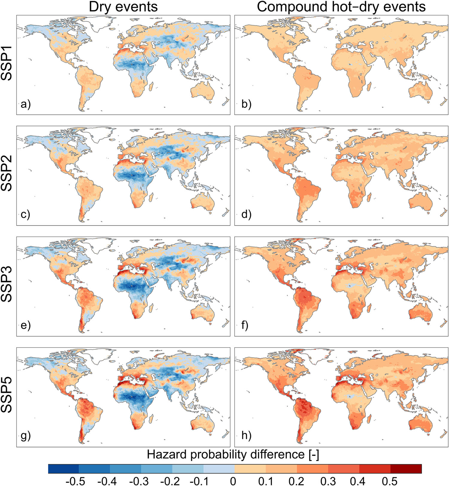
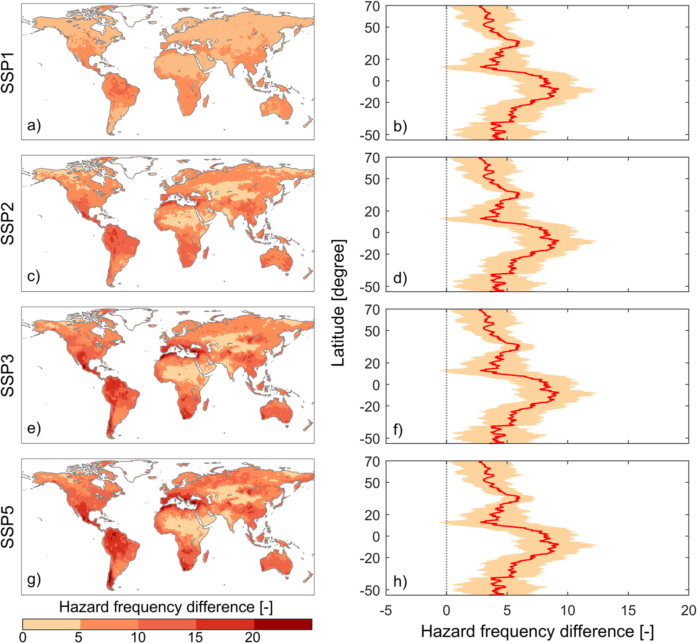
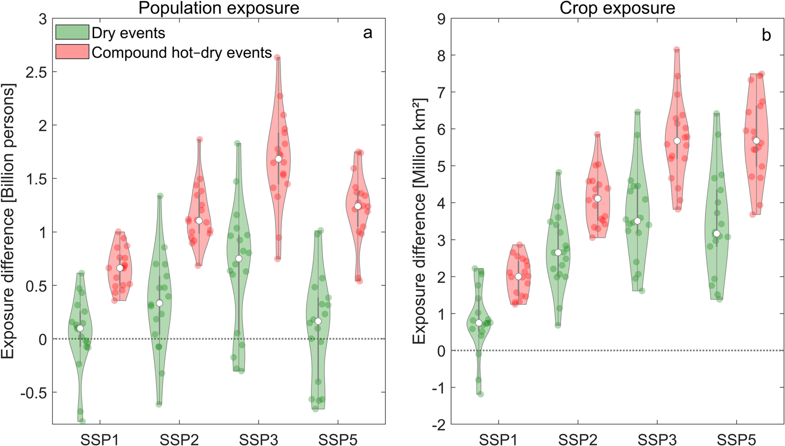
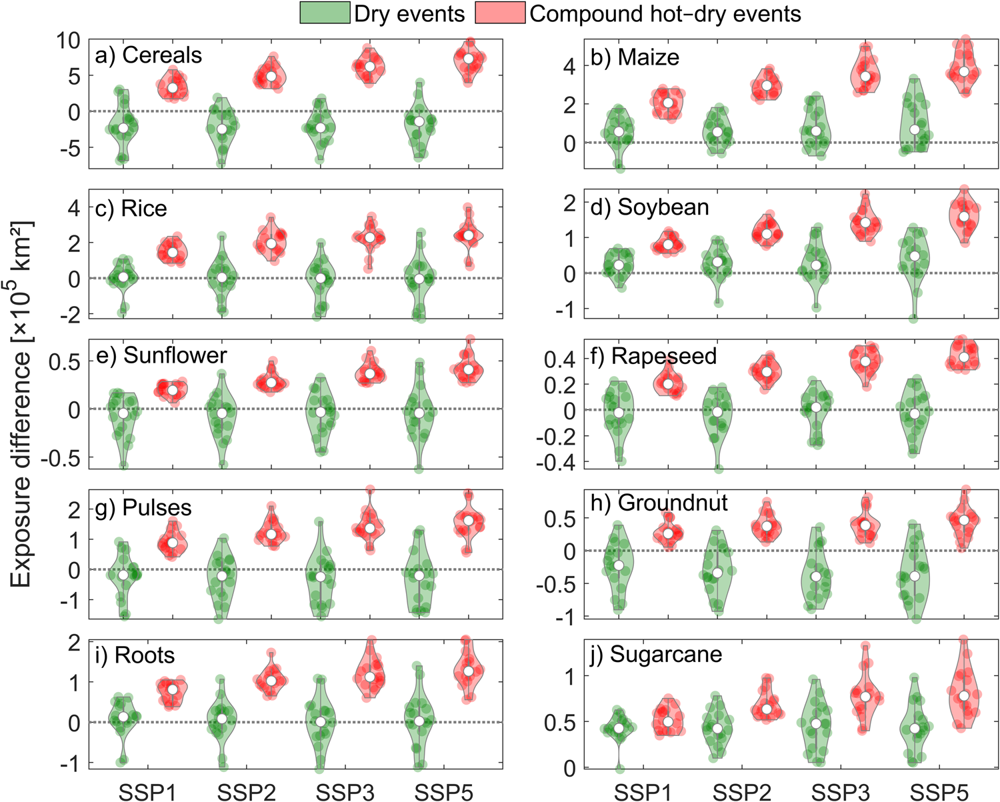
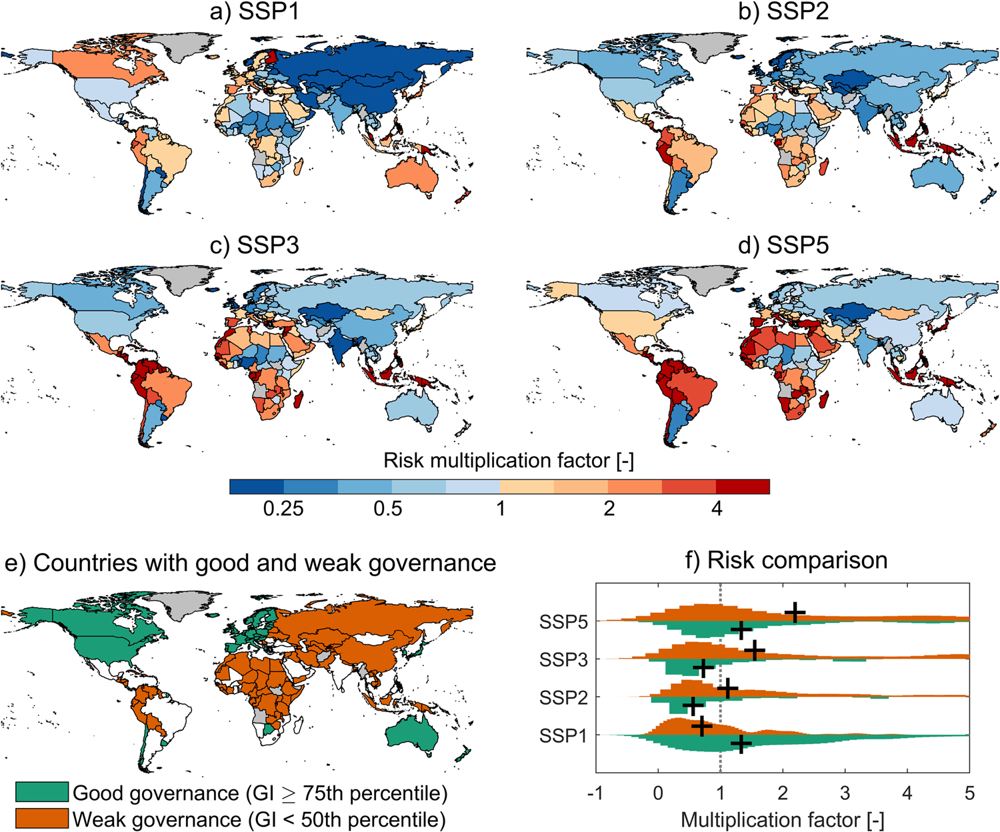
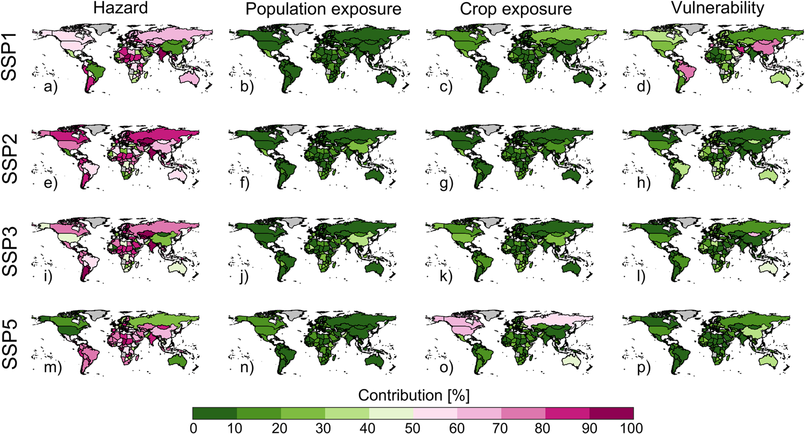

# Global Risk Assessment of Compound Hot-Dry Events in the Context of Future Climate Change and Socioeconomic Factors

## 全球复合干热事件风险评估——基于未来气候变化与社会经济因素

---

**文献信息：** Tabari, H., & Willems, P. (2023). *npj Climate and Atmospheric Science*, **6**, 74.

**DOI:** [10.1038/s41612-023-00401-7](https://doi.org/10.1038/s41612-023-00401-7)

**作者机构：** 鲁汶大学土木工程系 (比利时); 比利时皇家气象研究所气象与气候研究部; 安特卫普大学应用工程学院 (比利时)

---

## 一、研究背景 / Research Background

### 1.1 核心概念

**复合干热事件（compound hot-dry events）** 指高温与干旱在时空上同时或相继发生的复合极端事件。本研究的核心框架围绕风险三角的三个维度展开：

| 维度 | 英文 | 含义 | 本研究量化方式 |
|:---|:---|:---|:---|
| 灾害 | Hazard | 极端气候事件的发生概率与强度 | CMIP6多模式模拟的复合干热事件概率 |
| 暴露度 | Exposure | 人员和资产处于灾害影响范围内的程度 | 人口密度 + 耕地比例（含10种主要作物） |
| 脆弱性 | Vulnerability | 系统对灾害影响的敏感性与应对能力 | 治理指标（GI）：人均GDP + 高等教育比例 + 教育性别差距 |

> **风险 = 灾害概率 × 暴露度 × 脆弱性**

在既往研究中，复合事件风险评估通常仅考虑灾害和暴露度两个维度，**脆弱性往往被忽略**——这正是本研究试图填补的关键空白。

### 1.2 问题的严重性：为什么关注复合干热事件？

干旱和热浪在近几十年已导致全球**40%**的灾害相关死亡（WMO, 2021）。当两者同时发生时，其破坏力远超单一事件：

- **2010年俄罗斯复合事件：** 死亡人数55,000人
- **2018年欧洲复合事件：** 经济损失约33亿欧元
- **2022年欧洲夏季复合事件：** 作物减产16%

> **核心逻辑：** 复合胁迫超越了自然和人类系统同时应对干旱+高温的联合承载能力，将社会经济系统推向临界点。

### 1.3 领域研究缺口

1. **从单一灾害到复合事件：** 既往全球风险评估多聚焦于单一干旱或单一热浪，可能**系统性低估**了极端条件的真实风险。

2. **干旱指标的选择偏差：** 大多数研究使用**降水**定义干旱（气象干旱），但土壤湿度能更直接地反映陆-气耦合、植被生理响应和农业水分胁迫——未来全球变暖下**土壤湿度的干旱化信号比降水更强**。

3. **脆弱性维度的缺失：** 少数已有全球复合干热事件研究仅关注暴露度变化，未考虑脆弱性（即不同国家的应对能力差异）在塑造风险中的关键作用。

---

## 二、关键科学问题 / Key Scientific Questions

本研究的核心科学问题可以凝练为：

> **在SSP1–SSP5四种未来情景下，全球复合干热事件的风险将如何变化？灾害、暴露度和脆弱性分别贡献多少？治理能力的差异是否会导致风险的系统性分化？**

具体分解为四个子问题：

1. **灾害变化问题：** 气候变化对复合干热事件发生概率和频率的影响，与单一干旱事件相比有何差异？
2. **暴露度量问题：** 未来人口和耕地的暴露度将增加多少？不同作物类型的暴露差异如何？
3. **风险驱动分解问题（最核心）：** 将风险变化分解为灾害、人口暴露、作物暴露和脆弱性四个因子，各国的主导驱动因素是什么？
4. **治理效应问题：** 良好治理与弱治理国家之间的风险增幅是否存在系统性差异？

---

## 三、数据与方法 / Data and Methods

本文的方法论核心在于设计了一个**"灾害-暴露-脆弱性三维集成、风险驱动因素可分解"**的全球风险评估框架。

### 3.1 核心数据源

| 数据类型 | 数据来源 | 时空分辨率 | 用途 |
|:---|:---|:---|:---|
| 月土壤湿度、气温 | CMIP6 (18个GCMs) | 各模型原生网格, 1971–2100 | 构建复合干热事件（灾害） |
| 历史人口密度 | HYDE3.2 数据库 | 0.5°×0.5°, 年尺度, 2005 | 暴露度基准 |
| 未来人口预测 | GPWv3 + SSP国家人口预测 | 0.5°×0.5°, 年尺度, 2085 | SSP情景暴露度 |
| 耕地比例 | AIM-SSP/RCP 排放与土地利用数据集 | 0.5°×0.5°, 2005 & 2085 | 耕地暴露度 |
| 10种作物分布 | MAgPIE 土地利用模型 | 0.5°×0.5°, 2005 & 2085 (SSP2) | 作物类型暴露度细化 |
| 治理指标 (GI) | Andrijevic et al. (2020) *Nat. Sustain.* | 国家尺度, 2005 & 2085 | 脆弱性/应对能力代理 |

> **四种SSP情景对应的世纪末升温（CMIP6集合中位数）：** SSP1 → 2.2°C | SSP2 → 3.3°C | SSP3 → 4.3°C | SSP5 → 5.1°C

### 3.2 灾害量化方法（核心方法之一）

#### 标准化指数构建

使用**标准化土壤湿度指数（SSI）** 和**标准化温度指数（STI）** 分别定义干旱和高温事件：

- **SSI：** 月土壤湿度 → Gringorten绘图位置公式 P = (i − 0.44)/(n + 0.12) → 边际概率 → 标准正态逆变换
- **STI：** 月气温 → 同上标准化流程
- **关键设计：** 对全时段（1971–2100）统一估计边际概率，以捕捉气候变化引起的趋势和非平稳性

#### Copula依赖结构建模

使用二元Copula函数量化每个格点干-热事件之间的依赖结构：

| Copula类型 | 族 | 尾部依赖特征 | 用途 |
|:---|:---|:---|:---|
| Gaussian | Elliptical | 无尾部依赖 | 主分析 |
| Gumbel | Archimedean | 上尾依赖 | 稳健性检验 |
| Clayton | Archimedean | 下尾依赖 | 稳健性检验 |

> 三种Copula的结果空间格局和量级高度一致，结论对Copula选择不敏感。

参数估计采用极大似然法。联合概率经标准正态变换后得到标准化复合干热事件指数。

#### 复合事件定义

> **复合干热事件阈值：** 标准化联合概率 < −0.5 。该阈值保证了历史和未来时期足够的样本量（40年 × 12月 = 480个月），减少小样本拟合误差。

边际阈值设置为 −0.8（SSI和STI），略高于联合阈值，以纳入在二元分布上极端但并非在两个边际上均极端的事件。

#### 信噪比检验

- **信号：** CMIP6 18个模式的变化中位数（强迫响应）
- **噪声：** 模式间标准差（内部变率）
- **显著性：** |信噪比| > 0.54 对应 5%显著性水平（n=18的 t 检验）

### 3.3 风险评估框架（核心方法之二）

#### 暴露度计算

- **人口暴露度 =** 格点人口数 × 格点灾害概率
- **耕地暴露度 =** 格点耕地面积(km²) × 格点灾害概率（通过球面三角学将百分比转为km²）
- **综合暴露度 =** 人口暴露度（min-max归一化至0.05–0.95）与耕地比例（同样归一化）的集成

#### 脆弱性代理

使用**治理指标（Governance Indicator, GI）**作为脆弱性和应对能力的代理变量：

- GI由三个维度合成：人均GDP + 高等教育人口比例 + 受教育年限的性别差距
- 脆弱性 = 1 − GI（治理越弱，脆弱性越高）
- 覆盖历史期和各SSP情景的2085年

> **GI的物理逻辑：** 治理质量和效率在极端事件发生后的**即时应对**以及国家的**长期气候脆弱性和适应能力**中均起决定性作用（Andrijevic et al., 2020; Harrington et al., 2021）。

#### 风险分解方法

> **风险倍增因子 =** 未来风险 / 历史风险 = f(灾害变化, 暴露度变化, 脆弱性变化)

将风险倍增因子**分解为四个因子的贡献**，分别量化各国灾害、人口暴露、作物暴露和脆弱性对风险变化的相对重要性——这为制定差异化的适应优先策略提供了定量依据。

#### 对比分析：单一 vs. 复合

在所有分析中并行计算单一干旱事件和复合干热事件的风险指标，以量化仅关注单一事件将导致的**风险低估程度**。

---

## 四、新发现与新认识 / New Findings

### 发现1：复合事件几乎覆盖全球所有陆地——与单一事件形成鲜明对比（图1）



> **图1解析（Fig. 1, p.2）：CMIP6多模式中位数显示的2061–2100年与1971–2010年间发生概率差异的空间格局。** (a, c, e, g) 单一干旱事件；(b, d, f, h) 复合干热事件。**核心对比：** 单一干旱事件发生概率增加仅覆盖全球约**50%**的陆地，而复合干热事件几乎覆盖**99.3%–99.8%**——两者相差近一倍。地中海、西欧和中欧、中南美洲、南部非洲和东亚的增加幅度最大且统计最显著（信噪比 > 3）。

| 对比维度 | 单一干旱事件 | 复合干热事件 | 倍数差异 |
|:---|:---|:---|:---|
| 概率增加的全球陆地面积 | 47.6%–53% | 99.3%–99.8% | ~2× |
| 概率增幅的全球中位数 | 0.05–0.10 | 0.09–0.17 | ~1.7× |
| 信噪比 | 较低 | 较高（气候变化信号更强） | — |

> **物理机制：** 复合事件的大面积增加由两个因素驱动：(1) 干旱和高温极端事件概率的双重增加；(2) 陆-气反馈的放大导致温度与土壤湿度的耦合增强。在高纬度地区，干旱概率的下降趋势部分抵消了高温增加趋势，因此复合事件增幅较弱。

### 发现2：复合干热事件频率将增加4–10倍——南半球热带增幅最大（图2）



> **图2解析（Fig. 2, p.3）：复合干热事件频率变化的空间格局与纬度分布。** (a, c, e, g) 2061–2100年与1971–2010年频率差异的空间分布；(b, d, f, h) 纬度分布（线为中位数，阴影为±1标准差）。**核心结果：** SSP1–SSP5下频率增幅分别为4倍、7倍、9倍、10倍。南半球热带和亚热带纬度带增幅最大，且不同GCM之间的一致性较高（阴影较窄）。

### 发现3：额外7–17亿人将暴露于复合事件——SSP3最严峻（图3）



> **图3解析（Fig. 3, p.4）：总人口(a)和总耕地(b)暴露度变化比较。** 绿点为单一干旱事件（18个GCM的各自结果），红点为复合干热事件，白点为集合中位数。**核心结果：** 复合事件导致的人口暴露度增幅（7–17亿人）远超单一事件（1–8亿人）。SSP3情景下最为严峻——17亿额外人口暴露——归因于该情景下最高的人口增长和较大的不平等。

> **SSP3的警示意义：** 在SSP3的"区域竞争"路径下（高不平等、弱国际合作），世界最贫困人口——特别是撒哈拉以南非洲和南亚——将承受**不成比例**的复合事件冲击。这与IPCC 1.5°C特别报告的结论一致。

### 发现4：所有作物类型均受威胁——玉米、水稻、豆类最脆弱（图4）



> **图4解析（Fig. 4, p.4）：10种作物对单一和复合事件暴露度变化的比较。** 复合事件对所有作物的影响均大于单一事件。**暴露度增幅排序：** 玉米 > 水稻 > 豆类 > 大豆 > 根茎类 > 甘蔗 > 向日葵、油菜籽、花生（增幅最小）。谷类作物在单一与复合事件之间的暴露度差异最大——撒哈拉以南非洲、阿根廷和印度是谷类种植面积扩大最显著的区域。

> **农业影响机制：** 水分胁迫下作物关闭气孔以节水 → 碳吸收降低 → 光合作用下降 → 减产。高温胁迫同时增加水分需求 → 叠加效应导致产量急剧下降 (Lesk et al., 2021)。

**区域层面的粮食安全隐忧：**

| 关键区域 | 主要作物风险 | 脆弱性背景 |
|:---|:---|:---|
| 撒哈拉以南非洲 | 玉米、根茎类面积大幅扩张 + CDHE暴露增加 | 全球粮食不安全人口最多，应急规划不足 |
| 南美（巴西、阿根廷） | 玉米暴露度大幅增加 | 世界第三、第四大玉米生产国 |
| 印度 | 水稻暴露度增加（占全球稻米1/4） | 季风依赖型农业，灌溉地下水压力 |

### 发现5：弱治理国家的风险增幅是良好治理国家的两倍（图5）



> **图5解析（Fig. 5, p.5）：复合干热事件风险因子的空间格局与治理差异。** (a–d) 各国风险倍增因子的空间分布（SSP1–SSP5）；(e–f) 良好治理 (GI>0.75) 与弱治理 (GI<0.5) 国家的风险因子比较。**核心发现：** 157个国家中，72–112个（取决于情景）面临风险上升；11–55个国家的风险将增加**四倍以上**。加勒比国家（牙买加、特立尼达和多巴哥、波多黎各）是所有情景下受影响最严重的国家。

| 治理水平 | SSP2 | SSP3 | SSP5 |
|:---|:---|:---|:---|
| 良好治理 (GI > 0.75) | 0.6 | 0.7 | 1.3 |
| 弱治理 (GI < 0.5) | 1.2 | 1.6 | 2.2 |
| **差距** | **2.0×** | **2.3×** | **1.7×** |

> **政策含义：** 治理能力是将相同的物理灾害暴露转化为不同社会结果的**关键调节器**。基础设施、社会和经济能力的不足使弱治理国家在灾害面前更为脆弱。

### 发现6：灾害是风险变化的主导因素，但各国差异巨大（图6）



> **图6解析（Fig. 6, p.6）：各国风险变化的驱动因素贡献分解。** (a, e, i, m) 灾害；(b, f, j, n) 人口暴露度；(c, g, k, o) 作物暴露度；(d, h, l, p) 脆弱性。**核心发现：** 灾害的全球平均贡献为55%–69%，是风险变化的首要驱动因素。脆弱性第二重要（14%–35%），但在个别国家可贡献**超过90%**。人口和作物暴露度的全球贡献最低，但在个别国家可贡献高达**66%**。

| 驱动因素 | 全球平均贡献 (SSP1→SSP5) | 国别范围 | 随SSP变化趋势 |
|:---|:---|:---|:---|
| 灾害 | 55% → 69% | 数%–近100% | ↑ 随SSP升高而增加 |
| 脆弱性 | 35% → 14% | >90%（个别国家） | ↓ 随SSP升高而降低 |
| 人口暴露 | 全球均值最低 | 高达66%（个别国家） | ↑ 略增 |
| 作物暴露 | 全球均值最低 | 高达66%（个别国家） | ↑ 略增 |

> **关键启示：** 忽视任何一个风险要素都将导致风险的高估或低估，进而误导政策响应。各国必须根据自身的风险驱动因素特征制定差异化策略——对于灾害主导国，减排和适应并重；对于脆弱性主导国，优先投资于治理能力和制度建设。

---

## 五、讨论要点 / Discussion Highlights

### 5.1 为什么是土壤湿度而非降水？

> "Soil moisture represents water deficits at each location as a function of meteorological conditions, landscape topography, soil characteristics, and crops' physiology. Moreover, future global warming is expected to cause a more widespread and intense drying signal for soil moisture than precipitation." (p.1)

使用土壤湿度而非传统降水的理由有三：

1. **物理完整性：** 土壤湿度整合了陆面过程、大气需求和植被生理的相互作用，降水指标忽视了这些核心过程
2. **信号强度：** 未来变暖下土壤湿度的干旱化信号比降水更广泛、更强烈（Cook et al., 2020）
3. **农业相关性：** 土壤湿度直接关联作物根区水分胁迫，对农业影响评估尤其关键

### 5.2 复合事件与单一事件差距的物理驱动

复合干热事件发生概率覆盖全球~100%陆地（vs. 单一干旱的~50%）的驱动机制：

> **双重驱动：** (1) 全球变暖导致高温极端事件概率的**全球性普增**；(2) 陆-气反馈的增强使温度-土壤湿度耦合更加紧密——干旱减少蒸散发冷却 → 增加感热 → 升温 → 进一步增强蒸散发需求 → 加剧干旱（正反馈循环）。

### 5.3 治理的杠杆效应

弱治理国家风险增幅是良好治理国家的约两倍，其政策逻辑链为：

> **教育** + **经济发展** → 治理效率提升 → 更强的应对能力 → 更低的风险

促进经济增长可释放对气候适应、研发、经济多元化、教育和灾害意识的投资空间。国际合作至关重要——高能力国家应通过技术转让、财政援助和能力建设支持弱治理国家。

---

## 六、结论 / Conclusions

### 6.1 核心结论

1. **复合事件全面超越单一事件：** 复合干热事件发生概率增加覆盖全球**99.3%–99.8%**陆地（vs. 单一干旱~50%），未来频率增加**4–10倍**，暴露人口额外增加**7–17亿**。

2. **治理是风险分化的关键杠杆：** 弱治理国家的风险增幅是良好治理国家的**约两倍**。SSP3（高不平等）情景下，全球最贫困人口承受不成比例的复合事件冲击。

3. **灾害是主导因素但不应忽视其他维度：** 灾害全球平均贡献55%–69%，但脆弱性在个别国家贡献可超90%，暴露度贡献可达66%——**忽略任何维度都将导致风险误判**。

4. **所有主要作物均面临威胁：** 玉米、水稻和豆类是受影响最大的作物，撒哈拉以南非洲、南美和印度是最脆弱的农业产区。

5. **区域异质性要求差异化策略：** 风险驱动因素的国家间差异要求"一刀切"式政策让位于基于各国主导风险因子的精准适应投资。

### 6.2 学术与实践意义

1. **方法论贡献：** 首次建立全球尺度的三维（灾害-暴露-脆弱性）复合干热事件风险评估框架，实现了风险驱动因素的可分解量化
2. **政策工具价值：** 为各国提供了"风险诊断"工具——可定量确定需要多大程度上改善每个风险要素以减缓复合事件的不利影响
3. **适应优先级：** 明确了不同国家的主导风险驱动因素，可直接指导适应投资的优先级排序

### 6.3 局限性

1. **脆弱性指标单一：** 仅使用治理指标（GI）作为脆弱性代理，未涵盖灌溉基础设施、早期预警系统、健康保障等复合事件特有的脆弱性维度。作者在讨论中明确指出应开发专门针对复合干热事件的脆弱性指数。

2. **国家尺度空间分辨率：** 风险分析在国家层面汇总，可能掩盖大型发展中国家的次国家异质性——中国、印度、巴西等国内部的社会经济差异极大。

3. **静态脆弱性假设：** 未考虑适应措施的动态反馈——经历复合事件后，国家可能增加灌溉投资（改变脆弱性）或人口可能迁出高风险区（改变暴露度）。

4. **未设定全球变暖水平（GWL）目标：** 未来研究应在1.5°C和2°C等巴黎协定温升目标下评估风险，以直接服务政策决策。

5. **代码可获取性：** 代码"可应要求从通讯作者处获取"，但未开源发布，可能影响结果的完全复现性。

---

## 七、研究亮点 / Research Highlights

| 序号 | 亮点 | 说明 |
|:---|:---|:---|
| 1 | **首次三维风险集成** | 全球首次将灾害、暴露度、脆弱性三个维度同时纳入复合干热事件风险评估，超越既往仅关注灾害或灾害+暴露度的研究 |
| 2 | **风险驱动因素可分解** | 将风险倍增因子分解为四个独立贡献因子（灾害、人口暴露、作物暴露、脆弱性），为差异化适应策略提供定量依据 |
| 3 | **土壤湿度替代降水** | 使用SSI而非SPI定义干旱，更准确地反映陆-气耦合和作物生理胁迫，响应了"未来土壤干旱化信号强于降水"的最新研究共识 |
| 4 | **系统比较单一vs.复合** | 在所有分析中并行量化单一和复合事件，以具体数字揭示了"仅关注单一事件将严重低估风险" |
| 5 | **治理指标的创新应用** | 将Andrijevic et al. (2020)的SSP治理指标引入复合事件风险分析，揭示了治理水平对风险的系统性调节效应（约2倍差距） |
| 6 | **Copula稳健性验证** | 使用三种Copula（Gaussian、Gumbel、Clayton）并行分析并报告结果一致性，在方法论层面建立了高标准的稳健性检验 |
| 7 | **作物类型细化** | 将耕地暴露度分解至10种主要作物，为农业适应策略（如品种选择、种植区调整）提供了作物特异性的决策信息 |

---

## 八、方法流程总图

```
数据输入
  ├── CMIP6 18个GCMs (1971–2100): 月土壤湿度 + 月气温
  ├── HYDE3.2 / GPWv3: 历史与未来(SSP)人口密度 (0.5°)
  ├── AIM-SSP/RCP: 耕地比例与未来扩张 (0.5°)
  ├── MAgPIE: 10种作物分布 (0.5°, SSP2)
  └── Andrijevic et al. (2020): 治理指标GI (国家尺度, 各SSP)

灾害量化 ── Copula框架
  ├── SSI: 月土壤湿度 → Gringorten → 边际概率 → 正态变换
  ├── STI: 月气温 → Gringorten → 边际概率 → 正态变换
  ├── 二元Copula (Gaussian/Gumbel/Clayton) → 联合概率
  ├── 联合概率 → 逆正态变换 → 标准化复合干热指数
  └── 阈值: 联合概率 < −0.5 (边际 < −0.8)
      └── 发生概率 = N_event / 480个月

对比分析
  ├── 单一干旱事件 (SSI < −0.8)
  └── 复合干热事件 (SSI < −0.8 且 STI > 0.8)

暴露度计算
  ├── 人口暴露 = 人口 × 灾害概率 (格点尺度 → 国家汇总)
  ├── 耕地暴露 = 耕地面积 × 灾害概率 (球面三角学转换)
  ├── 综合暴露 = 归一化人口暴露 + 归一化耕地比例
  └── 10种作物分别计算 (SSP2土地利用)

风险与分解
  ├── 脆弱性 = 1 − GI
  ├── 风险 = 归一化灾害 × 综合暴露 × 脆弱性
  ├── 风险倍增因子 = Risk_future / Risk_historical
  └── 分解 ──→ 灾害贡献 + 人口暴露贡献 + 作物暴露贡献 + 脆弱性贡献

稳健性检验
  ├── 三种Copula (Gaussian/Gumbel/Clayton) 并行比较
  ├── 信噪比检验 (|S/N| > 0.54 → p < 0.05)
  └── 阈值的敏感性分析

结论输出
  ├── 发现1: 复合事件覆盖~100%全球陆地 (vs. 单一~50%)
  ├── 发现2: 频率增加4–10倍, 南半球热带最剧烈
  ├── 发现3: 额外7–17亿人暴露, SSP3最严峻
  ├── 发现4: 玉米/水稻/豆类最脆弱, 撒哈拉以南非洲风险最高
  ├── 发现5: 弱治理国家风险增幅≈良好治理国家的2倍
  └── 发现6: 灾害主导(55%–69%), 脆弱性国别差异极大(>90%个别)
```

