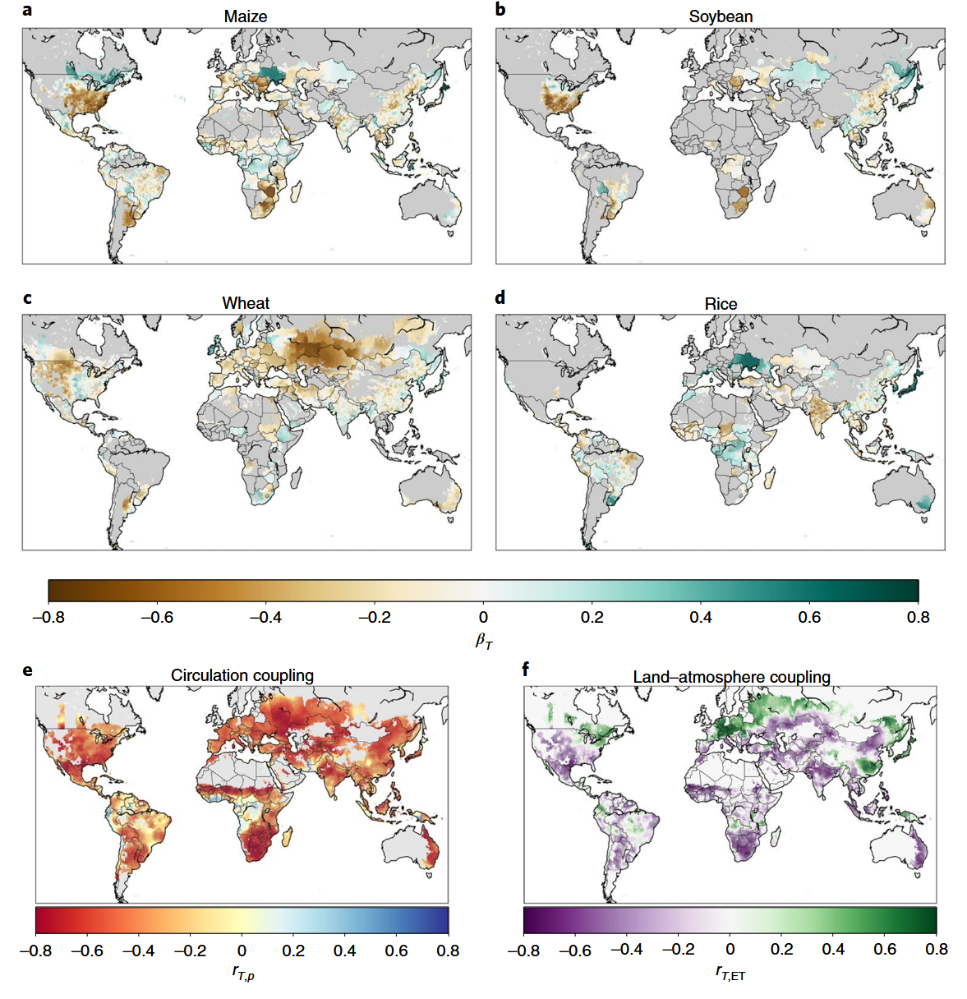
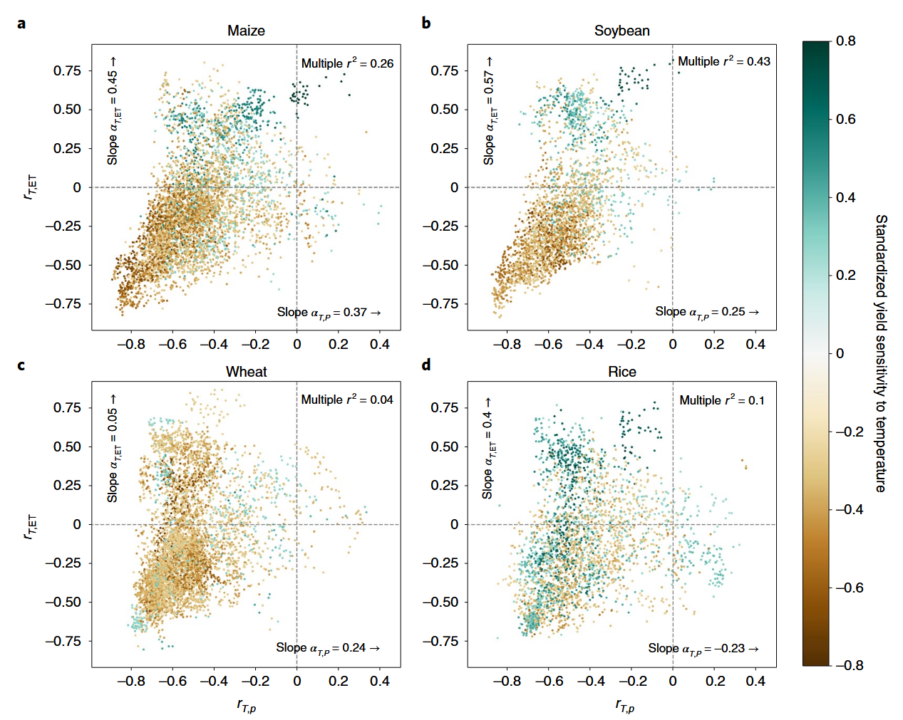
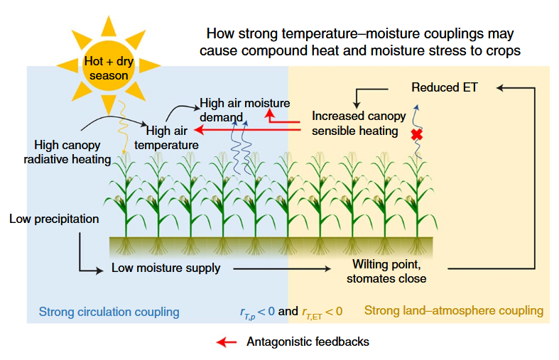
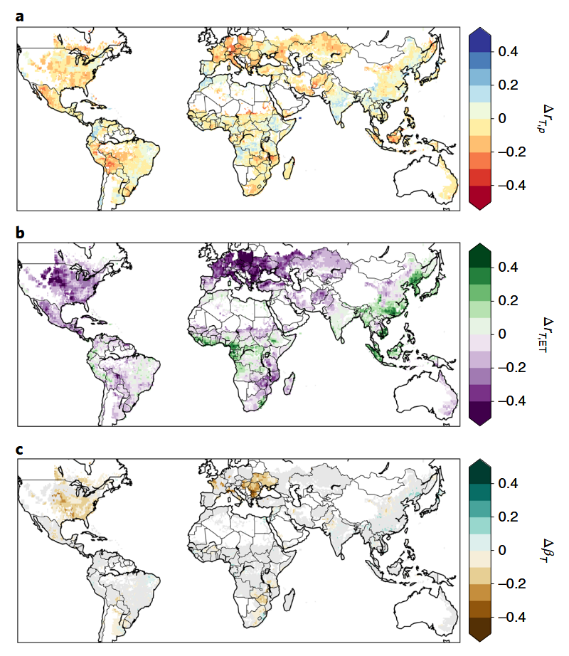
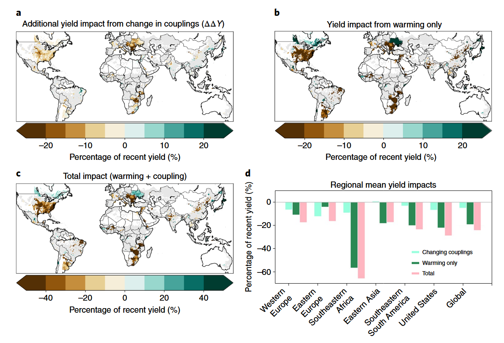
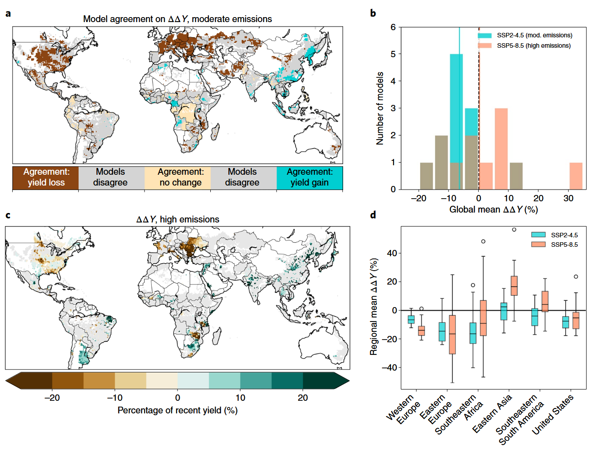

# Stronger Temperature–Moisture Couplings Exacerbate the Impact of Climate Warming on Global Crop Yields

## 更强的温-湿耦合加剧了气候变暖对全球作物产量的影响

---

**文献信息：** Lesk, C., Coffel, E., Winter, J., Ray, D., Zscheischler, J., Seneviratne, S. I., & Horton, R. (2021). *Nature Food*, **2**, 683–691.

**DOI:** [10.1038/s43016-021-00341-6](https://doi.org/10.1038/s43016-021-00341-6)

**作者机构：** 哥伦比亚大学拉蒙特-多尔蒂地球观测站; 哥伦比亚大学地球与环境科学系; 雪城大学地理与环境系; 达特茅斯学院地理系; 明尼苏达大学环境研究所; 伯尔尼大学气候与环境物理研究所 (瑞士); ETH苏黎世大气与气候科学研究所 (瑞士)

---

## 一、研究背景 / Research Background

### 1.1 核心概念

本文提出并系统验证了一个关键机制：**气候系统中的温度-湿度耦合（temperature–moisture couplings）决定了作物对高温的敏感程度**。研究定义了两类温-湿耦合：

| 耦合类型 | 英文 | 指标 | 物理含义 | 主导过程 |
|:---|:---|:---|:---|:---|
| 大气环流耦合 | Circulation coupling | r<sub>T,p</sub>：温度与降水的年际相关 | 高温季节是否也偏干（少雨、晴天多、太阳辐射强） | 大尺度环流异常（副高控制、晴空辐射加热、干热空气输送） |
| 陆-气相互作用耦合 | Land–atmosphere coupling | r<sub>T,ET</sub>：温度与蒸散发的年际相关 | 高温季节蒸散发是否减少（土壤变干、感热增加形成正反馈） | 陆面过程（土壤水分限制蒸散发 → 感热增强 → 进一步升温 → 蒸散发需求加大） |

> **核心逻辑链：** r<sub>T,p</sub> < 0（高温伴随少雨）且 r<sub>T,ET</sub> < 0（高温伴随蒸散发减少）→ 高温与干旱**同时发生** → 热量胁迫与水分胁迫**叠加放大** → 作物遭受的损害远超单一胁迫。

当两类耦合均为负值时，生长季的高温和干旱形成**拮抗性正反馈循环**（Fig. 3）：高温 → 大气水汽需求增加 → 土壤水分不足 → 气孔关闭 → 蒸散发冷却效应消失 → 冠层温度进一步升高 → 光合作用下降 → 减产。

### 1.2 问题的提出：为什么同样的升温在不同地区导致截然不同的减产？

已有研究反复证实高温会降低作物产量（Lobell & Field, 2007; Zhao et al., 2017），但**同样的升温幅度在不同地区造成的减产效应差异巨大**——有些地区玉米对温度高度敏感，有些地区则几乎不受影响。传统解释聚焦于：

1. **作物生理差异：** 不同作物的耐热性不同（如小麦最适温度比玉米低~10°C）
2. **灌溉的缓冲作用：** 灌溉可部分解耦温度与产量的关系

但本文指出一个被忽略的维度：**气候系统本身的温-湿耦合强度决定了热量胁迫是否伴随着水分胁迫**。在耦合强的地方，热量和水分胁迫"同步到达"，作物无法逐个应对；在耦合弱的地方，高温季节可能恰好水分充足，作物能通过蒸腾降温缓解热胁迫。

### 1.3 领域研究缺口

1. **统计模型假设温度敏感性恒定：** 现有统计作物模型（Lobell et al., 2013; Zhao et al., 2017）假设历史建立的产量-温度关系在未来保持不变，**完全忽略了气候变化可能改变温-湿耦合结构，进而改变作物对温度的敏感性本身**。

2. **过程模型人为匹配历史相关结构：** 作物过程模型的输入数据通常经过偏差校正以匹配历史的温度-湿度相关结构（Rosenzweig et al., 2014），**排除了耦合关系未来变化的可能性**。

3. **耦合变化的农业影响完全未知：** 气候科学界已知温-湿耦合在变暖下会发生变化（Seneviratne et al., 2006; Berg et al., 2015），但**这种变化的农业后果从未在全球尺度上被量化**。

> **本文的根本创新：** 不满足于"变暖导致减产"的已知结论，而是追问——**变暖通过改变温-湿耦合，是否会进一步放大（或缩小）作物对温度的敏感性？** 这相当于在传统的"升温 → 减产"链条上增加了一个二阶效应——"升温 → 改变耦合 → 改变温度敏感性 → 额外减产"。

---

## 二、关键科学问题 / Key Scientific Questions

本研究的核心科学问题可以凝练为：

> **作物对温度的敏感性在多大程度上取决于当地的温-湿耦合强度？气候变化将如何改变这些耦合关系，进而如何改变作物对高温的敏感性——加剧还是缓解变暖对全球粮食生产的影响？**

具体分解为四个子问题：

1. **历史证据问题：** 1970–2013年间，温-湿耦合强度能否解释全球玉米、大豆、小麦和水稻产量对温度敏感性的空间差异？
2. **作物差异问题：** 四种主要作物（玉米、大豆、小麦、水稻）对耦合的依赖性是否存在系统性差异？差异的生理和物理机制是什么？
3. **未来预测问题：** 到2051–2100年，CMIP6气候模式预测温-湿耦合将如何变化？这些变化将如何改变作物对温度的敏感性？
4. **不确定性评估问题：** 气候模式在耦合变化预测上的不确定性有多大？这种不确定性如何影响产量预测的可靠性？

---

## 三、数据与方法 / Data and Methods

本文的方法论核心在于设计了一个**"历史统计关系建立 → 未来耦合变化预测 → 产量影响外推"**的三步框架。整个分析建立在将"温度敏感性本身作为因变量"这一独特视角上。

### 3.1 核心数据源

| 数据类型 | 数据来源 | 时空分辨率 | 用途 |
|:---|:---|:---|:---|
| 月气温、降水观测 | CRU TS4.02 (Hadley Center) | 0.5°, 1970–2013 | 计算历史温度和r<sub>T,p</sub> |
| 月蒸散发 (ET) | GLDAS Noah L4 v2.0 | 0.25°→0.5°, 1970–2013 | 计算历史r<sub>T,ET</sub> |
| 作物产量（玉米/大豆/小麦/水稻） | Ray et al. (2019) 全球格点化产量 | 0.5°, 1970–2013 | 估算历史产量-温度敏感性 |
| 未来气候模拟 | CMIP6 (12个GCMs, SSP2-4.5 + SSP5-8.5) | 各模型原生网格→0.5° | 预测未来耦合变化 |
| 作物日历 | Sacks et al. (2010) 全球作物种植/收获日期 | 0.5° | 界定生长季窗口 |
| 替代ET验证 | GLDAS-CLSM, GLDAS-VIC, ERA5 | 0.5° | 关键参数的ET数据集稳健性检验 |

> **ET数据处理尤其审慎：** 鉴于ET是观测最稀疏的关键输入数据，作者对核心回归参数使用了三种替代ET数据集（GLDAS-CLSM、GLDAS-VIC、ERA5）进行稳健性验证，确认结果对ET数据源选择不敏感（Supplementary Fig. 6）。

### 3.2 历史温度敏感性估计（核心方法之一）

#### 去趋势处理

对产量和气候数据均采用**奇异谱分析（SSA）**去趋势，这是一种非参数方法，不假设趋势的函数形式，能更灵活地分离年际变率和长期趋势。

#### 线性回归模型

> **y = β<sub>0</sub> + β<sub>T</sub>·T + ε** **(1)**

其中 y 为去趋势产量，T 为生长季平均最高气温。β<sub>T</sub> 即为标准化产量温度敏感性（无量纲，单位：σ<sub>yield</sub> / σ<sub>T</sub>），正的 β<sub>T</sub> 表示高温有利于产量，负的表示高温有害。标准化处理便于跨区域和跨作物比较。

> **方法说明：** 虽然模型形式简单（仅用季节均温），但作者强调 β<sub>T</sub> 不仅仅反映热胁迫的直接效应——它还通过气温与水汽压差（VPD）的关联，**间接反映了水分胁迫对产量的影响**。这一理解是整个分析框架的认识论前提。

### 3.3 温-湿耦合的量化（核心方法之二）

> **r<sub>T,p</sub>** = cor(T<sub>detrended</sub>, P<sub>detrended</sub>)，负值表示高温伴随少雨（大气环流耦合强）

> **r<sub>T,ET</sub>** = cor(T<sub>detrended</sub>, ET<sub>detrended</sub>)，负值表示高温伴随蒸散发减少（陆-气耦合强）

> **延长至50年（1961–2010）**计算耦合以提高对ENSO等气候模态的稳健性。两类耦合间存在中等相关性（r² ≈ 0.2–0.3），但方差膨胀因子（VIF）仅1.2–1.3，表明共线性不足以损害回归系数估计。

### 3.4 耦合-敏感性回归（核心方法之三）

> **β<sub>T</sub> = β<sub>0</sub> + β<sub>T,ET</sub>·r<sub>T,ET</sub> + β<sub>T,p</sub>·r<sub>T,p</sub> + ε** **(2)**

这是全文**最关键的方程**。它不再将作物温度敏感性视为常数，而是将其作为因变量，用两个耦合强度作为自变量来解释。由此得到的两个全局斜率系数：

- **β<sub>T,ET</sub>：** 陆-气耦合每增强1个单位（r<sub>T,ET</sub> 更负），产量温度敏感性的变化幅度
- **β<sub>T,p</sub>：** 环流耦合每增强1个单位（r<sub>T,p</sub> 更负），产量温度敏感性的变化幅度

仅对 r² > 0.2 的作物进行未来预测（玉米和大豆满足，小麦和水稻不满足）。

### 3.5 未来耦合变化与产量影响预测（核心方法之四）

#### 耦合变化因子的计算

对每个CMIP6模式，分别计算历史期（1961–2010）和未来期（2051–2100）的 r<sub>T,ET</sub> 和 r<sub>T,p</sub>，两者之差即为耦合变化因子 Δr。采用**模式各自与自身历史期比较**（而非与观测比较），消除了历史均值偏差的影响。

#### 产量敏感性变化的预测

> **Δβ<sub>T</sub> = β<sub>T,ET</sub>·Δr<sub>T,ET</sub> + β<sub>T,p</sub>·Δr<sub>T,p</sub>** **(3)**

核心假设：未来每个格点的产量敏感性对耦合变化的响应遵循历史建立的全局速率（β<sub>T,ET</sub> 和 β<sub>T,p</sub>）。

#### 额外产量影响的量化

> **ΔY = B<sub>T</sub>·ΔT** **(5)**

其中 B<sub>T</sub> = Δβ<sub>T</sub>·(σ<sub>Y</sub>/σ<sub>T</sub>)，将标准化敏感性变化转为有量纲的产量变化（吨/公顷/°C）；ΔT 为多模式中位数升温。最终 ΔY 以近期（2004–2013）平均产量的百分比表示。

#### 不确定性评估

- **12个模式逐一计算：** 用各模式的 Δr 代替集合中位数，保持 ΔT 统一，隔离耦合变化的不确定性
- **模式一致性判断：** ≥8/12模式同号 → 高一致性；< 8/12同号 → 实质性分歧
- **两种排放情景：** SSP2-4.5（中等排放）和 SSP5-8.5（高排放）

---

## 四、新发现与新认识 / New Findings

### 发现1：作物温度敏感性的全球格局——玉米/大豆 vs. 小麦/水稻的分化（图1）



> **图1解析（Fig. 1, p.684）：全球作物产量温度敏感性及温-湿耦合空间格局。** (a–d) 四种作物的标准化产量温度敏感性（β<sub>T</sub>）；(e) 大气环流耦合强度 (r<sub>T,p</sub>)；(f) 陆-气相互作用耦合强度 (r<sub>T,ET</sub>)。**核心观察：** 玉米(a)和大豆(b)的温度敏感性在空间上高度异质——高纬度和部分热带地区产量受益于升温（蓝色），而中纬度大陆地区（美国中西部、东欧）大幅减产（红色）。小麦(c)几乎全球一致地受升温损害。水稻(d)温度敏感性最弱。耦合(e, f)在全球农田上以负值为主——意味着大多数农田在高温季节同时面临水分减少。

| 作物 | 显著温度影响的农田比例 | 主导模式 | 灌溉影响 |
|:---|:---|:---|:---|
| 玉米 | 20–32% | 中纬度减产，高纬度和部分热带受益 | 灌溉区（印度北部、法国中部、美国西部）敏感性弱 |
| 大豆 | 20–32% | 与玉米相似，但热带受益区更少 | 类似玉米 |
| 小麦 | 20–32% | 几乎全球一致减产（耐热性最低，最适温度比玉米低~10°C） | — |
| 水稻 | 20–32% | 总体弱相关，除欧洲受益和印度微损 | 广泛灌溉解耦了温度-产量关系 |

### 发现2：玉米和大豆的温度敏感性系统性地取决于温-湿耦合强度（图2）


> **图2解析（Fig. 2, p.685）：产量温度敏感性与两类耦合的二维关系。** 每个点代表一个格点，颜色表示产量温度敏感性（红=减产，蓝=受益）。横轴为 r<sub>T,p</sub>（环流耦合），纵轴为 r<sub>T,ET</sub>（陆-气耦合）。**左下象限（两类耦合均负值）= 高温+干旱同步区。** (a) 玉米和(b) 大豆的左下象限聚集了绝大多数减产格点，且耦合越强（越左下方），减产越严重。(c) 小麦和(d) 水稻的关系弱得多（r² ≤ 0.1），不满足进一步预测的条件。

| 回归参数 | 玉米 | 大豆 | 含义 |
|:---|:---|:---|:---|
| β<sub>T,ET</sub> | **0.45 ± 0.02** | **0.57 ± 0.02** | 陆-气耦合每增强1单位（更负），温度敏感性增加的程度 |
| β<sub>T,p</sub> | **0.37 ± 0.03** | **0.25 ± 0.04** | 环流耦合每增强1单位（更负），温度敏感性增加的程度 |
| 多元 r² | **0.26** | **0.43** | 两类耦合共同解释了温度敏感性空间方差的26%（玉米）和43%（大豆） |

> **关键量化：** 在陆-气耦合最强的区域（r<sub>T,ET</sub> 最负），玉米对温度的敏感性比耦合中性区域高约**40%**（玉米34%，大豆43%）。

**为什么小麦和水稻不敏感？**

- **小麦：** 耐热性极低，即使在相对低温下也会受到热损害；此时大气水汽需求仍较低，水分胁迫的叠加空间有限（Zhang et al., 2015）。
- **水稻：** 广泛灌溉 + 总体弱温度敏感性 + 淹水环境 → 有效解耦了作物与温度/水分条件的直接关联（Welch et al., 2010）。

### 发现3：温-湿耦合造成复合胁迫的物理机制（图3）


> **图3解析（Fig. 3, p.686）：复合热-水分胁迫的拮抗性反馈机制。** 强环流耦合（蓝色框）：高温+少雨 → 高入射太阳辐射 + 干热空气输送 → 冠层辐射加热 + 高水汽需求。强陆-气耦合（黄色框）：低土壤水分供给 → 到达萎蔫点 → 气孔关闭 → 蒸散发冷却丧失 → 冠层感热增加 → 进一步升温。**红色箭头显示了两个耦合之间以及它们与作物生理响应之间的拮抗性正反馈。**

> 这一机制解释了为什么耦合强的地方"热+干"同时发生，且相互强化。作物的生理响应（气孔关闭以减少水分损失）在水分胁迫下是适应性的，但**在热胁迫下是反适应性的**——因为气孔关闭同时牺牲了蒸腾降温，使冠层温度进一步升高。这就是"抗旱"和"耐热"之间的根本性拮抗。

### 发现4：未来温-湿耦合将系统性变化——欧美增强，亚洲减弱（图4）



> **图4解析（Fig. 4, p.686）：CMIP6预测的2051–2100年温-湿耦合变化（SSP2-4.5）。** (a) 环流耦合 (r<sub>T,p</sub>) 变化——变化幅度较小；(b) 陆-气耦合 (r<sub>T,ET</sub>) 变化——变化幅度较大且空间格局鲜明；(c) 基于历史关系（Fig. 2a）预测的玉米温度敏感性变化。**核心格局：** 美国、欧洲和东南部非洲的耦合将**增强**（更负），而南亚至东亚广大地区的耦合将**减弱**（趋向正值）——意味着亚洲作物可能从耦合变化中获益。

耦合变化的物理驱动：

- **欧美增强：** 气候变暖 → 土壤变干 → 土壤水分对蒸散发的限制增强 → 陆-气耦合增强（Seneviratne et al., 2006 的经典预测在此得到12个模式的集体确认）
- **亚洲减弱：** 可能与季风环流变化和/或云-辐射反馈的变化有关

### 发现5：耦合变化将使全球玉米和大豆的变暖影响额外加剧约5%——但不确定性极大（图5-6）



> **图5解析（Fig. 5, p.687）：SSP2-4.5下耦合变化对玉米产量的额外影响。** (a) 耦合变化导致的额外产量影响（ΔY）——美国中西部、欧洲、东南非为负值（额外减产），东亚为小幅正值（轻微缓解）；(b) 仅变暖（假设敏感性不变）的产量影响；(c) 总影响 = 变暖 + 耦合变化；(d) 区域平均。**核心数字：** 全球平均额外减产~5%（相对近期产量），但区域影响强烈分化——美国−7%，西欧−7%，东欧−12%，东南非−9%，东亚+1%。



> **图6解析（Fig. 6, p.688）：耦合变化预测的不确定性。** (a) SSP2-4.5下12个模式对ΔY符号的一致性——仅欧美和东亚≥8/12模式同号，热带和亚热带模式分歧严重；(b) 模式间全球平均ΔY分布——SSP2-4.5从−17%到+11%，SSP5-8.5从−18%到+32%；(c) SSP5-8.5下耦合变化的产量影响——与中等排放的空间格局有差异；(d) 按区域分列的两种情景下模式预测分布。

| 指标 | SSP2-4.5（中等排放） | SSP5-8.5（高排放） |
|:---|:---|:---|
| 全球平均ΔY（集合中位数） | **−5%**（额外减产） | **+1.6%**（额外增产！） |
| 模式间范围 | −17% 至 +11% | −18% 至 +32% |
| 美国玉米 | −7% | 损失减小 |
| 东欧玉米 | −12% | — |
| 东亚 | +1% | 增益更大 |

> **反直觉发现：高排放情景下全球平均反而"获益"？** 这是因为SSP5-8.5下亚洲地区出现广泛的T-p解耦（r<sub>T,p</sub> 变得更正）（Supplementary Fig. 4），这一解耦效应带来的产量增益超过了欧美耦合增强带来的损失。但作者强调：**这一反直觉结果高度不确定**（模式间范围从−18%到+32%），不应被解读为"高排放对农业有利"——而应被理解为"我们模拟关键物理过程的能力仍然不足"。

### 发现6：不确定性主要源于三个层面

1. **气候模式对耦合变化的模拟差异：** 在热带和亚热带（包括南美东南部和东南非等重要粮仓），不到2/3的模式对ΔY的符号达成一致——这些地区恰恰是观测最稀疏、模式验证最薄弱的区域。

2. **排放情景的非单调性：** 全球平均影响并非随排放增加而单调变化——高排放的全球均值反而为正（+1.6%），主要由亚洲解耦效应驱动。但这一结果模式分歧极大。

3. **历史耦合偏差的传播：** CMIP6模式的历史耦合与观测存在系统性偏差（Supplementary Fig. 5），尤其在耦合最不确定的区域——这些偏差可能污染未来耦合变化的预测。

---

## 五、讨论要点 / Discussion Highlights

### 5.1 二阶气候风险的发现：升温不仅直接损害作物，还通过改变气候系统的内部耦合结构来间接改变作物的脆弱性

这是本文最深刻的科学贡献。传统气候影响评估假设"升温 → 减产"是一个稳定的一阶关系。本文证明：

> **气候变暖 → 改变温-湿耦合 → 改变作物对温度的敏感性 → 额外放大或缩小变暖的直接效应**

这意味着当前的作物影响预测（无论统计模型还是过程模型）都系统性地**遗漏了一个二阶风险维度**。耦合增强区的风险被低估，耦合减弱区的风险被高估。

### 5.2 灌溉的双刃剑效应

灌溉通过提供可靠的水分供应，有效破坏了"高温 → 干旱 → 气孔关闭 → 冠层升温"的拮抗反馈链。这解释了为什么灌溉区（印度北部、中国、美国西部）的作物温度敏感性显著低于雨养区。

但在未来耦合增强区，**灌溉的可靠性可能同时下降**——因为更频繁的复合干热事件意味着"当最需要灌溉的时候（极端高温），水资源恰好最紧缺（干旱）"。这一灌溉-耦合的负反馈在文中被明确指出，但未量化。

### 5.3 适应策略的潜在陷阱

作者精准指出了几个适应策略可能适得其反的场景：

| 适应策略 | 耦合增强区的潜在风险 | 机制 |
|:---|:---|:---|
| 基于气孔调控的耐旱育种 | 减少蒸腾降温 → 冠层温度升高 → 在高温季节反而加剧热胁迫 | 抗旱-耐热的生理拮抗 |
| 增加种植密度 | 增加总蒸散发需求 → 加快土壤水分消耗 → 强化陆-气耦合反馈 | 水分竞争加剧 |
| 灌溉 | 耦合增强意味着干旱更频繁 → 灌溉水源的可靠性下降 | 供需同步恶化 |

> **空间差异化的适应策略：** 在耦合将减弱的亚洲地区，高温季节可能不再与干旱同步——灌溉的边际效益降低，而耐热性的边际效益升高；在耦合将增强的欧美，耐旱和耐热必须统筹考虑，避免拮抗。

### 5.4 作物模型的改进方向

当前作物过程模型在进行气候输入偏差校正时，通常匹配历史的温度-湿度相关结构。但本文表明该结构在未来会显著改变——这意味着**偏差校正本身可能引入新的偏差**，使模型无法准确模拟耦合变化对作物胁迫路径的改变。作者呼吁作物建模社区在模型评估中有意识地检验和修正这一盲区。

---

## 六、结论 / Conclusions

### 6.1 核心结论

1. **耦合决定敏感性：** 玉米和大豆对高温的产量敏感性在温-湿耦合强的地区系统性地更强——耦合最强区比中性区高约**40%**。小麦和水稻未发现此依赖关系，归因于小麦的低绝对耐热性和水稻的广泛灌溉。

2. **耦合将在未来系统性变化：** CMIP6多模式预测2051–2100年温-湿耦合将在美国、欧洲和东南非**增强**，在亚洲大部**减弱**。这一格局在12个模式中有较高一致性（≥8/12模式）。

3. **耦合变化将对全球粮食生产产生额外压力：** 多模式中位数估计耦合变化将使全球玉米和大豆的变暖影响额外加剧约**−5%**（区域影响在−12%至+3%之间），但不确定性很大（−17%至+11%）。

4. **不确定性源自物理过程模拟的根本挑战：** 热带和南半球重要粮仓的模式一致性低，反映了这些地区ET和降水对温度年际变率响应过程的模拟约束不足。

5. **作物适应需考虑耦合变化：** 在一个变暖加剧的世界中，作物管理不仅要"耐热"、"耐旱"，更要针对**热+旱同步频率的变化**来设计综合适应方案。

### 6.2 学术与实践意义

1. **方法论创新：** 首次将"温度敏感性本身作为变量"引入气候变化影响评估，建立了"耦合 → 敏感性 → 产量"的二阶效应分析框架。
2. **风险揭示：** 识别了当前所有作物影响评估中系统性遗漏的一个风险维度——耦合变化对作物脆弱性的间接影响。
3. **适应指导：** 空间显式地预测了哪里需要"耐热+耐旱"协同适应（耦合增强区），哪里可以"偏重耐热"（耦合减弱区）。

### 6.3 局限性

1. **季节尺度vs.次季节尺度：** 分析在生长季平均尺度上进行，但复合胁迫最致命的可能是次季节的短期极端事件（如热浪期间的骤旱）。未来研究应在**日-周尺度**考察耦合效应。

2. **作物被动假设：** 将作物视为被动受气候影响，但在密植高产区（如美国玉米带），作物通过大规模蒸散发**主动影响区域气候**——这一反馈随着农业集约化将愈发重要。

3. **CO₂施肥效应的缺失：** 未考虑升高的CO₂对水分利用效率的提升——CO₂升高可使气孔部分关闭而减少水分损失，可能减弱图2中的耦合-敏感性关系。

4. **两耦合的交互：** 将环流耦合和陆-气耦合视为独立变量（虽已通过VIF检验），但二者在物理上并非完全独立——其交互效应对产量敏感性的影响值得进一步研究。

5. **适应措施的纳入：** 假设未来产量敏感性对耦合变化的响应速率与历史一致（β<sub>T,ET</sub>和β<sub>T,p</sub>不变），但成功的适应（如灌溉扩张、耐热育种）将改变这一关系。

---

## 七、研究亮点 / Research Highlights

| 序号 | 亮点 | 说明 |
|:---|:---|:---|
| 1 | **发现二阶气候风险** | 首次揭示并量化了"变暖 → 改变耦合 → 改变敏感性 → 额外减产"的二阶效应链，超越了"升温→减产"的传统一阶分析框架 |
| 2 | **耦合-敏感性统一框架** | 用简单优雅的双变量回归（β<sub>T</sub> = f(r<sub>T,ET</sub>, r<sub>T,p</sub>)）将气候动力学与农业影响定量连接，实现了跨学科的机制整合 |
| 3 | **作物差异的物理机制解释** | 对玉米/大豆（敏感）与小麦/水稻（不敏感）的分化提供了基于作物生理（耐热性阈值、灌溉）和物理过程（VPD-温度非线性）的统一解释 |
| 4 | **多维稳健性验证** | 三种替代ET数据集 + 两种排放情景 + 12模式逐一分析 + 显著性阈值敏感性测试——在多个层面上验证了核心结论的可靠性 |
| 5 | **反直觉发现：高排放≠更大损失** | SSP5-8.5全球均值"获益"——这一违反直觉的结果是严谨的数据分析产物，而非预设结论，凸显了科学发现的可贵品质 |
| 6 | **不确定性诚实评估** | 没有隐藏模式间分歧，而是系统展示了不确定性的空间格局（Fig. 6a），并诚实指出了观测稀疏区的模型约束不足 |
| 7 | **适应策略的双刃性分析** | 精准识别了耐旱育种、灌溉依赖、密植策略在耦合增强区的潜在反效果，为适应决策提供了"必须避免的陷阱"清单 |

---

## 八、方法流程总图

```
数据准备
  ├── 气候观测: CRU TS4.02 (T, P) + GLDAS Noah (ET) → 0.5°, 1970–2013
  ├── 作物产量: Ray et al. (2019) 格点产量 (玉米/大豆/小麦/水稻) → 0.5°
  ├── 作物日历: Sacks et al. (2010) → 生长季窗口
  └── 未来气候: CMIP6 12个GCM (SSP2-4.5 + SSP5-8.5) → 1961–2100

步骤1: 历史分析 (1970–2013)
  ├── SSA去趋势: 产量, T, P, ET (去除非平稳趋势)
  ├── 方程(1): y = β₀ + β_T·T → 每个格点的标准化温度敏感性 β_T
  ├── 计算耦合: r_T,p = cor(T_det, P_det); r_T,ET = cor(T_det, ET_det)
  └── 方程(2): β_T = β₀ + β_T,ET·r_T,ET + β_T,p·r_T,p
      └── 产出全局系数 β_T,ET 和 β_T,p (仅玉米和大豆 r²>0.2)
      └── 稳健性: 3种替代ET数据集 → 参数稳健 (Supp. Fig. 6)

步骤2: 未来耦合变化预测 (2051–2100 vs 1961–2010)
  ├── 各CMIP6模式计算 Δr_T,ET 和 Δr_T,p
  ├── 历史偏差隔离: 模式各自与自身历史比较 (非与观测比较)
  └── 多模式中位数: 耦合变化因子的集合中位数

步骤3: 未来产量影响预测
  ├── 方程(3): Δβ_T = β_T,ET·Δr_T,ET + β_T,p·Δr_T,p
  ├── 方程(4): B_T = Δβ_T·(σ_Y/σ_T) → 转换为有量纲系数 (吨/公顷/°C)
  ├── 方程(5): ΔY = B_T·ΔT → 额外产量影响
  └── 以近期(2004–2013)平均产量百分比表示

不确定性评估
  ├── 模式内部分析: 12个模式各自计算ΔY → 分布与一致性
  │   └── ≥8/12同号 = 高一致性; <8/12 = 实质性分歧
  ├── 情景比较: SSP2-4.5 vs SSP5-8.5
  └── 历史偏差评估: CMIP6 vs 观测耦合的差异 (Supp. Fig. 5)

结论输出
  ├── 发现1: β_T,ET (玉米0.45, 大豆0.57) 和 β_T,p (玉米0.37, 大豆0.25) 均显著
  ├── 发现2: 耦合最强区作物温度敏感性高~40%
  ├── 发现3: 未来耦合变化格局——欧美增强, 亚洲减弱
  ├── 发现4: 全球平均额外影响~−5% (SSP2-4.5中位数), 范围−17%至+11%
  ├── 发现5: SSP5-8.5全球中位数+1.6% (亚洲解耦主导), 但范围−18%至+32%
  └── 发现6: 热带/南半球模式一致性低——关键粮仓的预测可信度不足
```

