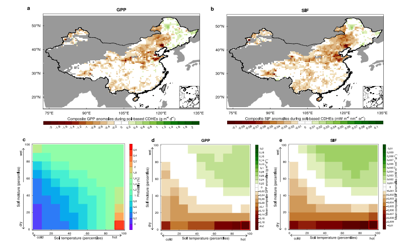
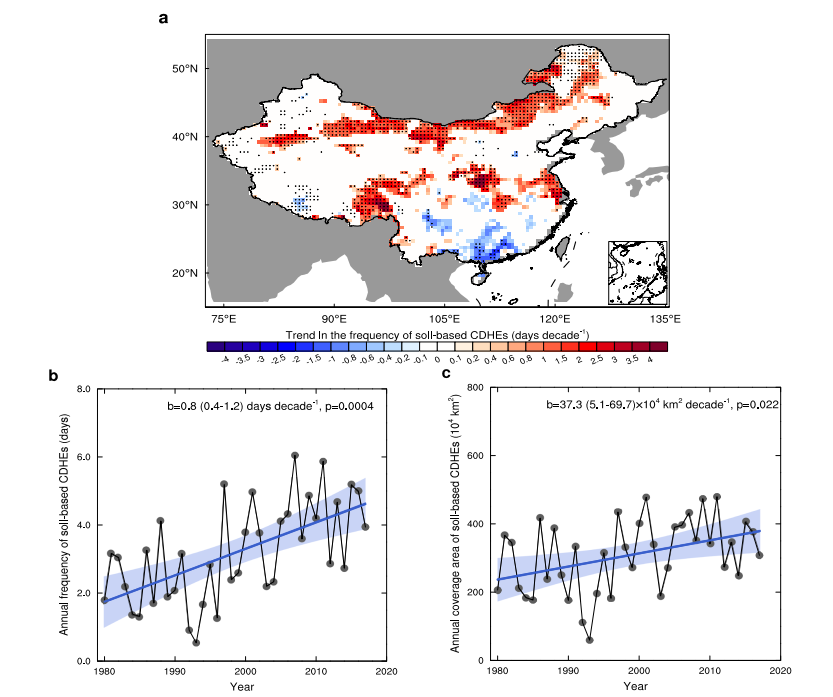
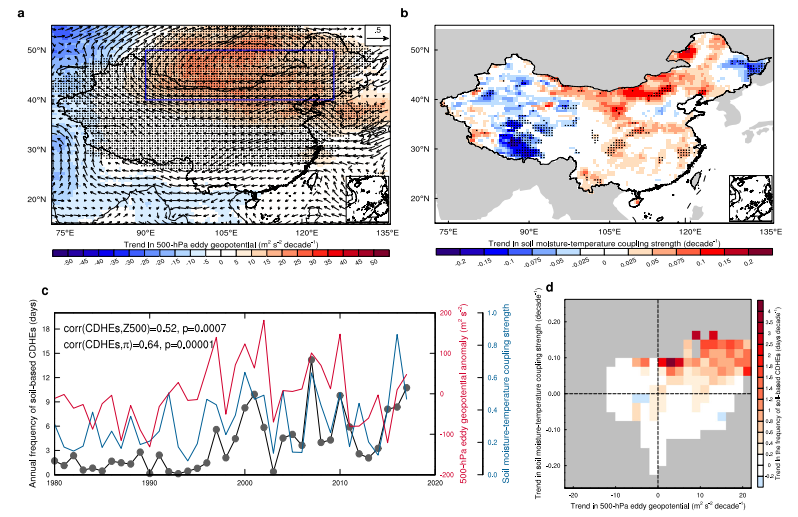
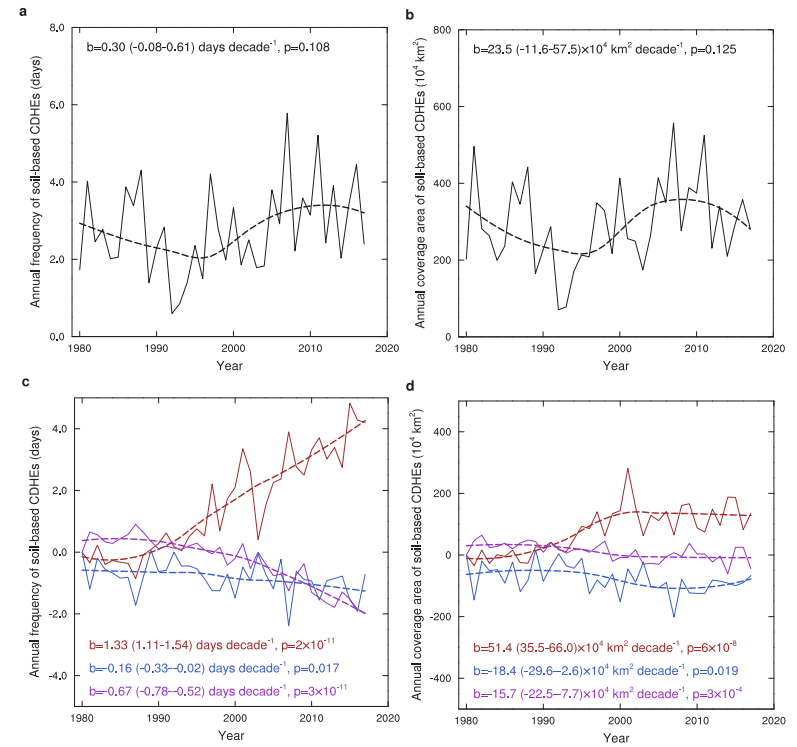
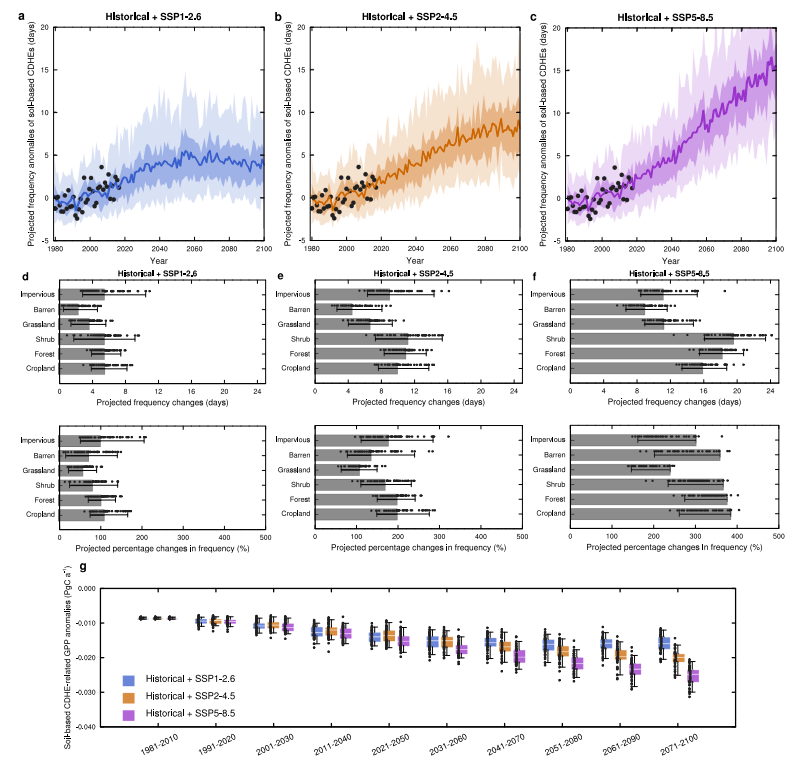

# Anthropogenically-Driven Escalating Impact of Soil-Based Compound Dry-Hot Extremes on Vegetation Productivity

## 人类活动驱动的土壤复合干热极端事件对植被生产力的日益加剧影响

---

**文献信息：** Liang, Y., Wang, J., Hao, Z., Wang, H., Cui, H., & Ge, Q. (2026). *Nature Communications*, **17**, 2303.

**DOI:** [10.1038/s41467-026-68878-3](https://doi.org/10.1038/s41467-026-68878-3)

**作者机构：** 中国科学院地理科学与资源研究所 陆地表层格局与模拟重点实验室; 中国科学院大学; 北京师范大学水科学研究院

---

## 一、研究背景 / Research Background

### 1.1 核心概念：从"气象"到"土壤"的视角转换

**复合干热极端事件（CDHEs）** 指干旱与高温在时空上同时或相继发生的极端事件。但本文指出了一个长期被忽视的关键区分：

| 事件类型 | 定义 | 常用指标 | 数据可获取性 |
|:---|:---|:---|:---|
| **气象CDHE** | 大气高温 + 大气干旱 | 2m气温 + VPD/降水/SPEI | 丰富（全球气象站网+卫星+再分析） |
| **土壤CDHE** (本文创新) | 土壤高温 + 土壤干旱 | 0–10cm土壤温度 + 土壤湿度 | 稀缺（监测网络建设运维昂贵，卫星微波反演有空间缺失） |

> **核心逻辑链：** 土壤水热条件才是植物根系直接感知的环境信号——叶面积指数对土壤湿度的敏感性在增强（Jiao et al., 2021），春季物候的主导驱动力在约一半的中国森林区域是土壤温度而非气温（Wang et al., 2023）——但既往CDHE研究几乎全部基于大气指标。本文首次系统地将"土壤CDHE"独立出来进行识别、归因和预测。

### 1.2 问题的严重性：土壤极端事件的隐蔽性

土壤极端事件的增长速度可能远超大气极端事件。近期研究发现，中欧土壤高温极端事件的强化速率比大气高温极端事件快**0.7°C/十年**，频率的增加速度是后者的**两倍**（García-García et al., 2023）。然而，由于土壤观测数据稀缺和"大气中心主义"的长期主导，土壤CDHE的风险演变几乎未被研究。

### 1.3 领域研究缺口

1. **定义层面的盲区：** 少数纳入了土壤水分定义干旱的CDHE研究，其高温指标仍使用2m气温，"土壤热极端"的视角完全缺失。

2. **影响的低估：** 植被生产力对土壤湿度的敏感性在多数地区高于对VPD的敏感性（Liu et al., 2020），且土壤温度比气温更直接地调控植物根区生理过程——以气象指标评估CDHE的生态影响可能**系统性低估**真实损害。

3. **归因的缺失：** 土壤CDHE的变化在多大程度上由人类活动驱动（温室气体排放、气溶胶）？传统CDHE归因受限于CMIP6模式鲜少同时提供日尺度土壤温度和湿度数据——本文绕过了这一瓶颈，设计了一套间接归因分析框架。

---

## 二、关键科学问题 / Key Scientific Questions

本研究的核心科学问题可以凝练为：

> **中国土壤CDHE的演变趋势如何？它们对植被生产力的影响是否比气象CDHE更严重？观测到的增加在多大程度上由人类活动（特别是人为土壤增温）驱动？**

具体分解为四个子问题：

1. **生态影响问题：** 土壤CDHE对GPP、SIF和NPP的影响是否比气象CDHE（基于VPD、SPEI等）更严重？土壤温度和湿度各自扮演什么角色？
2. **时空演变问题：** 1980–2017年间中国土壤CDHE的频率和覆盖面积如何变化？空间格局由什么物理机制驱动？
3. **归因问题（最核心）：** 观测到的增加中，人为土壤增温、人为土壤湿度变化和自然变率各自贡献多少？
4. **未来预测问题：** 在不同SSP情景下，土壤CDHE的频率将如何变化？在不同土地覆盖类型上的风险如何？对中国陆地植被GPP的潜在影响有多大？

---

## 三、数据与方法 / Data and Methods

本文的方法论核心在于**"独立定义土壤CDHE → 生态影响比较 → 物理驱动分析 → 间接归因框架 → 大集合预测"** 的五步体系。

### 3.1 核心数据源

| 数据类型 | 数据来源 | 时空分辨率 | 用途 |
|:---|:---|:---|:---|
| 土壤温度（观测） | 中国均一化格点日土壤温度数据集 (Wang et al.) | 0.25°, 日尺度, 1980–2017 | 定义土壤热极端 |
| 土壤湿度（观测约束） | GLEAM4 (Global Land Evaporation Amsterdam Model) | 0.1°, 日尺度, 1980–2017 | 定义土壤干旱 |
| GPP | FLUXNET观测约束+神经网络升尺度 | 0.05°, 日尺度, 2001–2017 | 植被生产力响应 |
| SIF | OCO-2卫星+神经网络重构 | 0.05°, 4日→日尺度, 2001–2017 | 光合作用活性（独立验证） |
| NPP | MiCASA模型 | 0.1°, 日尺度, 2001–2017 | 净初级生产力（补充验证） |
| 气象数据 | CN05.1 (2400+站点插值) | 0.25°, 日尺度, 1980–2017 | 定义气象CDHE (VPD, SPEI) |
| 大气环流 | ERA5 | 月尺度 | 500hPa涡度位势、风场 |
| CMIP6归因模拟 | 9个GCMs (ALL + NAT强迫) | 月尺度 | 人为/自然强迫的土壤温湿度变化 |
| MPI-GE-CMIP6 | MPI-ESM1.2-LR 50成员大集合 | 日尺度 | 未来预测（SSP1-2.6/2-4.5/5-8.5） |
| 土地覆盖 | CLCD (中国30m年土地覆盖) | 30m, 2018 | 按土地覆盖类型预测风险 |

> **数据亮点：** 土壤温度数据集经过严格均一化处理——校正了2004年人工-自动观测转换的系统偏差（利用逐月逐站回归方程重建），以及台站迁移和记录规程变更的散在偏差（MASH方法）。所有分析数据统一重采样至0.5°。

### 3.2 土壤CDHE的定义（核心方法之一）

> **土壤CDHE日：** 日地表土壤温度 > 其历史第90百分位数 **且** 日地表土壤湿度 < 其历史第10百分位数

- **限定暖季（5–9月）：** 植被生产力最高的时段，对土壤水热胁迫最敏感
- **15天滑动窗口的日历日百分位：** 目标日 ±7天，共30年×15天=450天样本。该设计同时考虑了植被适应能力在生长季内的季节性变化（如开花vs灌浆的不同耐受性）
- **历史基准期：** 1981–2010

**对比定义：**
- **气象CDHE：** 2m气温 > 90th百分位 + VPD > 90th百分位
- **SPEI-CHE：** 2m气温 > 90th百分位 + SPEI < 10th百分位（分5/30/90/180天四个时间尺度）
- **土壤-大气混合CDHE：** 土壤温度 > 90th百分位 + VPD > 90th百分位（用于解耦土壤湿度vs VPD的效应）

**CO₂施肥效应的去除：** 对GPP、SIF、NPP逐一格点回归至Mauna Loa CO₂浓度，扣除长期CO₂趋势信号。这一步确保植被生产力对CDHE的响应不被CO₂施肥的生长刺激"掩盖"。

### 3.3 归因分析框架（核心方法之二）——间接归因

由于极少数CMIP6模式同时提供日尺度土壤温度和湿度，无法直接对土壤CDHE进行检测归因。作者设计了一个巧妙的**间接框架**：

**步骤1：** 计算9个CMIP6模式ALL-forced与NAT-forced之间月尺度土壤温度和土壤湿度的多模式集合平均差异（ΔST, ΔSM）——代表了人为外强迫引起的时空变化

**步骤2：** 从观测数据中逐一剔除人为信号：
- 剔除人为土壤温度变化：ST′ = ST − ΔST
- 剔除人为土壤湿度变化：SM′ = SM − ΔSM
- 同时剔除两者：ST′, SM′

> **步骤3：** 用上述"调整后"数据重新计算土壤CDHE频率和覆盖面积，计算趋势。趋势间的差异即为各因子的贡献：
> - **人为土壤增温贡献 =** b<sub>ST</sub>（仅剔除湿度变化后的趋势） − b<sub>0</sub>（剔除两者后的自然变率趋势）
> - **人为土壤湿度变化贡献 =** b<sub>SM</sub>（仅剔除温度变化后的趋势） − b<sub>0</sub>
> - **自然变率贡献 =** b<sub>0</sub>
> - **非线性交互贡献 =** b（原始观测趋势） − b<sub>ST</sub> − b<sub>SM</sub> + b<sub>0</sub>

### 3.4 未来预测（核心方法之三）

使用MPI-GE-CMIP6的50成员大集合——这是CMIP6中唯一同时提供日尺度地表土壤温度和湿度的大集合数据集：

- 50个成员各自从略微不同的初始条件出发 → 内部变率被有效平均 → 外强迫响应被提取
- 三种排放情景：SSP1-2.6、SSP2-4.5、SSP5-8.5
- 按CLCD九种土地覆盖类型分别计算区域平均频率变化
- GPP损失估计假设植被对土壤CDHE的响应格局（Fig. 1a）在未来保持不变

---

## 四、新发现与新认识 / New Findings

### 发现1：土壤CDHE对植被生产力的损害远大于气象CDHE（图1）



> **图1解析（Fig. 1, p.3）：GPP和SIF对土壤CDHE的响应。** (a–b) 土壤CDHE期间GPP和SIF的合成异常——中国大部分植被区（华北、西南）呈现显著负异常，仅东北北部冷湿区呈现微正异常（高温可增强该区光合效率）。(c) 土壤温度和湿度的联合概率分布——呈现双峰结构，干热和湿冷条件的发生频率最高（LMF=2.5，表明土壤水热耦合显著促进了CDHE形成）。(d–e) 各百分位组合的GPP和SIF合成异常——右下角（极端干热）的负异常最为严重，GPP达−0.186 g C m⁻² d⁻¹。

| 对比维度 | 土壤CDHE | 气象CDHE (VPD) | SPEI-CDHE (短期) | SPEI-CDHE (长期90–180天) |
|:---|:---|:---|:---|:---|
| GPP负异常幅度 | **最大** | 弱（仅东北微负） | 弱于土壤CDHE | 与土壤CDHE**相当** |
| SIF负异常幅度 | **最大** | 弱 | 弱于土壤CDHE | 与土壤CDHE**相当** |
| 原因 | 土壤水分直接反映根系可获取水 | VPD反映大气需求而非供给 | 短期SPEI仍以降水定义 | 6个月SPEI与土壤湿度相关性最强 |

> **关键机制：** 土壤-大气混合CDHE（土壤温度+VPD）的负GPP/SIF异常远小于纯土壤CDHE（土壤温度+土壤湿度）——表明**低土壤水分供给（而非高大气水汽需求）** 是损害植被生产力的主导干旱胁迫路径。

### 发现2：中国土壤CDHE在近40年间快速增加——北方尤为突出（图2）



> **图2解析（Fig. 2, p.4）：中国土壤CDHE的时空变化趋势（1980–2017）。** (a) 年频率变化趋势的空间格局——华北、中原和西南（青藏高原东缘）增幅最大；(b) 区域面积加权平均频率的时间序列——增加3.0天；(c) 空间覆盖面积的时间序列——增加141.9×10⁴ km²。**最显著的增加集中在北方，与强烈的土壤增温（Supplementary Fig. 6a）和土壤湿度-温度耦合增强（Fig. 3b）高度一致。**

| 指标 | 1980–2017年变化 | 95%置信区间 |
|:---|:---|:---|
| 年频率 | **+3.0天** | 1.5–4.5天 |
| 覆盖面积 | **+141.9×10⁴ km²** | 19.2–264.7×10⁴ km² |
| 最显著区域 | 华北、中原、青藏高原东缘 | 与强烈土壤增温区重叠 |

### 发现3：大尺度环流+土壤水热耦合共同驱动了频率变化的空间异质性（图3）



> **图3解析（Fig. 3, p.5）：土壤CDHE频率趋势的物理驱动。** (a) 500hPa涡度位势（Z500）趋势——华北和蒙古上空显著增加，反气旋环流增强 → 绝热加热+太阳辐射增加 → 土壤和大气温度升高；(b) 土壤湿度-温度耦合强度趋势——华北和东北增强显著；(c) 华北土壤CDHE频率与Z500异常（r=0.52, p<0.01）和耦合强度（r=0.64, p<0.01）的时间序列高度相关；(d) Z500趋势与耦合强度趋势的联合效应——两者均呈增加趋势的格点对应最大的CDHE频率增幅。

**物理机制链：**
> 反气旋环流增强（Z500↑） → 下沉运动 → 少云 → 太阳辐射↑ + 绝热加热 → 土壤升温 → 土壤水分蒸发↑ → 土壤变干 → 感热通量增强 → 土壤进一步升温（正反馈） → CDHE频率↑

华南因气旋性环流转向（上升运动+降水增加+土壤湿化）而CDHE频率下降。

### 发现4：人为土壤增温是土壤CDHE激增的主导驱动力（图4）



> **图4解析（Fig. 4, p.6–7）：人为土壤增温对土壤CDHE的贡献分解。** (a–b) 剔除人为土壤温湿度变化后——自然变率贡献CDHE频率+1.1天、面积+89.3×10⁴ km²；(c–d) 各因子贡献：人为土壤增温贡献**+5.1天**和**+195.3×10⁴ km²**（主导因子），人为土壤湿度变化贡献**−0.6天**和**−69.9×10⁴ km²**（微弱缓解），非线性交互贡献**−2.5天**和**−59.7×10⁴ km²**（进一步削弱了净增幅）。

| 贡献因子 | 对频率趋势的贡献 | 对覆盖面积趋势的贡献 | 方向 |
|:---|:---|:---|:---|
| **人为土壤增温** | **+5.1天** | **+195.3×10⁴ km²** | ↑ 主导 |
| 人为土壤湿度变化 | −0.6天 | −69.9×10⁴ km² | ↓ 微弱缓解 |
| 自然气候变率 | +1.1天 | +89.3×10⁴ km² | ↑ 次要 |
| 非线性交互 | −2.5天 | −59.7×10⁴ km² | ↓ 部分抵消 |
| **观测总趋势** | **+3.0天** | **+141.9×10⁴ km²** | — |

> **核心解读：** 人为土壤增温贡献了+5.1天，但被人为土壤湿度变化的微弱缓解（−0.6天）和非线性交互（−2.5天）部分抵消，观测到净增幅+3.0天。自然变率贡献+1.1天。人为土壤增温的主导性——若仅计算**净贡献**，它超过了所有其他因子之和。

> **关键归因证据：** ALL-forced模拟的土壤增温空间格局与观测的相关系数达**0.73 (p<0.01)**；NAT-forced模拟则完全无法再现观测到的土壤增温——人为外强迫（以温室气体和气溶胶为主）是土壤增温的主导驱动力。

### 发现5：SSP5-8.5下世纪末土壤CDHE频率将增加13.3天，可能导致中国GPP减少0.025 Pg C a⁻¹（图5）



> **图5解析（Fig. 5, p.7–8）：未来土壤CDHE频率变化及对植被生产力的影响。** (a–c) 观测、模拟和预测的CDHE频率异常时间序列——SSP1-2.6下本世纪中叶达峰后下降，SSP2-4.5下2080s后趋稳，SSP5-8.5下持续快速上升；(d–f) 六种主要土地覆盖类型的频率变化——耕地、森林和灌木面临最严峻的风险；(g) GPP异常预测——SSP5-8.5下从−0.009恶化至−0.025 Pg C a⁻¹。

| 情景 | 世纪末频率变化 (相对1981–2010) | 5–95%范围 | GPP损失 (2071–2100) |
|:---|:---|:---|:---|
| SSP1-2.6 | **+4.1天** | 2.6–5.8天 | 略低于本世纪中叶（频率已开始下降） |
| SSP2-4.5 | **+7.7天** | 5.6–10.4天 | 中等恶化 |
| SSP5-8.5 | **+13.3天** | 11.7–15.7天 | **−0.025 Pg C a⁻¹**（从−0.009恶化2.8倍） |

**按土地覆盖类型的风险分化：**

| 风险梯队 | 土地覆盖类型 | 频率变化特征 | 原因 |
|:---|:---|:---|:---|
| 最高 | 耕地、森林、灌木 | 增幅最大 | 集中分布于华中、华南和东北——未来CDHE增幅最显著的区域 |
| 中等 | 裸地、草地 | 约最高梯队的一半 | 多分布于干旱半干旱区 |
| 特殊 | 不透水面 | SSP1-2.6和SSP2-4.5下百分比变化大 | 城市热岛效应叠加 |

---

## 五、讨论要点 / Discussion Highlights

### 5.1 土壤-植物-大气连续体的CDHE视角

本文的核心贡献在于将CDHE研究从"大气中心"拓展至"土壤-植物-大气连续体"。土壤CDHE之所以对植被生产力的影响比气象CDHE更严重，根本原因在于：

> **植物根区直接感知的是土壤（而非大气）的水热状态。** 高VPD反映了大气对水分的"需求"，但植物真正受胁迫是在根区水分"供给"不足时——这两者在时空上并非总是一致。

### 5.2 长期SPEI可以部分替代土壤湿度的原因

研究发现6个月尺度的SPEI-CDHE的生态影响与土壤CDHE相当。这为数据稀缺地区的CDHE评估提供了实用方案——在无法获取土壤湿度数据的地区，**长期SPEI（90–180天）可作为土壤CDHE的合理代理**。

### 5.3 CO₂施肥效应的悖论

升高的CO₂可提高植物水分利用效率（气孔部分关闭减少水分损失），可能缓解土壤CDHE的影响。另一方面，CO₂引起的气孔关闭也会减少蒸腾降温，可能加剧热胁迫。本文通过统计方法去除了CO₂趋势，但未量化这两种机制的未来净效应——这构成了影响估计的一个不确定性来源。

---

## 六、结论 / Conclusions

### 6.1 核心结论

1. **土壤CDHE比气象CDHE更具破坏性：** 中国植被生产力的负异常在土壤CDHE期间最为严重（GPP −0.186 g C m⁻² d⁻¹），气象CDHE（基于VPD或短期SPEI）的影响显著偏弱。**低土壤水分供给（而非高大气水汽需求）是主导干旱胁迫路径。**

2. **近40年快速增加：** 1980–2017年，中国土壤CDHE频率增加3.0天，覆盖面积增加141.9×10⁴ km²，华北增幅最为显著。大尺度反气旋环流增强和土壤水热耦合增强是关键物理驱动。

3. **人为土壤增温是主导驱动力：** 人为土壤增温贡献了+5.1天（净贡献超过所有其他因子之和），人为土壤湿度变化贡献−0.6天（微弱缓解），自然变率贡献+1.1天。**ALL-forced模拟与观测的空间相关系数达0.73，NAT-forced模拟完全无法再现观测趋势。**

4. **未来风险将显著升级：** SSP5-8.5下世纪末频率增加13.3天——耕地、森林和灌木面临最大风险。中国陆地GPP可能因此减少约0.025 Pg C a⁻¹，相当于当前水平的2.8倍。

5. **低碳路径的生态协同效益：** SSP1-2.6下土壤CDHE频率于本世纪中叶达峰后下降——尽早实现净零排放可为陆地碳汇提供实质性保护。

### 6.2 学术与实践意义

1. **范式转换：** 首次将CDHE研究从"大气中心"范式拓展至"土壤-植物-大气连续体"范式，揭示了传统基于气象指标的CDHE评估可能系统性低估了生态风险。
2. **间接归因方法论：** 为数据受限情况下的复合事件归因提供了可推广的分析框架。
3. **长期SPEI的实用价值：** 验证了6个月尺度的SPEI可作为土壤CDHE的合理代理——为缺乏土壤湿度数据的区域提供了可行的替代方案。
4. **预警系统设计：** 为将土壤指标纳入复合极端事件早期预警系统提供了科学依据。

### 6.3 局限性

1. **未来GPP估计的双向不确定性：** 假设植被GPP对土壤CDHE的响应格局不变——但若未来CDHE强度增加，可能触发更强的生理胁迫（低估）；若植被发生生理适应，敏感性可能降低（高估）。

2. **灌溉效应的遗漏：** GLEAM4土壤湿度数据未纳入灌溉——在灌溉密集区可能低估土壤湿度、高估CDHE频率及其影响。

3. **人类干预的缺失：** 农业管理、森林经营、放牧等未被考虑——这些活动可改变植被对极端事件的暴露度和脆弱性。

4. **表层vs根区：** 分析聚焦于0–10cm表层土壤，但根区（通常可达1–2m）的土壤水热条件对植被生产力的影响可能更为直接和强烈——受限于根区数据的观测约束，这一问题有待未来研究。

5. **CO₂效应未建模：** CO₂升高对水分利用效率的提升和蒸腾降温的抑制这两股相反力量未被量化——未来需通过过程模型进行归因。

---

## 七、研究亮点 / Research Highlights

| 序号 | 亮点 | 说明 |
|:---|:---|:---|
| 1 | **首创土壤CDHE独立定义与分析** | 全球首次将土壤温度和土壤湿度同时作为CDHE的定量指标，突破了长期以来的"大气中心主义" |
| 2 | **系统比较六种CDHE定义** | 土壤vs气象（VPD）vs SPEI（四个时间尺度）vs 土壤-大气混合——通过多定义系统比较锁定"低土壤水分供给"为生态影响的关键路径 |
| 3 | **三重植被生产力指标** | GPP（FLUXNET约束）+ SIF（OCO-2卫星）+ NPP（MiCASA模型）——三个独立数据集的一致结果为结论提供了高可靠性 |
| 4 | **巧妙的间接归因框架** | 绕过了CMIP6模式缺乏日尺度土壤数据的瓶颈，从月尺度强迫差异中提取人为信号，实现了复合事件的间接归因 |
| 5 | **大集合预测（50成员）** | 使用CMIP6中唯一的大集合日尺度土壤水热数据集，在预测中有效隔离了内部变率 |
| 6 | **CO₂施肥效应的统计去除** | 逐格点回归至Mauna Loa CO₂浓度去除长期CO₂信号——确保了CDHE影响信号不被CO₂施肥的生长趋势掩盖 |
| 7 | **政策相关性** | 直接量化了三种排放路径下土壤CDHE的生态风险差异——低碳路径（SSP1-2.6）的CDHE频率可于本世纪中叶达峰后下降 |

---

## 八、方法流程总图

```
数据准备
  ├── 土壤温度: 中国均一化日值 (2400+站点, MASH校正人工/自动偏差)
  ├── 土壤湿度: GLEAM4 (微波同化约束, 0.1°)
  ├── 气象数据: CN05.1 (日值T/RH/P), ERA5 (500hPa位势/风)
  ├── 植被: GPP (FLUXNET+NN), SIF (OCO-2+NN), NPP (MiCASA)
  ├── CMIP6归因: 9模型 ALL vs NAT (月尺度土壤T/SM)
  ├── MPI-GE-CMIP6: 50成员大集合 (日尺度, SSP1/2/5)
  └── 土地覆盖: CLCD 30m (2018)

步骤1: CDHE定义 (暖季5-9月, 15日滑动窗口日历日百分位)
  ├── 土壤CDHE: ST > 90th & SM < 10th
  ├── 气象CDHE: T2m > 90th & VPD > 90th
  ├── SPEI-CDHE: T2m > 90th & SPEI_n < 10th (n=5/30/90/180天)
  └── 土壤-大气混合CDHE: ST > 90th & VPD > 90th

步骤2: 植被响应分析 (CO₂效应已通过回归至Mauna Loa CO₂去除)
  ├── 各CDHE类型的GPP/SIF/NPP合成异常
  ├── 10×10百分位联合分布 → 干热象限负异常最严重
  └── 解耦土壤温度 vs VPD 和 土壤湿度 vs VPD 的独立效应

步骤3: 物理驱动分析
  ├── 500hPa涡度位势 (Z500) 趋势: 华北反气旋增强
  ├── 土壤水热耦合 (π): 华北/东北增强
  └── Z500 × π 联合归因 → 空间格局的解释框架

步骤4: 间接归因框架
  ├── ALL-NAT差异 → 人为外强迫的土壤温湿度变化 (ΔST, ΔSM)
  ├── 从观测中逐项剔除 → 重新计算CDHE趋势
  ├── b_ST − b₀ → 人为增温贡献: +5.1天, +195.3×10⁴ km²
  ├── b_SM − b₀ → 人为湿度变化贡献: −0.6天, −69.9×10⁴ km²
  └── b₀ → 自然变率贡献: +1.1天, +89.3×10⁴ km²

步骤5: 未来预测 (MPI-GE-CMIP6 50成员)
  ├── SSP1-2.6: +4.1天, 世纪中叶达峰后下降
  ├── SSP2-4.5: +7.7天, 2080s后趋稳
  ├── SSP5-8.5: +13.3天, 持续快速上升
  ├── 6种土地覆盖类型面积加权频率
  └── GPP损失: −0.025 Pg C a⁻¹ (SSP5-8.5, 相对当前恶化2.8倍)

结论输出
  ├── 发现1: 土壤CDHE生态影响 > 气象CDHE (低土壤水分供给是主导干旱胁迫路径)
  ├── 发现2: 1980-2017频率+3.0天, 面积+141.9×10⁴ km² (华北最显著)
  ├── 发现3: 反气旋增强 + 土壤水热耦合增强 → 空间异质性
  ├── 发现4: 人为土壤增温主导 (+5.1天净贡献 > 所有其他因子之和)
  ├── 发现5: SSP5-8.5 → +13.3天 → GPP −0.025 Pg C a⁻¹
  └── 发现6: 低碳路径(SSP1-2.6)可使CDHE频率于世纪中叶达峰后下降
```

