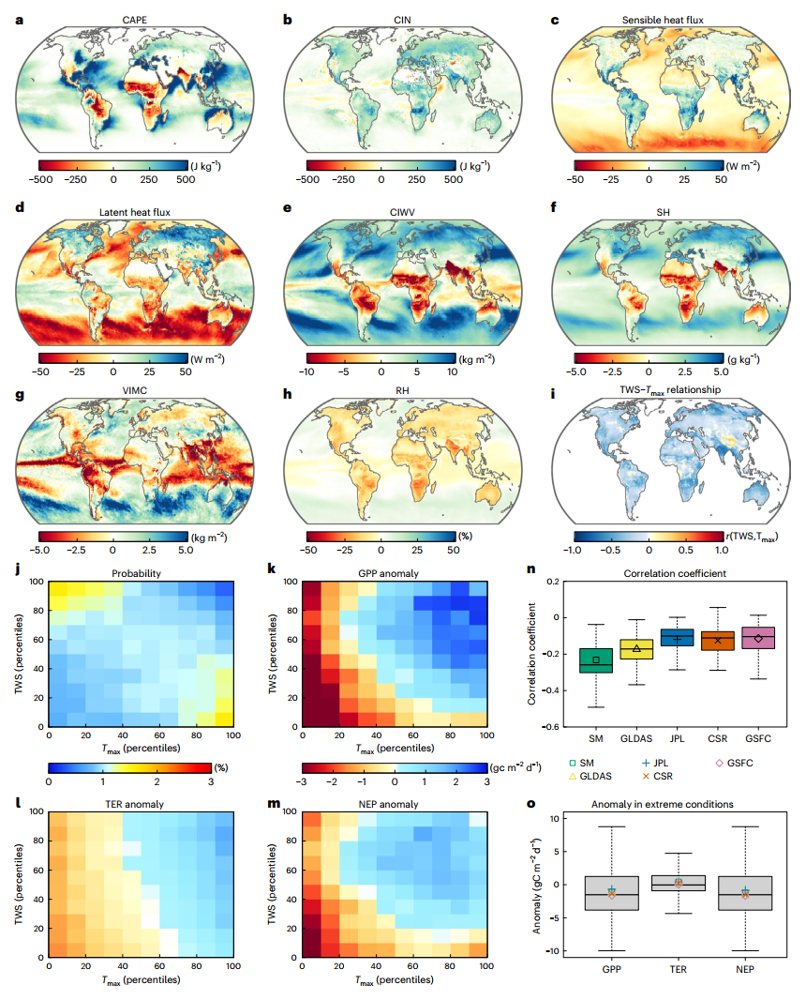
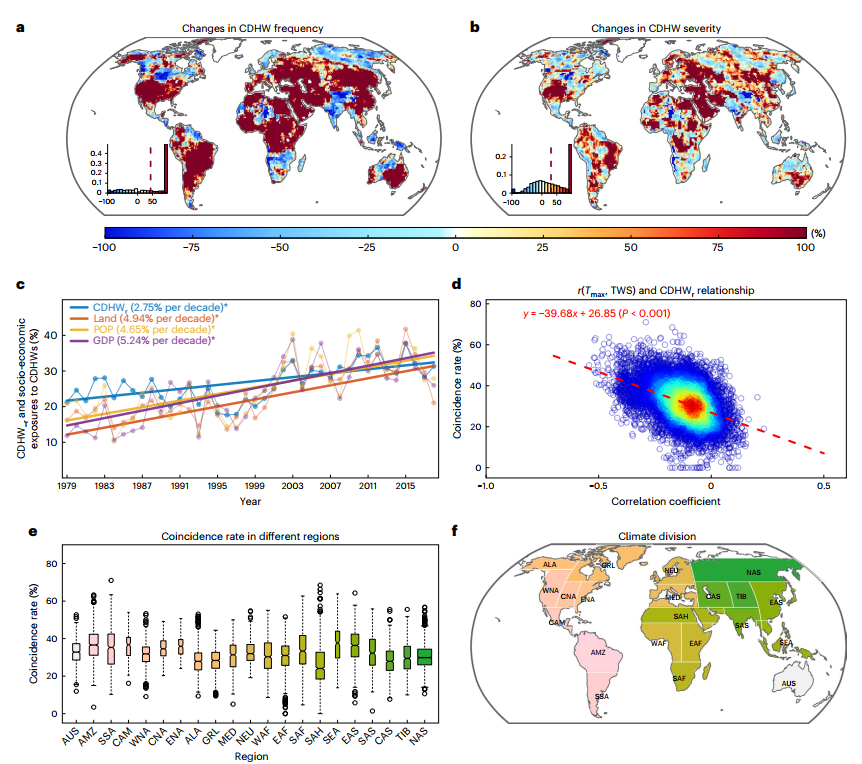
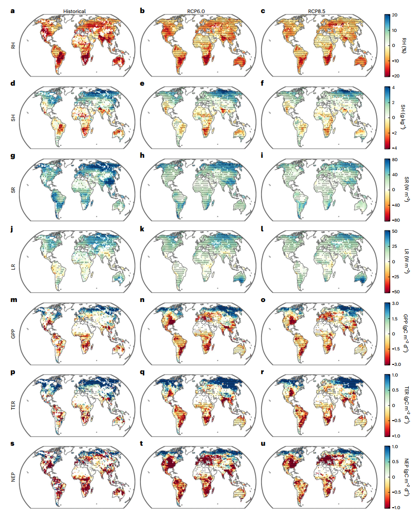
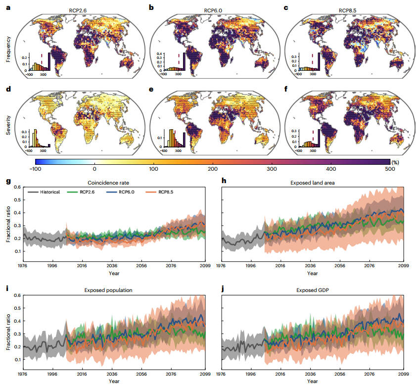
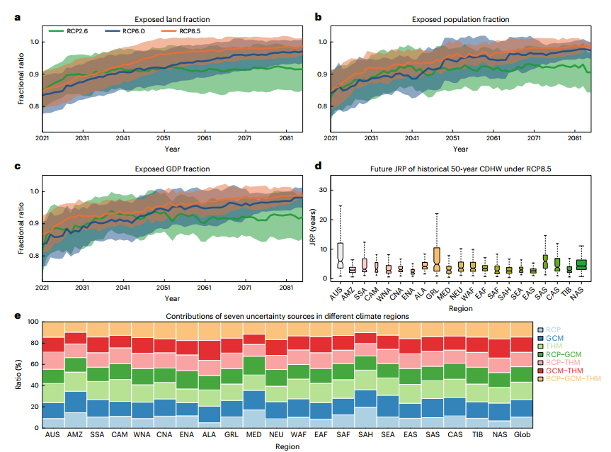

# Future Socio-Ecosystem Productivity Threatened by Compound Drought–Heatwave Events

## 复合干旱-热浪事件威胁未来社会-生态系统生产力

---

**文献信息：** Yin, J., Gentine, P., Slater, L., Gu, L., Pokhrel, Y., Hanasaki, N., Guo, S., Xiong, L., & Schlenker, W. (2023). *Nature Sustainability*, **6**, 259–272.

**DOI:** [10.1038/s41893-022-01024-1](https://doi.org/10.1038/s41893-022-01024-1)

**作者机构：** 武汉大学 水资源与水电工程科学国家重点实验室; 哥伦比亚大学 地球与环境工程系 + 地球研究所; 牛津大学 地理与环境学院; 华中科技大学 土木与水利工程学院; 密歇根州立大学 土木与环境工程系; 日本国立环境研究所 气候变化适应中心; 哥伦比亚大学 国际与公共事务学院

---

## 一、研究背景 / Research Background

### 1.1 核心概念：TWS——一个被忽视的干旱指标

复合干旱-热浪事件（Compound Drought–Heatwave, CDHW）被公认为全球可持续发展面临的最严峻气候胁迫之一。但既往研究在**用什么指标定义"干旱"**这一根本问题上存在重大分歧：

| 干旱指标 | 表征内容 | 局限性 |
|:---|:---|:---|
| 降水（SPI） | 仅大气水分输入 | 忽略了蒸发需求和下垫面储存 |
| 土壤湿度（SM） | 地表薄层水分 | 忽略了地下水和深层土壤水的植物可获取性 |
| 蒸散发（SPEI） | 大气水分供需平衡 | 基于气象驱动的潜在蒸发，不反映实际可用于蒸发的水量 |
| **陆地水储量（TWS）** (本文创新) | **地表水和地下水的垂直积分总量** | 卫星观测时期较短（GRACE 2002至今），需重建以延长时间序列 |

> **TWS的核心优势：** TWS同时包含地表水（积雪、冰、湖泊、水库）、土壤水和地下水——是真正意义上"植物可获取的全部水资源"。TWS-DSI（基于TWS的干旱严重性指数）在本文中被证明比传统指数提供了更强的干旱加剧信号——SPEI和土壤湿度指数在大多数区域低估了干旱加剧趋势。

### 1.2 问题的重要性：CDHW事件威胁碳汇和全球GDP

- **2011–2013年美国三次CDHW事件：** 经济损失约**600亿美元**
- **2003年欧洲干旱热浪：** 植物生产力下降~30%，相当于抵消了欧洲**四年**的CO₂净吸收
- CDHW后植被恢复通常滞后——生长减缓、水力导度不可逆损失、碳储备耗竭——这种滞后增长可能使植被更易受到下一次CDHW的打击

### 1.3 领域研究缺口

1. **TWS视角的缺失：** 尽管TWS是水-能量平衡的关键决定因素，但它在CDHW动态和影响评估中的应用几乎是空白。
2. **"双变量非平稳"视角的缺失：** 传统评估分别分析干旱和热浪趋势，但二者的**联合概率**在气候变化下正在非平稳地变化——单变量分析系统性低估了复合风险。
3. **社会经济暴露的异质性：** CDHW对不同收入水平和城乡群体的差异化影响尚未在全球尺度上系统量化。

> **本文的根本创新：** 将TWS作为定义CDHW的干旱维度指标，构建了一个**111成员的气候-水文大集合模拟系统**，并在全球尺度上系统评估了CDHW对**碳汇+社会经济**的双重影响——特别聚焦穷人和农村地区的差异化暴露。

---

## 二、关键科学问题 / Key Scientific Questions

> **在全球变暖背景下，基于TWS定义的CDHW事件的物理机制是什么？它们将如何变化？对陆地碳汇和全球社会经济系统的未来风险有多大？谁将承受最不成比例的冲击？**

具体分解为五个子问题：

1. **物理机制问题：** TWS与温度之间的耦合关系是怎样的？大气环流异常如何同时驱动干旱和热浪？
2. **碳汇影响问题：** CDHW如何影响GPP、TER和NEP？水资源限制和温度限制的相对重要性如何在未来演变？
3. **未来预测问题：** CDHW的频率、持续时间和严重程度将如何变化？历史50年一遇的事件未来将多久发生一次？
4. **社会经济暴露问题：** 全球多少人口和GDP将暴露于CDHW风险增加？穷人与富人、农村与城市之间的暴露是否存在系统性差异？
5. **不确定性分解问题：** 情景选择、GCM、水文模型及其交互各自贡献多少预测不确定性？

---

## 三、数据与方法 / Data and Methods

本文的方法论核心在于**"TWS-DSI干旱定义 → 水-热-碳耦合分析 → ISIMIP2b 111成员大集合预测 → 双变量非平稳风险评估 → 社会经济异质性分析"**的五步体系。

### 3.1 核心数据源

| 数据类型 | 数据来源 | 时期 | 用途 |
|:---|:---|:---|:---|
| TWS（卫星+重建） | GRACE/GRACE-FO (JPL/CSR/GSFC三个中心) + 统计重建TWS | 1979–2020 | 定义干旱（TWS-DSI） |
| 气温+大气变量 | ERA5 (CAPE, CIN, CIWV, SH, 辐射通量等) + Berkeley Earth Tmax | 1979–2020 | 定义热浪，分析物理机制 |
| 碳通量（观测） | FLUXNET涡度协方差塔（73个站点）| 站点时段 | GPP/TER/NEP对极端事件的响应 |
| SIF（卫星） | OCO-2机器学习重构全球SIF | 2001–2020 | 光合作用活性的独立验证 |
| GPP（模型） | MODIS光能利用效率模型 | 2001–2020 | 补充验证 |
| 未来气候-水文模拟 | ISIMIP2b (8个GCMs × 8个THMs = 96个组合) | 1976–2099 (RCP2.6/6.0/8.5) | 未来CDHW预测（主分析） |
| CMIP6+H08 | H08水文模型 × 5个CMIP6 GCMs (SSP126/370/585) | 1976–2099 | 未来CDHW预测（独立验证，15个成员） |
| CLM4.5 | GFDL-ESM2M驱动 | 历史+RCP2.6/6.0 | 碳通量预测 |
| 人口+GDP | SSP格点化数据集 (0.5°) | 2010–2100 | 社会经济暴露 |

> **111成员大集合：** ISIMIP2b框架下8个GCM × 8个THM × 3个RCP = ~192个组合（部分THM-GCM配对数据缺失，最终96个可用），加上CMIP6/H08的15成员，总计~111个独立模拟路径。这是本文区别于既往少量模型研究的关键——**足够的集合规模使不确定性可以定量分解**。

### 3.2 TWS-DSI干旱指数的构建（核心方法之一）

> **TWS-DSI<sub>i,j</sub> = (TWS<sub>i,j</sub> − TWS̄<sub>j</sub>) / σ<sub>j</sub>**

- 使用**全时段（1976–2099）的共同参考期**计算均值和标准差——避免不同时期使用不同基准带来的趋势误判
- GRACE观测期（2004–2009）作为时间均值基准
- 干旱阈值：TWS-DSI < −0.8（参考Zscheischler & Seneviratne, 2017）
- 热浪阈值：Tmax > 90th百分位
- 暖季定义：各格点历史Tmax最高的连续5个月

**为何TWS-DSI比传统指数更强？** 作者系统比较了TWS-DSI与SPI、SPEI、土壤湿度指数、径流指数：
- 径流指数与SPI高度相关（仅反映降水）
- SPEI和土壤湿度指数在大多数Giorgi区域**低估**了干旱趋势变化
- TWS-DSI因为包含地下水和人类活动（灌溉、水库调度）的综合效应，提供了**更完整的水资源胁迫信号**

### 3.3 双变量非平稳风险评估（核心方法之二）

> **联合重现期（JRP）：** 在Copula框架下计算"TWS-DSI < −0.8 **且** Tmax > 90th百分位"的双变量联合概率——考虑了TWS和Tmax之间随时间变化的依赖关系（非平稳假设）。

- 历史50年JRP事件：1976–2005期间平均50年一遇的CDHW
- 计算该事件在未来（2070–2099）的更新JRP
- **非平稳Copula参数估计**允许依赖结构随时间演变
- CDHWr = CDHW天数 / 热浪天数（重合率）——度量干旱与热浪的共现强度

### 3.4 不确定性分解（核心方法之三）

使用**多元方差分析（MANOVA）**将总不确定性分解为七个来源：
1. RCP情景选择
2. GCM结构
3. THM（陆地水文模型）结构
4. RCP-GCM交互
5. RCP-THM交互
6. GCM-THM交互
7. RCP-GCM-THM三阶交互

---

## 四、新发现与新认识 / New Findings

### 发现1：TWS与温度在全球尺度上显著负相关——TWS耗竭对碳汇的约束超过温度极端（图1）




> **图1解析（Fig. 1, p.261）：极端气候事件期间水-热-碳变量的合成异常。** (a–h) 热浪期间的大气条件：高CAPE（对流有效位能）+高CIN（对流抑制）在高纬度共存，高感热/潜热通量，但VIMC（垂直积分水汽辐合）和RH（相对湿度）在全球陆地普遍下降——尽管大气能量充足，水汽输送在减弱。(i) TWS与Tmax的全球负相关（r = −0.2, P<0.001）。(j–m) Tmax-TWS联合分布的GPP/TER/NEP异常——右下角（极端高温+极端低TWS）NEP负异常最严重（−1.42 gC m⁻² d⁻¹），且主要由GPP下降（−1.25）驱动而非TER增加（+0.30）。(n–o) 多种TWS和SM数据集的验证结果一致。

**物理机制链：**
> 高CAPE + 高CIN共存的"高能-高抑制"大气配置 → 水汽辐合减弱（VIMC↓） → 相对湿度下降 → 大气干燥度增强 → 地表蒸发需求加大 → TWS下降 → 植被水分胁迫 → GPP↓ > TER↓ → NEP↓（碳汇减弱）

### 发现2：全球CDHW重合率以每十年2.75%的速率增长——八个热点区域被识别（图2）



> **图2解析（Fig. 2, p.262）：CDHW的近期变化与社会经济暴露。** (a–b) 1999–2019 vs 1979–1998的CDHW频率和严重程度变化——美国东部、南美中部、中非、东欧、中东和东亚部分地区增幅最大。(c) 全球平均CDHWr（2.75%/十年）、暴露陆地面积（4.94%/十年）、暴露人口（4.65%/十年）和暴露GDP（5.24%/十年）均显著增加。(d) r(TWS,Tmax)越负 → CDHWr越高。(e–f) 八个Giorgi气候区域被识别为CDHW热点：亚马逊(AMZ)、中美洲(CAM)、北美东部(ENA)、北美中部(CNA)、地中海(MED)、南美南部(SSA)、北亚(NAS)和东亚(EAS)。

| 指标 | 1979–2019年趋势 | 显著性 |
|:---|:---|:---|
| CDHW重合率 (CDHWr) | **+2.75%/十年** | P<0.05 |
| 暴露陆地面积 | **+4.94%/十年** | P<0.05 |
| 暴露人口 | **+4.65%/十年** | P<0.05 |
| 暴露GDP | **+5.24%/十年** | P<0.05 |

> **八个CDHW热点中，五个显示出显著的社会经济暴露增加（>10%/十年），说明CDHW加剧正在转化为实际的社会经济风险。**

### 发现3：水资源限制将在未来超越温度限制，成为碳汇的主要约束因素（图3）



> **图3解析（Fig. 3, p.264）：历史和未来CDHW期间水-热-碳变量的异常。** (a–l) CDHW期间的RH、SH、短波/长波辐射变化——全球RH持续下降，辐射增加。(m–u) GPP、TER和NEP的异常——CDHW期间的NEP负异常远超单一极端事件。**关键对比：** 极端低TWS对GPP的负面效应在>80%（RCP8.5）和>75%（RCP6.0）的陆地面积上**超过了**极端高温的效应——表明未来水资源可用性将成为碳汇更重要的限制因子。

> **CO₂施肥效应的悖论：** 尽管CO₂上升在全球尺度上增强了GPP，但在亚马逊和南欧等区域，CDHW的增加完全**抵消**了CO₂施肥效应——这些区域未来NEP在CDHW期间与历史相比没有改善甚至恶化。

### 发现4：CDHW将四倍增强——极端事件将十倍频发（图4-5）




> **图4解析（Fig. 4）：CDHW特征的未来预测。** RCP8.5下全球CDHW频率四倍增加覆盖>50%陆地，天数六倍增加覆盖68%陆地，持续时间和严重程度四倍增强覆盖~70%陆地（RCP6.0和RCP8.5）。**CDHWr（重合率）持续增加——表明干旱和热浪的相互依赖性随变暖而增强。** 热浪在加剧CDHW中起到主导作用。



> **图5解析（Fig. 5, p.266）：社会经济暴露与双变量风险。** (a–c) 全球暴露陆地面积、人口和GDP比例——RCP8.5下均从~17%增至~40%（额外17–25%的人口和GDP）。(d) RCP8.5下历史50年一遇CDHW的JRP降至**5年以下**——即发生频率**增加10倍**。(e) 不确定性分解——亚马逊区域RCP和THM分别贡献~27%和~22%的总体不确定性，模型交互项同样重要。

| 指标 | 历史基线 | RCP8.5 (2070–2099) | 变化 |
|:---|:---|:---|:---|
| CDHW频率 | — | **四倍增加** (>50%陆地) | — |
| CDHW天数 | — | **六倍增加** (68%陆地) | — |
| CDHW持续/严重度 | — | **四倍增强** (~70%陆地) | — |
| 暴露陆地面积 | ~18% | ~40% | **+22%** |
| 暴露人口 | ~19% | ~38% | **+19%** |
| 暴露GDP | ~18% | ~36% | **+18%** |
| 历史50年JRP | 50年 | **<5年（十倍）** | 缩短10倍+ |
| 全球人口/GDP暴露>90% | — | **几乎所有地区** | — |

### 发现5：穷人和农村地区承受不成比例的CDHW冲击（Ext. Data Fig. 9 & Supp. Fig. 27–29）

> **贫富分化：** 以各地区人均GDP最低20%和最高20%格点比较——SSP585下2070–2099年贫困区的暴露人口和GDP比例（均为0.44）显著高于富裕区（0.39和0.38）。在澳大利亚、东亚和青藏高原等区域，贫困人口的CDHW风险尤其高于富裕人口。

> **城乡分化：** 农村地区（人口密度最低20%）在所有SSP下均面临比城市地区（人口密度最高20%）更高的CDHWr和更高的GDP/人口暴露度。使用更极端的阈值（10th/90th百分位）时，差异更为显著——表明最贫困和最偏远的人群目前生活在暴露度最高的边缘地带。

> **关键警示：** 作者的分析将"贫困"和"农村"的定义固定在2015年水平——未考虑未来的人口迁移和区域GDP变化。但即使在这一保守假设下，CDHW的差异化影响已经清晰可见。现实中贫困和农村人群的适应能力更低（缺乏空调、灌溉、保险和基础设施），实际脆弱性可能更高。

### 发现6：不确定性来自情景×GCM×水文模型的复杂交互（Fig. 5e）

MANOVA分解揭示了预测不确定性来源的显著区域差异：
- **亚马逊区域：** RCP情景选择(~27%)和THM结构(~22%)分别贡献最大的不确定性——反映了该区域水文过程（尤其是地下水-植被相互作用）模拟的根本困难
- **全球尺度：** GCM、THM和RCP的交互项贡献与主效应相当——意味着仅靠增加模式数量而不系统探索模式间交互，不足以降低不确定性
- CMIP6/H08大集合的不确定性显著**小于**ISIMIP2b集合——因为前者使用了更统一的偏差校正框架（ISIMIP3b）

---

## 五、讨论要点 / Discussion Highlights

### 5.1 TWS-DSI与传统干旱指数的根本差异

TWS-DSI在不同Giorgi区域的趋势变化显著强于SPEI和土壤湿度指数——后者在大多数地区"几乎看不到变化"。这是因为TWS包含了：

1. **地下水动态：** 长期地下水超采和补给变化
2. **人类活动：** 灌溉消耗、水库调度
3. **冰雪储存：** 冰川退缩和融雪变化的综合效应

> **关键含义：** 仅基于大气变量（降水、潜在蒸发）的干旱指数在人类世已经不够——它们系统性低估了水资源系统正在经历的深刻变化。

### 5.2 水资源限制将超越温度限制

在>80%的陆地面积上（RCP8.5），极端低TWS对GPP的负面效应超过了极端高温——这意味着**在未来气候下，碳汇的可持续性将越来越多地取决于水资源供应而非温度本身**。这一发现对于碳中和路径的可行性评估有深远含义：

- 当前大多数碳汇预测模型主要关注温度-CO₂-GPP的关系
- 如果水资源限制成为主导，则仅靠减排而不保护水资源，碳汇的保护效果将大打折扣

### 5.3 气候正义的量化证据

穷人和农村地区的高暴露度与低适应能力形成了一个"双重惩罚"：他们不仅生活在CDHW风险更高的地方，而且拥有更少的资源来应对——缺乏灌溉、空调、保险和有效的灾害响应基础设施。这一定量证据为气候融资和适应性援助的分配提供了科学依据。

---

## 六、结论 / Conclusions

### 6.1 核心结论

1. **TWS与Tmax全球负相关：** 基于GRACE卫星、再分析和通量塔观测的多源证据一致表明——TWS和温度在全球暖季负耦合，主要由共同的大气驱动因素（水汽亏缺、能量需求）所驱动。

2. **水限制将成为碳汇的主导约束：** 极端低TWS对GPP的损害在>80%的全球陆地上超过了极端高温的影响——碳汇的未来取决于水。

3. **CDHW将十倍频发：** RCP8.5下，历史50年一遇的极端CDHW事件将在世纪末每5年发生一次——频率增加10倍。超过90%的全球人口和GDP将面临CDHW风险上升。

4. **穷人和农村地区首当其冲：** 最贫困的20%人口和最偏远的农村地区承受了不成比例的CDHW暴露——而他们的适应能力最低。

5. **不确定性来源的复杂性：** 情景选择、GCM结构和THM结构的交互效应与主效应同等重要——未来评估必须使用大规模多模型集合。

### 6.2 学术与实践意义

1. **范式转换：** 将TWS从"水文学变量"升级为"全球变化生态学与风险评估的核心指标"。
2. **SDG监测：** TWS-DSI可作为SDG13（气候行动）进展监测的候选指标。
3. **气候正义：** 首次系统量化了CDHW风险的贫富/城乡分化，为气候融资分配提供科学依据。

### 6.3 局限性

1. **TWS重建的不确定性：** GRACE观测期仅2002至今，1979–2002需依赖统计重建——早期TWS-DSI的准确性受制于训练数据的覆盖。
2. **人类活动的简化处理：** 水文模型对灌溉、水库调度和地下水开采的模拟仍较为简化——可能低估了人类用水对TWS趋势的贡献。
3. **CO₂效应的不确定性：** 模型中CO₂施肥效应存在较大模式间差异——部分区域可能高估了碳汇对CDHW的恢复力。
4. **社会经济暴露的静态假设：** 人口和GDP分布的未来预测基于SSP路径，未考虑气候移民和适应性搬迁——可能低估了暴露度的空间转移。

---

## 七、研究亮点 / Research Highlights

| 序号 | 亮点 | 说明 |
|:---|:---|:---|
| 1 | **TWS开拓性应用** | 首次将卫星重力测量的陆地水储量作为CDHW的干旱维度，超越了传统大气/土壤指标，揭示了更强烈的干旱加剧信号 |
| 2 | **111成员超大集合** | ISIMIP2b (96组合) + CMIP6/H08 (15成员) = 111个独立模拟路径——规模远超既往CDHW研究 |
| 3 | **双变量非平稳风险评估** | 使用非平稳Copula框架计算联合重现期——允许TWS-Tmax依赖关系随时间演变 |
| 4 | **水-热-碳全链条物理机制** | 从CAPE/CIN大气配置 → VIMC水汽辐合 → RH/感热/潜热 → GPP/TER/NEP——建立了从大气动力学到碳通量的完整物理链 |
| 5 | **发现水资源限制超越温度限制** | 在>80%陆地上极端低TWS的GPP损害超过极端高温——这一发现对碳中和路径有深远含义 |
| 6 | **气候正义的定量化** | 首次在全球尺度量化CDHW风险的贫富和城乡分化——为气候融资和适应性援助提供了科学依据 |
| 7 | **MANOVA七源不确定性分解** | 将总不确定性分解为RCP×GCM×THM及其交互——指导未来模型改进的优先级方向 |

---

## 八、方法流程总图

```
数据准备
  ├── GRACE/GRACE-FO TWS (JPL/CSR/GSFC, 2002–2020)
  ├── 统计重建TWS (1979–2019, 6产品×100成员)
  ├── ERA5 (CAPE, CIN, CIWV, SH, RH, 辐射通量)
  ├── Berkeley Earth Tmax (日最高温)
  ├── FLUXNET 73站点 (GPP, TER, NEP)
  ├── OCO-2 SIF + MODIS GPP + GLDAS TWS
  ├── ISIMIP2b (8 GCMs × 8 THMs, RCP2.6/6.0/8.5)
  ├── CMIP6/H08 (5 GCMs, SSP126/370/585)
  ├── CLM4.5 (GFDL-ESM2M, RCP2.6/6.0)
  └── SSP人口+GDP (0.5°, 2010–2100)

步骤1: TWS-DSI干旱定义
  ├── TWS-DSI = (TWS − μ_TWS) / σ_TWS (全时段1976–2099为共同基准)
  ├── 干旱: TWS-DSI < −0.8
  ├── 热浪: Tmax > 90th百分位
  └── CDHW: 干旱 AND 热浪 同日发生

步骤2: 物理机制分析 (水-热-碳耦合)
  ├── 大气配置: CAPE↑ + CIN↑ → VIMC↓ → RH↓ → 干燥化
  ├── TWS-Tmax Pearson相关: r = −0.2 (P<0.001)
  ├── 联合分布: Tmax-TWS百分位矩阵 → GPP↓ TER↓ NEP↓
  └── TWS耗竭 → 气孔/非气孔调节 → GPP↓ > TER↓ → NEP↓

步骤3: 历史趋势检测 (1979–2019)
  ├── CDHW频率: 67%陆地增加
  ├── CDHWr (重合率): +2.75%/十年
  ├── 暴露陆地/人口/GDP: +4.94%/4.65%/5.24% 每十年
  └── 8个热点区域: 高CDHWr + 强负r(TWS,Tmax)

步骤4: 未来预测 (ISIMIP2b 96 + CMIP6/H08 15 = 111成员)
  ├── 频率: 四倍增加 (>50%陆地, RCP8.5)
  ├── 天数: 六倍增加 (68%陆地)
  ├── 持续/严重度: 四倍增强 (~70%陆地)
  ├── 历史50年JRP → <5年 (十倍频发, RCP8.5)
  ├── >80%陆地: TWS限制 > 温度限制
  └── >90%全球人口/GDP暴露于CDHW风险增加

步骤5: 社会经济异质性分析
  ├── 贫困 (GDP最低20%) vs 富裕 (GDP最高20%):
  │   └── 暴露人口 0.44 vs 0.39, 暴露GDP 0.44 vs 0.38 (SSP585, 2070-2099)
  ├── 农村 (人口密度最低20%) vs 城市 (最高20%):
  │   └── 更高CDHWr + 更高暴露度 (所有SSP)
  └── 10th/90th极端阈值: 差异更显著

步骤6: MANOVA七源不确定性分解
  ├── RCP: 亚马逊~27%
  ├── THM: 亚马逊~22%
  ├── GCM × THM × RCP 交互: 全球尺度与主效应同等重要
  └── CMIP6集合不确定性 < ISIMIP2b集合

结论输出
  ├── 发现1: TWS-Tmax全球负耦合, TWS耗竭对碳汇的约束 > 温度极端
  ├── 发现2: +2.75%/十年, 8个热点, 社会经济暴露增长
  ├── 发现3: >80%陆地水限制 > 温度限制 (RCP8.5)
  ├── 发现4: 四倍CDHW强度, 历史50年事件十倍频发
  ├── 发现5: 穷人+农村承受不成比例的暴露
  └── 发现6: 不确定性来自情景×GCM×THM复杂交互
```

