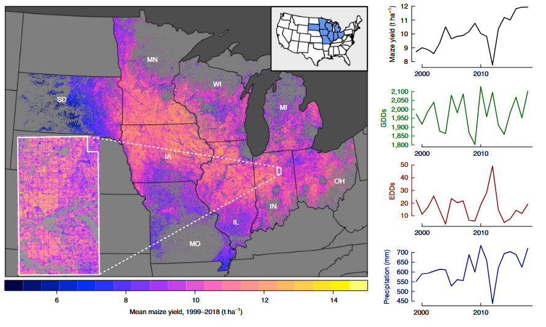
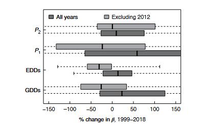
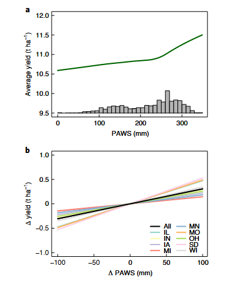
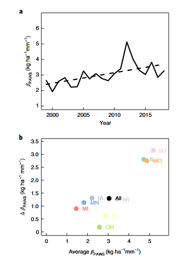

# Changes in the Drought Sensitivity of US Maize Yields

## 美国玉米产量干旱敏感性的变化

---

**文献信息：** Lobell, D. B., Deines, J. M., & Di Tommaso, S. (2020). *Nature Food*, **1**, 729–735.

**DOI:** [10.1038/s43016-020-00165-w](https://doi.org/10.1038/s43016-020-00165-w)

**作者机构：** 斯坦福大学 地球系统科学系; 斯坦福大学 粮食安全与环境中心

---

## 一、研究背景 / Research Background

### 1.1 核心悖论：产量在提高，但干旱敏感性也在提高

美国玉米带是全球最高产的农业区之一。过去几十年中，玉米产量持续增长——得益于遗传改良（耐旱品种DT、转基因抗虫/抗除草剂性状）、管理优化（早播、密植、少耕/免耕）和环境变化（CO₂施肥效应、O₃浓度下降）。一个自然的预期是：**这些进步应该使作物更"抗逆"——即降低干旱敏感性**。

但本文揭示了一个深刻的反直觉事实：

> **自1999年以来，美国玉米带的干旱敏感性不仅没有下降，反而增加了约55%。产量在所有条件下都在提高，但在干旱条件下与良好条件下的产量**差距**反而扩大了。**

这一发现早在30多年前就被育种学家Duvick（1989）预言："现代杂交种在环境有利季节可以大幅扩展产量，但当环境因素压倒性地限制时，它们的产量回落也相应地比老杂交种更大——即使新杂交种在恶劣条件下也比老品种产量高。"

### 1.2 为什么"观测到适应性行为"不等于"有效适应"？

农民确实在不断改变行为——改品种、提前播种、增加密度。但**行为的改变不等于干旱敏感性的降低**：

1. **密植的负效应：** 更高的种植密度增加了作物群体水分需求，反而可能**加剧**干旱敏感性（Assefa et al., 2018）。
2. **DT品种的行为反馈：** 耐旱品种使农民敢于在更贫瘠的土壤上密植——这一行为改变可能抵消甚至逆转品种本身的耐旱优势。
3. **CO₂的双刃效应：** 虽然CO₂升高提升了水分利用效率，但也可能增加早期叶面积生长和总水分消耗（Gray et al., 2016; Jin et al., 2018）。

### 1.3 方法论困境：如何检测干旱敏感性的变化？

传统实证方法面临一个几乎无解的根本困境：

> **在聚合尺度（如县级），严重干旱的发生频率太低，样本量不足以在统计上区分"敏感性无变化"和"敏感性发生了大幅变化"。**

本文的核心贡献在于系统地比较了**两种检测干旱敏感性变化的实证策略**——并证明了其中一种（基于空间变异）远比另一种（基于时间变异）更有效。

---

## 二、关键科学问题 / Key Scientific Questions

> **1999–2018年间，美国玉米带玉米产量对干旱的敏感性是否发生了变化？为什么传统的时间序列方法无法回答这个问题？空间替代策略如何克服这一限制？**

具体分解为四个子问题：

1. **方法比较问题（最核心）：** 基于天气时间变异的Panel模型 vs. 基于土壤空间变异的子县级分析——哪一种能有效检测干旱敏感性的时间变化？
2. **敏感性变化问题：** 玉米产量对土壤有效持水量（PAWS）的敏感性如何随时间演变？
3. **驱动因素问题：** 敏感性增加的可能驱动因素是什么——天气变化？密植？还是其他因素？
4. **方法论推广问题：** 这一发现对未来的气候变化影响检测研究有何启示？

---

## 三、数据与方法 / Data and Methods（重点详解）

### 3.1 两种策略的对比框架

本文的方法论核心在于**同时运行两种互补的实证策略并比较其结果**——这一设计本身就是最重要的方法论贡献。

| 维度 | 策略1：时间策略（Panel模型） | 策略2：空间策略（子县级PAWS分析） |
|:---|:---|:---|
| **干旱暴露的变异来源** | 年际天气波动（GDD, EDD, 降水） | 县内土壤有效持水量（PAWS）的空间差异 |
| **变异频率** | 严重干旱十年数次 → **样本量不足** | 每年每县数万个30m像素 → **样本量极大** |
| **统计模型** | 县级产量 ~ 天气 + 天气×年交互 | 像素级产量 ~ PAWS（控制县-年固定效应） |
| **核心假设** | 年际天气变异可识别敏感性趋势 | 县内土壤空间变异可反映干旱暴露梯度 |
| **结果** | **无结论**——所有变量的趋势估计包含±100%变化 | **稳健结论**——PAWS敏感性增加55%（P<0.02） |

### 3.2 数据来源详解

#### 产量数据

**SCYM方法（Scalable Crop Yield Mapper）——本文最关键的数据基础：**

这是一个基于卫星的30m分辨率玉米产量制图方法，其核心流程为：

1. **APSIM作物模型模拟：** 在少量代表性站点（由位置特定的天气和土壤特征定义）运行APSIM模型，覆盖广泛的管理条件范围和多年时间跨度。
2. **统计关系构建：** 利用模拟结果，建立玉米产量与**生长季天气+作物冠层绿度**之间的统计关系。冠层绿度通过对所有可用Landsat影像进行**调和回归（harmonic regression）**提取。
3. **关键自变量（SCYM输入）：**
   - 6–8月降水量
   - 6–8月太阳辐射
   - 7月水汽压差（VPD）
   - 8月最高气温
   - **注意：SCYM不含任何土壤输入**——这使得后续分析中用SCYM产量对土壤变量回归不会产生循环论证
4. **验证性能：** 对研究区762个县的1999–2018年数据，SCYM能解释64%的产量变异（RMSE=1.2 t/ha），县内年际R²中位数0.68，同年县内空间R²中位数0.62。

**玉米像素识别：**
- 2008–2018：使用USDA Cropland Data Layer (CDL)
- 1999–2007：使用基于随机森林的CDL扩展分类（Wang et al., 2020）

**采样策略：**
- 每州随机生成20,000个点（在2008–2018年间至少6年被分类为玉米或大豆的区域内）
- 每年每个点提取SCYM产量（仅玉米年份）
- 最终数据集：每年63,195–92,408个玉米观测值

#### 土壤数据

**PAWS（Plant-Available Water Storage，植物有效储水量）：**
- 来源：gSSURGO（Gridded Soil Survey Geographic）数据库
- 物理含义：土壤剖面中可供植物吸收的水分总量（mm）
- 关键特征：PAWS时间上几乎不变，但**空间变异极大**（县内标准差49mm >> 县内7月降水标准差12mm 或 ET₀标准差2mm）——这是空间策略可行的物理基础

**NCCPI（National Crop Commodity Production Index）：**
- 综合土壤生产力指数，整合了多种土壤和天气特征
- 用于验证PAWS的敏感性结论是否可推广至更综合的土壤质量指标

#### 天气数据

- **来源：** PRISM（Parameter-elevation Regressions on Independent Slopes Model），2.5弧分（~5km）分辨率
- **处理：** 各县级计算时仅使用CDL分类为耕地的网格单元平均
- **变量：** 日最高/最低气温 → 小时温度正弦插值 → GDD和EDD

#### 土壤湿度数据

- **来源：** TerraClimate 一维水量平衡模型（月步长）
- **输入：** 有效持水量（AWC）、降水、Penman-Monteith参考蒸散发（ET₀）
- **关键特征：** 县内土壤湿度变异与PAWS高度相关（r=0.85）——证实了PAWS是土壤湿度空间变异的主要驱动因素
- **验证：** 对研究区地表径流数据有良好验证（Abatzoglou et al., 2018）

### 3.3 策略1：时间策略——Panel模型（核心方法之一，详细推导）

#### 模型设定

从最一般的因果框架出发：

> **Y<sub>i,t</sub> = X<sub>i,t</sub>β + Z<sub>i,t</sub>γ + ε<sub>i,t</sub>** **(1)**

其中，Y为产量（t/ha），X为观测到的天气变量，Z为未观测的混杂因素。Z与X可能相关，直接估计(1)会产生遗漏变量偏差。

**固定效应Panel模型（Within-Group Estimator）：**

> **Y<sub>i,t</sub> = X<sub>i,t</sub>β + c<sub>i</sub> + ε<sub>i,t</sub>** **(2)**

其中c<sub>i</sub>为县固定效应，吸收所有不随时间变化的未观测异质性。

**去均值变换（核心识别策略）：**

定义县内时间均值：
> **Ȳ<sub>i</sub> = X̄<sub>i</sub>β + c<sub>i</sub> + ε̄<sub>i</sub>** **(3)**

(2) − (3)：
> **Y<sub>i,t</sub> − Ȳ<sub>i</sub> = (X<sub>i,t</sub> − X̄<sub>i</sub>)β + (ε<sub>i,t</sub> − ε̄<sub>i</sub>)** **(4)**

**β的识别仅依赖于每个县内部变量偏离其自身时间均值的程度。** 关键假设：县内任何随时间变化且未被观测的异质性与X不相关。

**本文的扩展设定（引入州×年趋势+天气×年交互）：**

> **Y<sub>i,t</sub> = W<sub>i,t</sub>β + W<sub>i,t</sub>·T·δ + c<sub>i</sub> + s<sub>i</sub>×t + ε<sub>i,t</sub>** **(5)**

- s<sub>i</sub>×t：州线性时间趋势，吸收与时间线性相关的未观测变化
- W<sub>i,t</sub>·T·δ：天气变量与年份的交互项——**δ是本文要检测的核心参数**，表示天气敏感性是否随时间变化

#### 天气变量W的定义

**GDD（生长度日，8–30°C）：**

> **GDD = Σ<sub>h=1</sub><sup>N</sup> max(0, min(Temp<sub>h</sub> − 8, 30 − 8))** **(6)**

**EDD（极端度日，>30°C）：**

> **EDD = Σ<sub>h=1</sub><sup>N</sup> max(0, Temp<sub>h</sub> − 30)** **(7)**

- Temp<sub>h</sub>：小时温度，通过对PRISM日最低/最高气温进行正弦插值获得
- 累积期：4月1日–9月30日
- GDD和EDD之间的30°C分界点在区域内被广泛验证为玉米产量的非线性阈值（Schlenker & Roberts, 2009; Lobell et al., 2013）

**分段线性降水（在650mm处设阈值）：**

> **P1 = max(0, P − P\*)** **(8)** —— 低于650mm为有益降水

> **P2 = min(0, P − P\*)** **(9)** —— 高于650mm为过量降水

- P\* = 650mm通过以50mm增量扫描、选择样本外预测精度最优的值确定
- 分段线性的表现与降水二次项相当，但系数解释更为直观

#### 不确定性量化

200次**块状Bootstrap**（以年为块进行重抽样），以考虑模型残差的空间相关性。

> **结果：** 四个天气变量（GDD, EDD, P1, P2）的敏感性趋势中位数均为略微增加，但**所有变量的Bootstrap分布都同时包含了+100%和−100%的变化**——即完全无统计显著性。是否包含2012年极端干旱年不影响结论。

**根本原因：** 20年间的严重干旱事件太少，无法通过年际天气变异来识别敏感性的趋势变化。这从根本上决定了"天气×年交互"策略在气候学时间尺度上的统计功效不足。

### 3.4 策略2：空间策略——子县级PAWS分析（核心方法之二，详细推导）

#### 为什么空间变异可以替代时间变异？

**物理逻辑链：**
> PAWS高 → 土壤储水能力强 → 降水不足时植物仍可获取深层水分 → 干旱胁迫减轻 → 产量更高

因此，**PAWS-产量的梯度（即β<sub>PAWS</sub>）反映了干旱敏感性的一个可度量维度**。关键是PAWS在县内的空间变异（SD=49mm）远大于天气在县内的时间变异——提供了更大的统计功效。

#### 基础模型（控制县-年固定效应）：

> **Y<sub>i,j,t</sub> = S<sub>i,j</sub> · β + c<sub>i,t</sub> + ε<sub>i,j,t</sub>** **(10)**

- i：县；j：30m像素；t：年份
- c<sub>i,t</sub>：**县-年联合固定效应**——这是本文最关键的控制策略

**县-年固定效应的含义：**
> c<sub>i,t</sub>吸收了第i县第t年所有**县层面均质**的因素——包括该年的天气条件（降水、温度、VPD）、该年的CO₂浓度、该年的区域经济条件、该县的平均管理实践。因此，β仅依赖于**县内部的PAWS空间变异**来识别。

> **换句话说：** 在同一个县的同一年中，天气完全相同，唯一导致产量空间差异的（可观测）因素是土壤持水能力——这就构建了一个"天然实验"。

#### 年度独立回归（检测时间趋势）：

对每一年t分别估计方程(10)，得到β<sub>t</sub>的时间序列，然后检验β<sub>t</sub>是否随时间系统性增加。

**替代设定：全时段交互模型**

> **Y<sub>i,j,t</sub> = S<sub>i,j</sub> · β₀ + S<sub>i,j</sub> · t · β₁ + c<sub>i,t</sub> + ε<sub>i,j,t</sub>**

其中β₁直接给出PAWS敏感性的线性时间趋势。两种方法给出了一致的结果。

#### 验证分析：土壤湿度和NCCPI

**土壤湿度分析（补充验证——排除SCYM循环论证）：**

> 使用TerraClimate模型估算的各月土壤湿度替代PAWS。县内土壤湿度变异与PAWS高度相关（r=0.85），但土壤湿度同时受天气驱动——因此具有年际动态性，更直接地反映当年的干旱胁迫。

**关键注意：** SCYM的部分输入与土壤湿度重叠（如降水、VPD），但SCYM系数在时间上是固定的。这意味着**SCYM产量对土壤湿度的敏感性变化仅能通过冠层绿度的变化体现**——如果检测到敏感性增加，那是最保守的估计（偏向于低估真实变化）。

结果：7月、8月和9月的土壤湿度敏感性均呈高度显著增加（Supplementary Fig. 5）——与PAWS结果一致。

**NCCPI分析（排除"仅水相关"的解释）：**

NCCPI是一个比PAWS更综合的土壤生产力指数（包含更多土壤属性），其对产量的影响甚至比PAWS更强，且从1999年到2018年**翻了一番**。这表明PAWS敏感性的增加至少部分反映了一个更广泛的模式——**良好土壤条件（不仅仅是水分）的相对重要性在提升**。

#### 测量误差的讨论

> SCYM产量和gSSURGO土壤数据均存在测量误差——倾向于使β<sub>PAWS</sub>**低估**（attenuation bias）。平均PAWS效应（0.3 t/ha per 100mm）仅为其他研究使用实测数据估计值的**三分之一**。但随机测量误差不会产生虚假的**趋势**——如果有什么影响，SCYM早期年份（Landsat 5/7）的质量若低于后期（Landsat 8），只会放大真实趋势的低估。

### 3.5 驱动因素分析（核心方法之三）

#### 排除天气趋势假说

建立包含PAWS×天气交互项的模型：

> **Y<sub>i,j,t</sub> = S<sub>i,j</sub> · β + S<sub>i,j</sub> · W<sub>i,t</sub> · γ + c<sub>i,t</sub> + ε<sub>i,j,t</sub>**

- PAWS敏感性在更暖（GDD↑, EDD↑）和更干（降水↓）条件下更高——交互项γ显著
- 但1999–2018年间，GDD的略微增加倾向于**提高**PAWS敏感性（+0.02 t/ha per 100mm），而其他天气变量的趋势倾向于**降低**敏感性
- **净天气趋势效应极小（<0.02 t/ha per 100mm），方向与观测到的0.13 t/ha增加相反**
- 结论：**天气变化不是敏感性增加的主要驱动因素**

#### 密度假说

USDA数据显示研究区玉米平均种植密度从1999年到2018年增加了约**20%**。更高的密度 → 更大的群体水分需求 → 在PAWS低的土壤上水分胁迫更早、更严重 → PAWS-产量梯度变陡。

这与农学文献（Assefa et al., 2018; DeLucia et al., 2019）一致。

#### "其他胁迫减少"假说

转基因抗虫/抗除草剂性状的普及（从1999年<25%到2018年>75%）大幅减少了病虫害和杂草造成的产量损失。当这些"其他胁迫"不再主导产量变异时，**水分胁迫在剩余变异中的相对重要性自然提升**——即使绝对水分胁迫并未恶化。

---

## 四、新发现与新认识 / New Findings

### 发现1：时间策略完全失效——Panel模型无法检测敏感性变化（图3）



> **图1解析（Fig. 1, p.730）：研究区域与数据特征。** 左侧为1999–2018年SCYM卫星产量图（30m分辨率），内嵌图为单个县（IN Wabash）的像素级产量分布。右侧为区域平均产量、GDD、EDD和生长期降水的时间序列——2012年是显著的极端干旱年。

**策略1的核心结果（Fig. 3, p.732）：**

> 四种天气变量（GDD, EDD, P1, P2）的敏感性趋势估计（1999–2018变化百分比）的中位数均为轻微增加，但Bootstrap分布范围极宽——**所有变量均同时包含−100%和+100%的变化**。无论是否包含2012年，无论使用九州还是100°W以东全部州，也无论将时间延长至1981年——结论不变：**县级尺度的天气时间变异不足以识别敏感性趋势。**

| 天气变量 | 1999–2018敏感性变化（中位数） | Bootstrap范围 | 结论 |
|:---|:---|:---|:---|
| GDD | 轻微正 | −100% ~ +100% | 无统计学意义 |
| EDD | 轻微正 | −100% ~ +100% | 无统计学意义 |
| P1（有益降水） | 轻微正 | −100% ~ +100% | 无统计学意义 |
| P2（过量降水） | 轻微正 | −100% ~ +100% | 无统计学意义 |

### 发现2：空间策略揭示了55%的干旱敏感性增加——稳健且显著（图4-5）

**图4（p.732）：产量对土壤有效持水量的敏感性**
- 每增加100mm PAWS，产量平均增加**0.30 t/ha**
- 干旱州（SD, MO）的敏感性几乎是湿润州（MI, MN）的两倍
- PAWS效应（0.30 t/ha/100mm）是等量生长季降水效应（0.10 t/ha/100mm）的**三倍**——凸显土壤的关键性

**图5（p.733）：敏感性随时间的变化**
- 1999年：每100mm PAWS → 产量+0.23 t/ha
- 2018年：每100mm PAWS → 产量+0.36 t/ha
- **增幅55%（P<0.02）**，排除2012年后仍稳健
- 九个州全部呈增加趋势，基线敏感性越高的州（SD, IL, MO）增加越快

| 指标 | 1999年 | 2018年 | 变化 |
|:---|:---|:---|:---|
| PAWS效应 (t/ha per 100mm) | 0.23 | 0.36 | **+55%** |
| NCCPI效应 | 基准 | ~2倍 | **~+100%** |
| 土壤湿度敏感性（7–9月） | 基准 | 显著增加 | 高度显著 |

### 发现3：天气变化不是驱动力——密植和其他因素才是

排除了天气趋势假说（净天气效应<0.02且方向相反），提出了两个互补机制：

1. **密植假说（主因）：** 密度+20% → 水分需求增加 → PAWS梯度变陡
2. **"其他胁迫减少"假说（辅因）：** 转基因性状普及 → 病虫草害损失减少 → 水分胁迫在剩余变异中的相对重要性上升

### 发现4：产量在所有土壤条件下均在增长——但"干旱代价"也在上升

即使是PAWS最低的贫瘠土壤，1999–2018年间产量也呈稳健正增长。但PAWS敏感性增加的幅度（0.13 t/ha）仅为总产量增益（2.1 t/ha）的~5%——**即产量的绝对提高远超干旱敏感性的恶化**。然而从**相对角度**看，干旱年份相对于丰水年份的"产量差距"确实在扩大——这正是Duvick（1989）的预言。

---

## 五、讨论要点 / Discussion Highlights

### 5.1 "实证研究可以检测适应性吗？"——一个根本性的方法论挑战

本文最具颠覆性的结论是：**使用聚合尺度的天气时间变异来检测作物对气候变化的适应性，在根本上统计功效不足**——因为严重干旱的发生频率太低。

这对大量已发表的文献具有深远的警示意义：
- 基于"天气×年交互"的Panel模型报告了各种"趋势"——本文证明这些趋势在统计上可能**完全不可靠**
- 空间的替代方案（利用土壤差异作为干旱暴露的代理）提供了**统计功效极高的互补路径**

### 5.2 卫星产量数据+土壤数据 = 天然实验

本文展示了一种低成本的实证策略：
1. 卫星产量制图（SCYM，30m）→ 提供**空间连续的、不受自报偏差影响的**产量数据
2. 土壤数据库（gSSURGO）→ 提供**时间不变但空间高度变异**的环境梯度
3. 县-年固定效应 → 控制所有县层面的混淆因素
4. 结果：一个相当于"在同一个县同年、唯一变量是土壤"的准实验设计

### 5.3 "适应"与"敏感性"的微妙关系

> 即使DT品种在控制实验中确实提高了干旱条件下的产量（Gaffney et al., 2015; Cooper et al., 2014），但农民可能因为种植了DT品种而做出**补偿行为**（如增加密度、扩展到更贫瘠的土壤）——这些行为的净效应可能反而提高系统层面的干旱敏感性。**"品种-水平"的适应成功不一定转化为"系统-水平"的敏感性降低。**

---

## 六、结论 / Conclusions

### 6.1 核心结论

1. **时间策略无能为力：** 基于县级天气年际变异的Panel模型，即使在20年数据下，也无法检测到干旱敏感性的大幅变化——因为严重干旱太罕见。

2. **空间策略揭示了55%的增加：** 通过利用县内土壤PAWS的空间变异，发现1999–2018年美国玉米带玉米的干旱敏感性显著增加了约55%。

3. **密植是关键驱动因素：** 种植密度增加约20%是敏感性上升最可能的原因，而非天气趋势的变化。

4. **DT品种未逆转系统趋势：** 尽管耐旱品种在田间试验中有效，但在整个系统的聚合层面，干旱敏感性仍在上升。

### 6.2 方法论启示

1. **"天气×时间交互"的反思：** 已发表的Panel模型研究中报告的敏感性趋势可能大面积不可靠。
2. **空间替代策略：** 利用土壤水分特征的空间变异作为干旱暴露的代理——统计功效远超时间替代。
3. **卫星数据的关键作用：** 没有30m分辨率的SCYM产量数据，县内空间分析不可能实现。

### 6.3 局限性

1. **PAWS非纯粹水分效应：** PAWS可能与NCCPI等其他土壤属性相关——敏感性增加至少部分反映了更广义的"好土壤vs坏土壤"分化。
2. **SCYM与土壤湿度的重叠：** 土壤湿度敏感性分析中使用SCYM产量存在循环论证风险（SCYM部分自变量与土壤湿度重叠），但SCYM系数的时间不变性使这一偏差倾向于**低估**真实趋势。
3. **测量误差：** SCYM和gSSURGO的测量误差使绝对敏感性估计偏低，但不影响趋势的稳健性。
4. **缺乏田间尺度验证：** 无法直接分离DT品种效应与密植效应——需要协调的田间实验。

---

## 七、研究亮点 / Research Highlights

| 序号 | 亮点 | 说明 |
|:---|:---|:---|
| 1 | **双策略对比的方法论框架** | 同时运行时间策略和空间策略并直接比较——证明时间策略在原理上统计功效不足，这是对大量已发表文献的根本性反思 |
| 2 | **土壤PAWS作为干旱暴露的空间代理** | 利用县内PAWS变异（SD=49mm >> 天气变异）构建"准实验"——在同一个县同年仅有土壤不同的条件下识别干旱敏感性 |
| 3 | **县-年联合固定效应** | c<sub>i,t</sub>吸收了所有县层面均质因素（天气、CO₂、经济条件），仅依赖县内部空间变异来识别——控制策略极其干净 |
| 4 | **30m卫星产量数据** | SCYM提供每年6.3–9.2万个县内像素观测——没有这种分辨率的数据，空间策略不可能实现 |
| 5 | **发现无视适应努力的敏感性上升** | 尽管DT品种推广、转基因普及和农业技术进步，系统层面的干旱敏感性仍在上升——扭转了"适应=降低敏感性"的直觉 |
| 6 | **提供可操作的未来研究路线** | 明确指出恢复研究人员对田间尺度产量数据（如政府保险数据）的访问权限，以及协调的田间实验（比较新旧品种+不同密度）是未来关键 |
| 7 | **Duvick预言的实证确认** | 用30年后的卫星数据证实了1989年的育种学预言——"modern hybrids yield more under all conditions, but the gap between good and poor conditions grows" |

---

## 八、方法流程总图

```
策略1: 时间策略 (Panel模型)
──────────────────────────────────────────────
数据: 县级玉米产量 (USDA NASS) + PRISM天气 (1999-2018, 9州)
模型: Y_it = W_it·β + W_it·T·δ + c_i + s_i×t + ε_it
  ├── GDD: Σ max(0, min(T_h−8, 22))  [8-30°C, 正弦插值]
  ├── EDD: Σ max(0, T_h−30)           [>30°C]
  ├── P1:  max(0, P−650mm)            [有益降水]
  └── P2:  min(0, P−650mm)            [过量降水]
控制: 县固定效应 c_i + 州×年趋势 s_i×t
核心参数: δ (天气×年交互) → 敏感性时间趋势
不确定性: 200次年块Bootstrap
结果: ✗ 完全无统计意义 — 所有变量Bootstrap分布含±100%
原因: 严重干旱太罕见 — 20年样本量不足

策略2: 空间策略 (子县级PAWS分析)
──────────────────────────────────────────────
数据: SCYM 30m卫星产量 + gSSURGO土壤 (1999-2018)
  ├── SCYM: Landsat → 冠层绿度 + 天气 → 产量 (30m)
  │   └── 输入: JJA降水, 太阳辐射, 7月VPD, 8月Tmax
  │   └── 验证: R²=0.64, RMSE=1.2 t/ha (762县)
  ├── 采样: 每州20,000点 → 63,195-92,408像素/年
  └── PAWS: gSSURGO (时间不变, 空间高变异)
基础模型: Y_ijt = S_ij·β + c_it + ε_ijt  [方程10]
  ├── c_it: 县-年联合固定效应 (吸收所有天气/经济/管理)
  └── β: PAWS效应 → 干旱敏感性的空间代理
年度独立回归: β_t (每年一个β)
时间趋势: β_1999=0.23 → β_2018=0.36 (+55%, P<0.02)
结果: ✓ 高度显著且稳健 — 9州全部增加

验证分析
├── 土壤湿度 (TerraClimate): 7-9月敏感性显著增加
│   └── 保守估计 (SCYM系数固定 → 仅通过绿度变化体现)
├── NCCPI: 敏感性翻倍 (更综合的土壤质量指标)
└── 天气趋势排除: PAWS×天气交互 → 净天气效应<0.02且方向相反

驱动因素分析
├── 天气变化 → 排除 (净效应可忽略, 方向相反)
├── 密植 (+20%) → 主因 (水分需求增加 → PAWS梯度变陡)
└── 其他胁迫减少 → 辅因 (转基因减少病虫草害 → 水分胁迫相对更突出)
```

