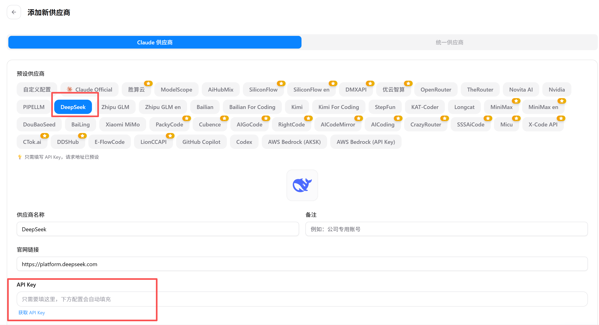
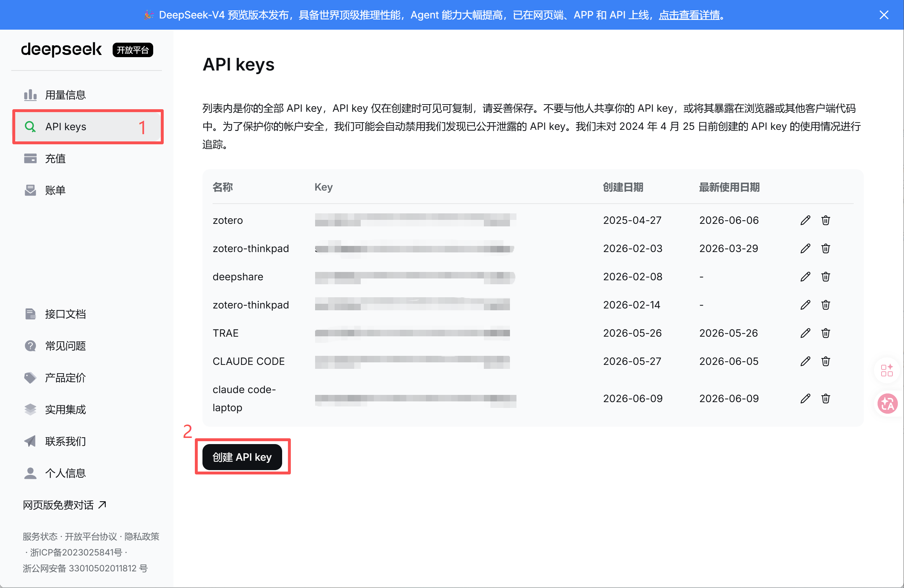
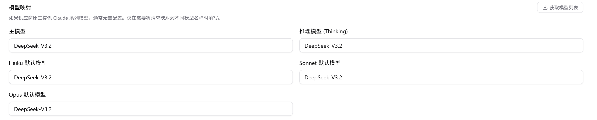
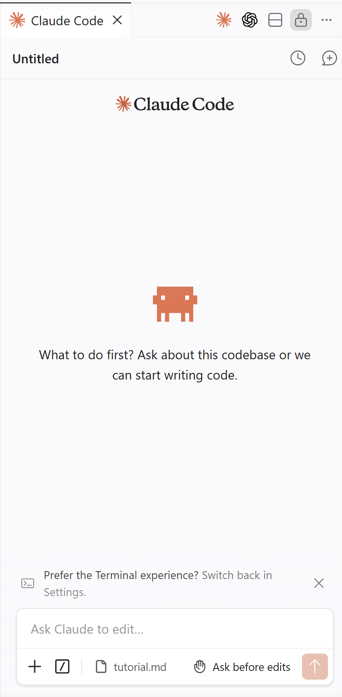

# Claude Code 篇

## 一、什么是 Claude Code

Claude Code 是 Anthropic 推出的 AI 编程助手，它能够像一个经验丰富的开发者一样，在终端中与你协作写代码、调试、重构。你可以把它理解为"命令行里的 AI 程序员"。

你可以通过三种方式使用它：

| 方式 | 特点 | 推荐人群 |
|------|------|----------|
| 🖥️ **Terminal（命令行）** | 最原生、最灵活，纯键盘操作 | 喜欢极客风、追求效率的老手 |
| 🔌 **IDE 插件（VS Code）** | 嵌入编辑器，边写边聊，所见即所得 | ⭐ 大多数科研用户的日常选择 |
| 🖱️ **Desktop（桌面应用）** | 图形界面，开箱即用，无需配置 | 不想折腾、追求简单上手的新人 |

> 本文后续的配置和截图均以 **IDE 插件（VS Code）** 为例。

---

## 二、AI 编程的三次革新

在深入了解 Claude Code 之前，先看看它在 AI 编程演进中处于什么位置。回顾这段发展历程，我认为它经历了三次关键革新：

- **第一阶段 · 网页对话（2022 年末至今）**：以 ChatGPT、Gemini 为代表。用自然语言对话取代了"查 CSDN → 复制粘贴"的老路子，但代码仍然需要手动搬运到项目里。
- **第二阶段 · AI 原生 IDE（2023 年至今）**：以 Cursor、TRAE、GitHub Copilot、通义灵码为代表。这一代有两种形态：Cursor、TRAE 等另起炉灶做了独立 AI IDE，Copilot 和通义灵码则深度嵌入 VS Code。共同点是 AI 终于住进了编辑器里，Tab 一下就能出代码，告别了复制粘贴。但人仍然是主导者 —— 你需要自己判断跨文件影响、手动协调改动。
- **第三阶段 · 项目级 Agent（2025 年初至今）**：以 Claude Code、OpenAI Codex 为代表。Agent 接管整个项目 —— 自主读文件、写代码、跑命令、管 Git，从"帮你写一行"真正升级为"帮你搞定一个项目"。人的角色从操作者变成了监督者。

三者的优劣对比如下：

| 对比维度 | 网页对话 | AI 原生 IDE | 项目级 Agent |
|----------|----------|-------------|--------------|
| 🛠️ **代表工具** | ChatGPT、Gemini | Cursor、TRAE、GitHub Copilot、通义灵码 | Claude Code、OpenAI Codex |
| 💬 **交互方式** | 浏览器中对话，手动粘贴 | 编辑器内 Tab 补全 / 内联对话 | 终端自然语言驱动，Agent 自主执行 |
| 📁 **操作范围** | 仅生成代码片段 | 当前文件为主，部分支持跨文件感知 | 整个项目：读写文件、执行命令、操作 Git |
| 🧠 **上下文深度** | 单轮 / 多轮对话窗口 | 当前文件 + 少量关联文件 | 完整项目结构感知，自动追溯依赖关系 |
| 👤 **人的角色** | 搬运工 —— 复制粘贴到项目 | 驾驶员 —— AI 给建议，你来把关、协调多文件 | 监督者 —— AI 自动驾驶，你来审核和拍板 |
| 🔄 **代码落地** | 手动复制粘贴到项目中 | 直接插入编辑器，仍需人工协调多文件 | 自动写入 → 运行 → 报错 → 修复，闭环迭代 |
| 🎯 **适合场景** | 快速问答、算法片段、学习理解 | 单文件开发、代码补全、小修小改 | 复杂重构、跨文件功能开发、科研项目级编程 |
| 📈 **自动化程度** | ⭐ 低 —— 纯辅助 | ⭐⭐ 中 —— 半自动 | ⭐⭐⭐ 高 —— 全流程自主 |

> 简单来说：从"**帮你回答一个问题**"到"**帮你写好一段代码**"再到"**帮你交付一个项目**"——这就是 AI 编程的三次跨越。Claude Code 正站在第三阶段的浪尖上。

---

## 三、基础知识：Agent 与模型的关系

> **Agent（智能体）是躯干，模型是大脑。**

- **Agent** 负责执行任务：读取文件、运行命令、管理上下文、调用工具。
- **模型** 负责思考决策：理解你的需求、推理出方案、生成代码。

两者分工明确 —— Agent 再灵活，没有一个好的模型驱动，也只是空壳。

理解了这层关系，接下来的问题就很自然了：**Claude Code 这个躯干已经有了，给它配一个什么样的"大脑"最合适？**

---

## 四、选择合适的模型：为什么是 DeepSeek

在国内直接使用 Claude 官方 API 成本高、门槛多，并不是最划算的选择。

而 **DeepSeek** 凭借以下优势，成为目前最理想的平替：

| 优势 | 说明 |
|------|------|
| 💰 **成本低廉** | API 定价远低于 Claude 官方 |
| 🧠 **上下文记忆优秀** | 长文本理解能力强，适合科研场景 |
| ⚡ **响应速度快** | 国内直连，延迟极低 |

> 唯一的短板是暂不支持多模态（图片理解），但纯代码 / 文本场景下完全够用。

因此，**Claude Code + DeepSeek** 的组合成为了当下许多 VibeCoder 的首选方案。

---

## 五、配置步骤

### 5.1 安装 Claude Code

上面提到 Claude Code 有三种打开方式：Terminal、VS Code 插件、Desktop 客户端，其相应的安装方式也不同。在 [Anthropic 官网](https://claude.com/product/claude-code) 上均有详细教程，在此不再赘述。

### 5.2 安装 CCSwitch

社区大佬们开发了一个利器 —— **CCSwitch**，可以一键切换 Claude Code / Codex 的底层模型，省去手动改配置的麻烦。

> 📦 下载链接：[CCSwitch 网盘分享](https://pan.bnu.edu.cn/l/u1pBvE)

### 5.3 配置 DeepSeek 模型

安装完成后，打开 CCSwitch 进行如下操作：

**第一步：添加模型**

点击界面右上角的 **＋** 按钮，在模型列表中找到并选择 **DeepSeek**。

**第二步：填写 API Key**

此时需要填入你的 DeepSeek API Key。前往 [DeepSeek 开放平台](https://platform.deepseek.com) 注册并申请一个。

> ⚠️ **关键操作：生成 Key 后请立刻点击"复制"，马上粘贴到 CCSwitch 中！** 出于安全考虑，平台不会再次展示完整的 Key，一旦关闭页面就只能重新申请。

> **什么是 API Key？**
> 简单理解，它就是你的"身份通行证"。调用任何 AI 模型的 API 时，服务商通过 Key 来识别是你本人在使用，并据此计费。

> 🔐 **请务必保管好你的 API Key，千万不要泄露！** 一旦泄露，他人可以冒用你的额度，产生不必要的费用。

**第三步：选择模型版本**

在下方的模型选项中，**全部选择 `deepseek-v4-pro`** 即可。放心，DeepSeek 定价亲民，哪怕是 Pro 版本也完全可以放开用。

### 5.4 配置完成

配置成功后，你的终端界面（以 VS Code 插件为例）应该类似下图：

---

## 六、接下来

你已经拥有了一个低成本、高效率的 AI 编程环境。接下来可以尝试：

- 用自然语言描述需求，让 Claude Code 帮你写代码
- 让它阅读你的科研项目代码，帮你理解和重构
- 用它来自动化重复性的数据处理工作
- 探索社区中更多有趣的开源 Skill，把 Claude Code 的能力边界不断拓宽

> 🚀 开始你的 VibeCoding 之旅吧！
